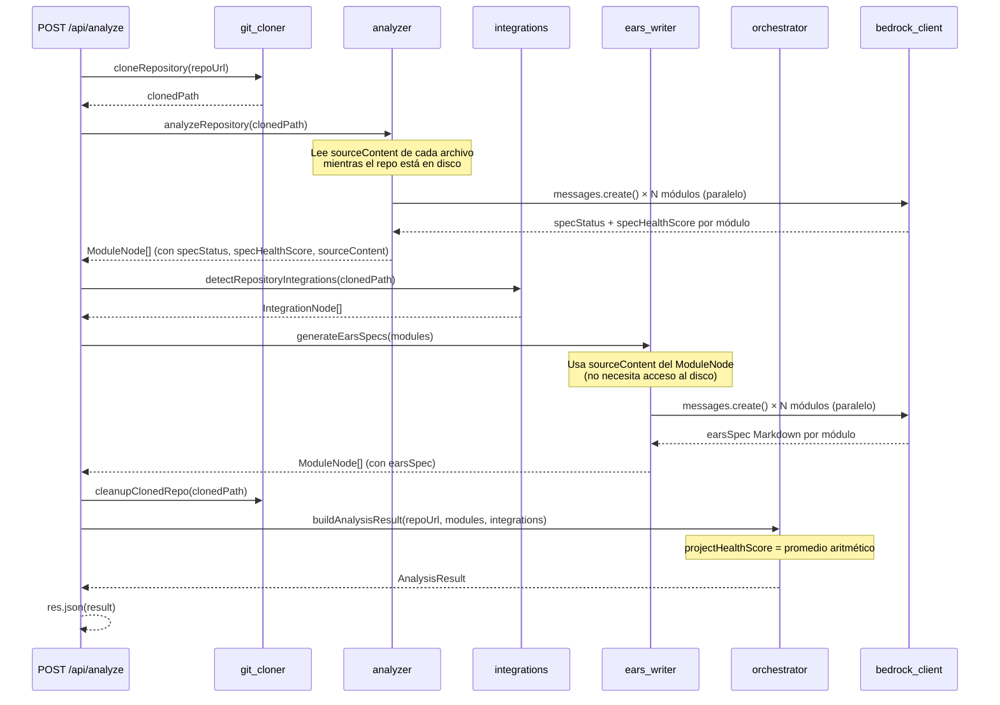

# Design Document — Bedrock Integration

## Overview

Este documento describe el diseño técnico para integrar AWS Bedrock como motor de IA real en el backend de TrazIA. El objetivo es reemplazar la clasificación estática hardcodeada con dos agentes LLM:

- **Analyzer + Haiku** — clasifica cada módulo como `traced`, `drift` o `untraced` y asigna un `specHealthScore` real (0–100).
- **EARS Writer + Sonnet** — genera una spec en sintaxis EARS en Markdown para cada módulo.

El resultado es que `POST /api/analyze` devuelve un `AnalysisResult` donde `projectHealthScore` refleja el estado de documentación real del repositorio.

### Contexto de investigación

El SDK `@anthropic-ai/bedrock-sdk` expone la clase `AnthropicBedrock` (no `Anthropic` ni `AnthropicBedrockMantle`). Para modelos con inference profile ID (prefijo `global.`), el cliente debe usar la región real donde están disponibles los modelos — `sa-east-1` en este caso. Las credenciales se resuelven con el mecanismo estándar de AWS SDK (perfil `trazia-backend` en `~/.aws/credentials`), sin necesidad de pasar `accessKeyId`/`secretAccessKey` explícitamente al constructor.

Los modelos seleccionados son:
- `global.anthropic.claude-haiku-4-5-20251001-v1:0` — latencia baja, adecuado para clasificación paralela de decenas de módulos.
- `global.anthropic.claude-sonnet-4-6` — mayor capacidad de razonamiento, adecuado para generación de especificaciones EARS.

La principal causa de fallos en cold start es `ThrottlingException` / "Try your request again", que requiere backoff exponencial. Errores no transitorios (prompt inválido, modelo no disponible) deben propagarse inmediatamente.

---

## Architecture

El pipeline de `POST /api/analyze` se extiende con dos nuevos pasos, insertados entre el análisis estático existente y el cleanup del repositorio:



### Decisión de diseño: lectura del código fuente

Se adopta la **Opción A** (recomendada): el Analyzer lee el `sourceContent` de cada archivo durante su propio recorrido, mientras el repositorio clonado aún existe en disco. El contenido se almacena en `ModuleNode.sourceContent` (campo temporal no serializado en la respuesta final). El EARS Writer recibe los módulos con ese contenido ya cargado, sin acceso al disco.

Ventajas sobre Opción B:
- No hay riesgo de race condition con el `finally: cleanupClonedRepo`.
- El Analyzer ya recorre los archivos uno a uno — leer el contenido no añade un segundo recorrido.
- El pipeline en `analyze.ts` no necesita pasar `clonedPath` al EARS Writer, reduciendo el acoplamiento.

### Módulos nuevos y modificados

```
packages/backend/src/
  clients/
    bedrock_client.ts         ← NUEVO: singleton AnthropicBedrock + modelIds exportados
  shared/
    llm_retry.ts              ← NUEVO: withLlmRetry<T>() utilitaria reutilizable
    types.ts                  ← MODIFICADO: specStatus, specHealthScore, projectHealthScore, sourceContent
  agents/
    analyzer/
      analyzer.ts             ← MODIFICADO: llama Haiku en paralelo, lee sourceContent
    ears_writer/
      ears_writer.ts          ← NUEVO: generateEarsSpec(moduleName, sourceContent)
      index.ts                ← NUEVO: handler (re-export)
    orchestrator/
      orchestrator.ts         ← MODIFICADO: projectHealthScore = promedio real
  routes/
    analyze.ts                ← MODIFICADO: inserta paso EARS Writer
packages/backend/
  package.json                ← MODIFICADO: añade @anthropic-ai/bedrock-sdk ^0.32.0
  .env.example                ← MODIFICADO: añade variables BEDROCK_*
```

---

## Components and Interfaces

### 1. `bedrock_client.ts`

Módulo que instancia el cliente Bedrock una sola vez al cargar el proceso. Falla en startup si faltan variables de entorno.

```typescript
// packages/backend/src/clients/bedrock_client.ts

import AnthropicBedrock from '@anthropic-ai/bedrock-sdk'

// Validar variables obligatorias al cargar el módulo
function requireEnv(name: string): string {
  const value = process.env[name]
  if (!value) throw new Error(`Variable de entorno requerida no definida: ${name}`)
  return value
}

export const BEDROCK_REGION        = requireEnv('BEDROCK_REGION')
export const BEDROCK_MODEL_ANALYZER = requireEnv('BEDROCK_MODEL_ANALYZER')
export const BEDROCK_MODEL_EARS     = requireEnv('BEDROCK_MODEL_EARS')

// Instancia única del cliente Bedrock — usa perfil trazia-backend de ~/.aws/credentials
export const bedrockClient = new AnthropicBedrock({ awsRegion: BEDROCK_REGION })
```

**Contrato de uso:** todos los agentes importan `{ bedrockClient, BEDROCK_MODEL_ANALYZER, BEDROCK_MODEL_EARS }` de este módulo. Nunca instancian su propio cliente.

---

### 2. `llm_retry.ts`

Función utilitaria genérica. Envuelve cualquier llamada async al LLM con lógica de reintentos.

```typescript
// packages/backend/src/shared/llm_retry.ts

export interface RetryOptions {
  maxRetries?: number         // por defecto: MAX_LLM_RETRIES del env, o 3
  baseDelayMs?: number        // por defecto: BASE_RETRY_DELAY_MS del env, o 1000
  maxDelayMs?: number         // por defecto: 30000
}

export async function withLlmRetry<T>(
  fn: () => Promise<T>,
  context: { agente: string; módulo: string },
  options?: RetryOptions
): Promise<T>
```

**Lógica de clasificación de errores transitorios:**

```typescript
function isTransientError(error: unknown): boolean {
  if (!(error instanceof Error)) return false
  return (
    error.message.includes('Try your request again') ||
    error.constructor.name === 'ThrottlingException' ||
    ('status' in error && (error as { status: number }).status === 429)
  )
}
```

**Fórmula de backoff:**
```
delay = min(MAX_RETRY_DELAY_MS, max(1000, BASE_RETRY_DELAY_MS * 2^(N-1)))
```

Donde N es el número del intento fallido (1-indexed). Para N=1: `max(1000, 1000 * 1) = 1000 ms`. Para N=2: `max(1000, 1000 * 2) = 2000 ms`. Para N=3: `max(1000, 1000 * 4) = 4000 ms`. Máximo capped en 30000 ms.

Al agotar todos los reintentos, loggea `{ intentos, últimoError, tiempoTotalMs }` y relanza el error original con contexto.

---

### 3. Cambios a `types.ts`

```typescript
// Nuevo tipo discriminado para el estado de spec de un módulo
export type SpecStatus = 'traced' | 'drift' | 'untraced'

export interface ModuleNode {
  id: string
  name: string
  type: 'module'
  dependencies: string[]
  path: string
  parentFolder?: string
  linesOfCode?: number
  lastModified?: string
  // Nuevos campos obligatorios (post-Analyzer)
  specStatus: SpecStatus        // clasificación del módulo por Haiku
  specHealthScore: number       // 0–100, clampado
  // Campo temporal: presente en pipeline, omitido en la respuesta JSON final
  sourceContent?: string        // contenido leído del archivo, truncado a 4000 chars si aplica
  earsSpec?: string             // spec EARS generada por Sonnet
}

export interface AnalysisResult {
  repoUrl: string
  analyzedAt: string
  modules: ModuleNode[]
  folders: FolderNode[]
  integrations: IntegrationNode[]
  edges: GraphEdge[]
  totalModules: number
  totalIntegrations: number
  primaryLanguage: string
  projectHealthScore: number    // nuevo: promedio aritmético de specHealthScore, entero 0–100
}
```

**Nota de backward-compatibility:** `specStatus` y `specHealthScore` se vuelven obligatorios. El Analyzer es el único productor de `ModuleNode[]` en el pipeline, por lo que todos los módulos tendrán estos campos antes de llegar al Orchestrator. Los valores por defecto ante error son `specStatus: 'untraced'`, `specHealthScore: 0`.

---

### 4. `analyzer.ts` — cambios

La función `analyzeRepository` se modifica para:

1. **Leer `sourceContent`** de cada archivo durante el recorrido existente (truncado a 4000 chars).
2. **Invocar Haiku en paralelo** — `Promise.all()` sobre todos los módulos.
3. **Parsear respuesta JSON** — si falla el parse o los campos son inválidos, usar valores por defecto.
4. **Clampar `specHealthScore`** al rango [0, 100].

```typescript
// Nuevo: interfaz de respuesta esperada de Haiku
interface HaikuClassification {
  specStatus: SpecStatus
  specHealthScore: number
}

// Nuevo: función para clasificar un módulo individual con Haiku
async function classifyModuleWithHaiku(
  module: ModuleNode,
  sourceContent: string
): Promise<HaikuClassification>

// Modificado: analyzeRepository ahora retorna Promise<ModuleNode[]>
// donde cada ModuleNode tiene specStatus, specHealthScore y sourceContent
export async function analyzeRepository(repoPath: string): Promise<ModuleNode[]>
```

**Prompt a Haiku:**

```
Eres un analizador de código. Dado el siguiente fragmento de código fuente, determina:
1. specStatus: si el módulo tiene una especificación actualizada ("traced"), desincronizada ("drift") o sin especificación ("untraced").
2. specHealthScore: un entero del 0 al 100 que refleja la calidad y cobertura de la spec.

Responde ÚNICAMENTE con JSON válido en este formato:
{"specStatus": "traced"|"drift"|"untraced", "specHealthScore": <número 0-100>}

Código del módulo (<nombre>):
<sourceContent>
```

---

### 5. `ears_writer.ts` — nuevo agente

```typescript
// packages/backend/src/agents/ears_writer/ears_writer.ts

/**
 * Genera una spec en formato EARS para un módulo dado su código fuente.
 * Retorna Markdown listo para guardarse como requirements.md.
 * Ante fallo total (tras reintentos), retorna un Markdown de error sin lanzar excepción.
 */
export async function generateEarsSpec(
  moduleName: string,
  sourceContent: string
): Promise<string>

/**
 * Genera specs EARS para una lista de módulos en paralelo.
 * Cada módulo que no tiene sourceContent recibe una spec vacía.
 */
export async function generateEarsSpecs(
  modules: ModuleNode[]
): Promise<ModuleNode[]>
```

**Prompt a Sonnet:**

```
Eres un redactor de especificaciones de software. Dado el siguiente código fuente del módulo "<nombre>", 
genera una especificación de requisitos en formato EARS (Easy Approach to Requirements Syntax).

Usa obligatoriamente estos patrones EARS:
- WHEN <trigger> THE SYSTEM SHALL <response>
- WHILE <condition> THE SYSTEM SHALL <response>  
- IF <condition> THEN THE SYSTEM SHALL <response>

Formato de respuesta (Markdown):
# Requirements: <nombre del módulo>

## Requisitos

[Aquí los requisitos en sintaxis EARS]

Código fuente:
<sourceContent>
```

Si `generateEarsSpec` falla tras agotar reintentos, retorna:

```markdown
> ⚠️ Error al generar la spec: <mensaje del error>
```

---

### 6. `orchestrator.ts` — cambios

La función `buildAnalysisResult` calcula `projectHealthScore` como promedio aritmético:

```typescript
function calculateProjectHealthScore(modules: ModuleNode[]): number {
  if (modules.length === 0) return 0
  const total = modules.reduce((sum, m) => sum + m.specHealthScore, 0)
  return Math.round(total / modules.length)
}
```

El resultado se incluye en `AnalysisResult.projectHealthScore`.

---

### 7. `analyze.ts` — pipeline extendido

```typescript
// Paso 2: Analizar estructura (con specStatus, specHealthScore, sourceContent)
const modules = await analyzeRepository(clonedPath)

// Paso 3: Detectar integraciones externas
const integrations = await detectRepositoryIntegrations(clonedPath)

// Paso 4 (NUEVO): Generar specs EARS por módulo
const modulesWithSpecs = await generateEarsSpecs(modules)

// Paso 5 (antes paso 4): Orquestar — cleanup ANTES de este paso no es necesario;
// el cleanup sigue en el finally, después del buildAnalysisResult
const result: AnalysisResult = buildAnalysisResult(repoUrl.trim(), modulesWithSpecs, integrations)
```

**Manejo de error HTTP 503:** si el `bedrockClient` no puede inicializarse (variables de entorno faltantes), el módulo lanza un error sincrónico al cargarse. La ruta debe capturarlo en el bloque catch existente y responder con 503:

```typescript
if (message.includes('Variable de entorno requerida no definida')) {
  res.status(503).json({ error: `Servicio de IA no disponible: ${message}` })
  return
}
```

---

## Data Models

### Flujo de datos por etapa del pipeline

```
cloneRepository()
  → clonedPath: string

analyzeRepository(clonedPath)
  → ModuleNode[] {
      id, name, type, path, dependencies,
      linesOfCode?, lastModified?,
      specStatus: 'traced'|'drift'|'untraced',
      specHealthScore: number,     // [0, 100]
      sourceContent?: string       // truncado a 4000 chars
    }

detectRepositoryIntegrations(clonedPath)
  → IntegrationNode[]              // sin cambios

generateEarsSpecs(modules)
  → ModuleNode[] {                 // mismos campos + earsSpec
      ...todos los campos anteriores,
      earsSpec?: string            // Markdown con spec EARS
    }

buildAnalysisResult(repoUrl, modules, integrations)
  → AnalysisResult {
      repoUrl, analyzedAt,
      modules: ModuleNode[],       // sourceContent omitido en serialización
      folders: FolderNode[],
      integrations: IntegrationNode[],
      edges: GraphEdge[],
      totalModules, totalIntegrations,
      primaryLanguage,
      projectHealthScore: number   // promedio aritmético, entero [0, 100]
    }
```

### Valores por defecto ante error

| Campo | Valor por defecto ante error |
|---|---|
| `specStatus` | `'untraced'` |
| `specHealthScore` | `0` |
| `earsSpec` | `"> ⚠️ Error al generar la spec: <mensaje>"` |
| `projectHealthScore` | `0` (si lista vacía) |

### Variables de entorno

| Variable | Obligatoria | Default | Descripción |
|---|---|---|---|
| `BEDROCK_REGION` | ✅ | — | Región AWS donde está disponible Bedrock |
| `BEDROCK_MODEL_ANALYZER` | ✅ | — | ID del modelo Haiku para clasificación |
| `BEDROCK_MODEL_EARS` | ✅ | — | ID del modelo Sonnet para specs EARS |
| `MAX_LLM_RETRIES` | ❌ | `3` | Número máximo de reintentos ante error transitorio |
| `BASE_RETRY_DELAY_MS` | ❌ | `1000` | Delay base en ms para backoff exponencial |
| `MAX_RETRY_DELAY_MS` | ❌ | `30000` | Cap máximo del delay en ms |

---

## Correctness Properties

*Una propiedad es una característica o comportamiento que debe ser verdadera en todas las ejecuciones válidas del sistema — esencialmente, un enunciado formal sobre lo que el sistema debe hacer. Las propiedades sirven como puente entre las especificaciones legibles por humanos y las garantías de corrección verificables por máquina.*

### Property 1: Backoff nunca excede el cap

*Para cualquier* número de intento N y cualquier configuración de `BASE_RETRY_DELAY_MS` y `MAX_RETRY_DELAY_MS`, el delay calculado por `withLlmRetry` nunca debe ser mayor que `MAX_RETRY_DELAY_MS` ni menor que `min(1000, BASE_RETRY_DELAY_MS)`.

**Validates: Requirements 2.3**

---

### Property 2: Clasificación de error transitorio

*Para cualquier* error producido por una llamada LLM, `withLlmRetry` debe clasificarlo como transitorio si y solo si su mensaje contiene "Try your request again" o su tipo es `ThrottlingException` — y en caso contrario propagarlo inmediatamente sin reintentar.

**Validates: Requirements 2.1, 2.5**

---

### Property 3: specHealthScore siempre dentro del rango

*Para cualquier* respuesta de Haiku (incluyendo valores fuera de rango, strings, negativos o mayores de 100), el `specHealthScore` almacenado en `ModuleNode` debe ser un entero en el rango `[0, 100]`.

**Validates: Requirements 3.3**

---

### Property 4: Fallo por módulo no interrumpe el análisis

*Para cualquier* lista de módulos donde un subconjunto falla con error permanente en Haiku, el Analyzer debe devolver un `ModuleNode[]` de longitud igual al input, con los módulos fallidos en estado `{ specStatus: 'untraced', specHealthScore: 0 }` y los exitosos con sus valores reales.

**Validates: Requirements 3.4, 3.5, 7.1**

---

### Property 5: projectHealthScore es promedio aritmético redondeado

*Para cualquier* lista no vacía de módulos, el `projectHealthScore` en `AnalysisResult` debe ser igual a `Math.round(sum(specHealthScore) / n)` y debe estar en el rango `[0, 100]`.

**Validates: Requirements 5.1, 5.3, 5.4**

---

### Property 6: EARS Writer nunca lanza excepción

*Para cualquier* nombre de módulo y contenido de código fuente (incluidos vacíos, caracteres especiales o contenido muy largo), `generateEarsSpec` debe retornar siempre un string Markdown sin lanzar excepción — en caso de fallo, el string contiene el mensaje de error embebido.

**Validates: Requirements 4.4**

---

## Error Handling

### Jerarquía de errores y su manejo

```
Error en startup (variables de entorno faltantes)
  → bedrock_client.ts lanza Error sincrónico al cargar el módulo
  → analyze.ts lo captura en el try/catch existente
  → responde HTTP 503 { "error": "Servicio de IA no disponible: ..." }

Error transitorio en llamada LLM (ThrottlingException / "Try your request again")
  → withLlmRetry intercepta, espera con backoff exponencial, reintenta
  → si agota MAX_LLM_RETRIES: loggea estadísticas, relanza error con contexto

Error permanente en llamada LLM (error no transitorio)
  → withLlmRetry propaga inmediatamente sin reintentar

Error en clasificación de módulo individual (Haiku)
  → analyzer.ts captura el error, asigna { specStatus: 'untraced', specHealthScore: 0 }
  → loggea { agente: 'analyzer', módulo: moduleId, error }
  → continúa con los demás módulos

Error en parse de respuesta JSON de Haiku
  → analyzer.ts captura, asigna valores por defecto
  → no interrumpe el pipeline

Error en generación de spec (EARS Writer)
  → ears_writer.ts captura, retorna Markdown con mensaje de error embebido
  → continúa con los demás módulos

Error en repositorio no encontrado / privado / URL inválida
  → manejo existente en analyze.ts (sin cambios)
```

### Logging estructurado

Todos los logs de agentes LLM siguen el formato:

```typescript
console.error(JSON.stringify({
  agente: 'analyzer' | 'ears-writer',
  módulo: moduleId,
  intento: n,
  error: errorMessage,
}))
```

---

## Testing Strategy

### Enfoque general

El testing de esta integración combina:

1. **Unit tests con mocks** — para toda la lógica pura (retry, clamping, promedio) y los agentes con Bedrock mockeado.
2. **Property-based tests** — para propiedades que deben sostenerse para cualquier input (backoff, clamping, resiliencia).
3. **Integration tests manuales** — un smoke test contra Bedrock real para verificar la cadena completa.

### Librería de property-based testing

Se usa **`fast-check`** (compatible con Jest, sin dependencias extra de runtime).

```bash
npm install --save-dev fast-check
```

Cada property test se configura con mínimo 100 iteraciones:

```typescript
import * as fc from 'fast-check'

test('backoff nunca excede el cap', () => {
  fc.assert(
    fc.property(fc.integer({ min: 1, max: 10 }), fc.integer({ min: 100, max: 5000 }), fc.integer({ min: 5000, max: 60000 }),
      (attempt, baseDelay, maxDelay) => {
        const delay = calculateBackoffDelay(attempt, baseDelay, maxDelay)
        return delay <= maxDelay && delay >= Math.min(1000, baseDelay)
      }
    ),
    { numRuns: 100 }
  )
})
```

### Property tests (Feature: bedrock-integration)

| Property | Tag | Módulo |
|---|---|---|
| Backoff nunca excede el cap | `Property 1: Backoff cap invariant` | `llm_retry.test.ts` |
| Clasificación transitoria correcta | `Property 2: Transient error classification` | `llm_retry.test.ts` |
| specHealthScore en rango [0, 100] | `Property 3: specHealthScore range invariant` | `analyzer.test.ts` |
| Fallo por módulo no interrumpe | `Property 4: Module failure isolation` | `analyzer.test.ts` |
| projectHealthScore = promedio redondeado | `Property 5: projectHealthScore arithmetic` | `orchestrator.test.ts` |
| generateEarsSpec nunca lanza | `Property 6: EARS Writer never throws` | `ears_writer.test.ts` |

### Unit tests (ejemplos específicos)

- `bedrock_client.test.ts` — verifica que lanzar error si falta `BEDROCK_REGION`, `BEDROCK_MODEL_ANALYZER` o `BEDROCK_MODEL_EARS` (cada uno por separado).
- `llm_retry.test.ts` — verifica que errores no transitorios se propagan en el primer intento sin esperar.
- `orchestrator.test.ts` — verifica `projectHealthScore: 0` cuando la lista de módulos está vacía.
- `analyzer.test.ts` — verifica que parse fallido de JSON devuelve valores por defecto.
- `ears_writer.test.ts` — verifica el formato del Markdown de error ante fallo total.

### Estructura de archivos de test

```
packages/backend/src/
  clients/
    bedrock_client.test.ts
  shared/
    llm_retry.test.ts
  agents/
    analyzer/
      analyzer.test.ts
    ears_writer/
      ears_writer.test.ts
    orchestrator/
      orchestrator.test.ts
```
