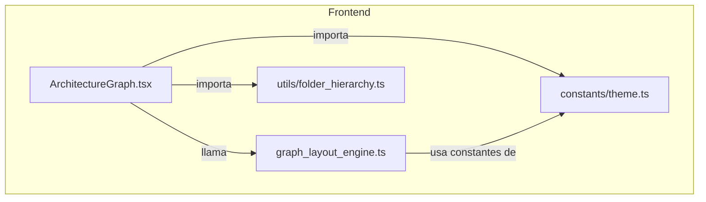
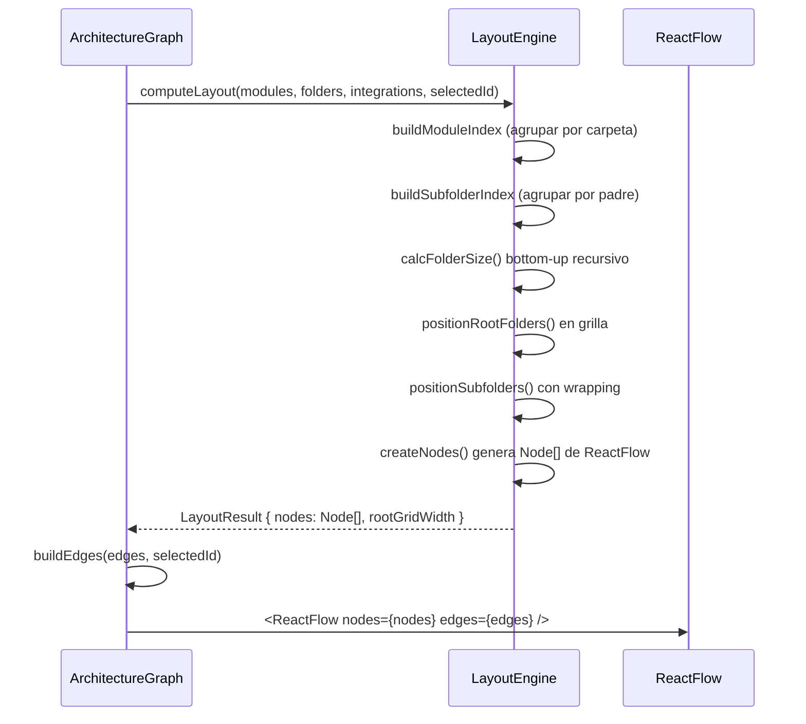

# Design Document: Compact Folder Layout

## Overview

Este diseño reemplaza el algoritmo de layout actual en `buildLayoutNodes()` (dentro de `architecture_graph.tsx`) por uno adaptativo que:

1. **Ajusta columnas dinámicamente** según la cantidad de archivos en cada carpeta (1–4 cols)
2. **Distribuye subcarpetas con wrapping** en múltiples filas cuando exceden el ancho disponible
3. **Calcula tamaños bottom-up**, resolviendo hojas primero y propagando dimensiones hacia arriba
4. **Posiciona carpetas raíz en grilla** (row-major, √N columnas) en lugar de una fila horizontal infinita

El cambio es interno al frontend — no modifica el contrato de datos con el backend ni altera los tipos compartidos. El componente `ArchitectureGraph` sigue recibiendo las mismas props y exponiendo la misma interfaz imperativa (`fitToNode`).

### Decisiones de diseño clave

| Decisión | Rationale |
|----------|-----------|
| Extraer la lógica de layout a un módulo separado (`graph_layout_engine.ts`) | Facilita testing unitario y PBT sin depender de React/ReactFlow |
| Mantener constantes como `FILE_NODE_WIDTH`, `FOLDER_GAP` etc. exportables | Permite que los tests las reutilicen y que el diseño sea paramétrico |
| Bottom-up con memoización en `Map<string, Size>` | Evita recalcular carpetas compartidas y garantiza O(n) en el total de nodos |
| Wrapping greedy (first-fit-decreasing no necesario, orden natural del array) | Preserva el orden alfabético/original de subcarpetas que el usuario espera |

## Architecture

### Diagrama de componentes



### Flujo de datos



## Components and Interfaces

### Módulo: `graph_layout_engine.ts`

Nuevo archivo en `packages/frontend/src/utils/graph_layout_engine.ts` que encapsula toda la lógica de cálculo de posiciones y tamaños.

#### Constantes exportadas

```typescript
// Dimensiones de nodos (ya existentes, se mueven aquí como fuente de verdad)
export const FILE_NODE_WIDTH = 170
export const FILE_NODE_HEIGHT = 36
export const FOLDER_PADDING_X = 20
export const FOLDER_PADDING_Y = 40
export const FOLDER_GAP = 12
export const INTEGRATION_NODE_WIDTH = 150
export const INTEGRATION_NODE_HEIGHT = 50
export const ROOT_GAP = 40
export const MIN_FOLDER_WIDTH = 200
export const MIN_FOLDER_HEIGHT = 60
export const MIN_ROOT_COLS = 2
export const MAX_ROOT_COLS = 5
```

#### Tipos internos

```typescript
export interface Size {
  width: number
  height: number
}

export interface Position {
  x: number
  y: number
}

export interface FolderLayout {
  size: Size
  position: Position
  fileGridHeight: number
  contentWidth: number
}

export interface LayoutResult {
  folderSizes: Map<string, Size>
  folderPositions: Map<string, Position>
  rootGridWidth: number // ancho total de la grilla de raíces (para posicionar integraciones)
}
```

#### Funciones exportadas

```typescript
/**
 * Determina el número de columnas para una cantidad de archivos.
 * - 0 archivos → 0 columnas
 * - 1–3 archivos → N columnas (una sola fila)
 * - 4–8 archivos → 2 columnas
 * - 9–15 archivos → 3 columnas
 * - >15 archivos → 4 columnas
 */
export function getAdaptiveColumns(fileCount: number): number

/**
 * Calcula el ancho de la grilla de archivos dado un número de columnas.
 * width = cols * (FILE_NODE_WIDTH + FOLDER_GAP)
 * Retorna 0 si cols === 0.
 */
export function computeFileGridWidth(cols: number): number

/**
 * Calcula la altura de la grilla de archivos dado fileCount y cols.
 * height = ceil(fileCount / cols) * (FILE_NODE_HEIGHT + FOLDER_GAP)
 * Retorna 0 si fileCount === 0 o cols === 0.
 */
export function computeFileGridHeight(fileCount: number, cols: number): number

/**
 * Dado un array de tamaños de subcarpetas y el contentWidth disponible,
 * distribuye las subcarpetas en filas con wrapping.
 * Retorna un array de filas, cada fila con sus índices y dimensiones.
 */
export interface SubfolderRow {
  indices: number[]      // índices en el array original de subcarpetas
  width: number          // ancho acumulado de la fila (incluyendo gaps)
  height: number         // altura de la subcarpeta más alta en esta fila
}
export function wrapSubfolders(
  subfolderSizes: Size[],
  contentWidth: number
): { rows: SubfolderRow[]; finalContentWidth: number }

/**
 * Calcula el tamaño de una carpeta (bottom-up recursivo con memoización).
 * Usa modulesByFolder y subfoldersByParent como índices pre-computados.
 */
export function calcFolderSize(
  folderId: string,
  modulesByFolder: Map<string, { length: number }>,
  subfoldersByParent: Map<string, string[]>,
  memo: Map<string, Size>
): Size

/**
 * Calcula las posiciones de carpetas raíz en una grilla row-major.
 * Columnas = clamp(ceil(sqrt(count)), MIN_ROOT_COLS, MAX_ROOT_COLS)
 */
export function computeRootGrid(
  rootFolderIds: string[],
  folderSizes: Map<string, Size>
): { positions: Map<string, Position>; totalWidth: number; totalHeight: number }

/**
 * Posiciona subcarpetas dentro de un padre usando el algoritmo de wrapping.
 * Retorna las posiciones relativas al padre.
 */
export function positionSubfoldersInParent(
  parentId: string,
  fileGridHeight: number,
  contentWidth: number,
  subfoldersByParent: Map<string, string[]>,
  folderSizes: Map<string, Size>
): Map<string, Position>

/**
 * Orquesta todo el cálculo de layout. Punto de entrada principal.
 */
export function computeLayout(
  modules: ModuleNode[],
  folders: FolderNode[],
  integrations: IntegrationNode[]
): LayoutResult
```

### Cambios en `architecture_graph.tsx`

El componente actual se simplifica:

1. **Elimina** la función interna `calcFolderSize` y `positionSubfolders`
2. **Importa** `computeLayout` y las constantes desde `graph_layout_engine.ts`
3. **`buildLayoutNodes`** se reduce a:
   - Llamar `computeLayout()` para obtener posiciones y tamaños
   - Iterar folders/modules/integrations para crear los `Node[]` de ReactFlow con estilos
4. La lógica de rendering (colores, íconos, labels JSX) permanece en el componente

## Data Models

### Estructuras de entrada (sin cambios)

Los tipos `ModuleNode`, `FolderNode`, `IntegrationNode`, `GraphEdge` definidos en `types/index.ts` no se modifican. El layout engine los consume como readonly.

### Estructuras internas del layout engine

```typescript
// Índice de módulos agrupados por carpeta padre
type ModuleIndex = Map<string, ModuleNode[]>
// rootModules: ModuleNode[] (los que no tienen parentFolder)

// Índice de subcarpetas agrupadas por padre
type SubfolderIndex = Map<string, FolderNode[]>
// rootFolders: FolderNode[] (sin parentFolder)

// Memoización de tamaños calculados bottom-up
type SizeMemo = Map<string, Size>

// Posiciones finales de todas las carpetas
type PositionMap = Map<string, Position>
```

### Fórmulas de cálculo

| Concepto | Fórmula |
|----------|---------|
| Columnas adaptativas | `fileCount ∈ [1,3] → N; [4,8] → 2; [9,15] → 3; >15 → 4` |
| Ancho grilla archivos | `cols × (FILE_NODE_WIDTH + FOLDER_GAP)` |
| Alto grilla archivos | `⌈fileCount / cols⌉ × (FILE_NODE_HEIGHT + FOLDER_GAP)` |
| Posición archivo (i) | `x = PADDING_X + (i % cols) × (W + GAP)`; `y = PADDING_Y + ⌊i / cols⌋ × (H + GAP)` |
| Content width | `max(fileGridWidth, MIN_FOLDER_WIDTH, widestSubfolderRow)` |
| Folder width | `contentWidth + FOLDER_PADDING_X × 2` |
| Folder height | `fileGridHeight + subfolderRowsHeight + FOLDER_PADDING_Y + FOLDER_PADDING_X` |
| Root cols | `clamp(⌈√rootCount⌉, 2, 5)` |
| Root row height | `max(folder.height for folder in row)` |
| Integration X | `rootGridTotalWidth + ROOT_GAP` |

### Algoritmo de wrapping de subcarpetas (pseudocódigo)

```
function wrapSubfolders(sizes[], contentWidth):
  rows = []
  currentRow = { indices: [], width: 0, height: 0 }
  finalContentWidth = contentWidth

  for i in 0..sizes.length:
    itemWidth = sizes[i].width
    gapNeeded = currentRow.indices.length > 0 ? FOLDER_GAP : 0
    projectedWidth = currentRow.width + gapNeeded + itemWidth

    if currentRow.indices.length > 0 AND projectedWidth > contentWidth:
      // Si el item solo no cabe, expandimos
      if itemWidth > contentWidth:
        finalContentWidth = max(finalContentWidth, itemWidth)
        // Recalcular: reiniciar wrapping con nuevo contentWidth
      rows.push(currentRow)
      currentRow = { indices: [i], width: itemWidth, height: sizes[i].height }
    else:
      currentRow.indices.push(i)
      currentRow.width += gapNeeded + itemWidth
      currentRow.height = max(currentRow.height, sizes[i].height)

  if currentRow.indices.length > 0:
    rows.push(currentRow)

  return { rows, finalContentWidth }
```


## Correctness Properties

*A property is a characteristic or behavior that should hold true across all valid executions of a system — essentially, a formal statement about what the system should do. Properties serve as the bridge between human-readable specifications and machine-verifiable correctness guarantees.*

### Property 1: Adaptive columns formula

*For any* non-negative integer `fileCount`, calling `getAdaptiveColumns(fileCount)` SHALL return:
- `fileCount` when fileCount ∈ [1, 3]
- `2` when fileCount ∈ [4, 8]
- `3` when fileCount ∈ [9, 15]
- `4` when fileCount > 15
- `0` when fileCount === 0

**Validates: Requirements 1.1, 1.2, 1.3, 1.4, 1.7**

### Property 2: File grid width formula

*For any* non-negative integer `fileCount`, the computed file grid width SHALL equal `getAdaptiveColumns(fileCount) × (FILE_NODE_WIDTH + FOLDER_GAP)`, and the total folder width for the file grid SHALL equal that value plus `FOLDER_PADDING_X × 2`.

**Validates: Requirements 1.5**

### Property 3: File node position formula

*For any* folder containing `N` files (N > 0), and for any file at index `i` (0 ≤ i < N), its position within the parent folder SHALL be `x = FOLDER_PADDING_X + (i % cols) × (FILE_NODE_WIDTH + FOLDER_GAP)` and `y = FOLDER_PADDING_Y + floor(i / cols) × (FILE_NODE_HEIGHT + FOLDER_GAP)` where `cols = getAdaptiveColumns(N)`.

**Validates: Requirements 1.6**

### Property 4: Subfolder wrapping validity

*For any* array of subfolder sizes and a positive content width, the result of `wrapSubfolders` SHALL satisfy:
- Every subfolder index appears in exactly one row (completeness and no duplication)
- No row's total width (including inter-item gaps) exceeds `finalContentWidth`, unless the row contains a single oversized item
- Subfolders maintain their original relative order across rows

**Validates: Requirements 2.2, 2.4, 2.5**

### Property 5: Subfolder row Y positioning

*For any* wrapping result with multiple rows, each row's Y offset SHALL equal the sum of all previous rows' heights plus `FOLDER_GAP` per transition, starting from `FOLDER_PADDING_Y + fileGridHeight + FOLDER_GAP` for the first row.

**Validates: Requirements 2.1, 2.3**

### Property 6: Folder size formula

*For any* folder in the tree, the computed size SHALL satisfy:
- `width = max(fileGridWidth, widestSubfolderRow, MIN_FOLDER_WIDTH) + FOLDER_PADDING_X × 2`
- `height = fileGridHeight + totalSubfolderRowsHeight + FOLDER_PADDING_Y + FOLDER_PADDING_X`
- If the folder has no children: `width >= 120` and `height >= 60`

**Validates: Requirements 3.2, 3.3, 3.4, 3.5**

### Property 7: Root grid layout

*For any* set of `N` root folders (N ≥ 1), `computeRootGrid` SHALL:
- Use `clamp(ceil(sqrt(N)), 2, 5)` columns
- Place folders in row-major order (index `i` is at row `floor(i / cols)`, column `i % cols`)
- Set each row's Y to the cumulative sum of previous rows' max-heights plus `ROOT_GAP` per row transition
- Maintain `ROOT_GAP` (40px) horizontal separation between adjacent columns

**Validates: Requirements 4.1, 4.2, 4.3, 4.4**

### Property 8: Integration node separation

*For any* computed layout, every integration node's X position SHALL be ≥ `rootGridTotalWidth + ROOT_GAP`, and no integration node's bounding box SHALL overlap with any folder or file node's bounding box.

**Validates: Requirements 4.5, 5.5**

### Property 9: Parent-child node assignment

*For any* module with a `parentFolder` and any subfolder with a `parentFolder`, the generated ReactFlow `Node` SHALL have its `parentId` property set to that `parentFolder` id.

**Validates: Requirements 5.4**

## Error Handling

### Datos de entrada inválidos

| Situación | Comportamiento |
|-----------|---------------|
| `folders` array vacío | Layout produce solo nodos de integración y módulos sueltos |
| Carpeta con `parentFolder` apuntando a id inexistente | Se trata como carpeta raíz (orphan) |
| Referencia circular en `parentFolder` | Detectada por `computeFolderDepth` existente; se rompe el ciclo tratando el nodo como raíz |
| `modules` con `parentFolder` apuntando a carpeta inexistente | Se posiciona como módulo raíz (sin `parentId` en ReactFlow) |
| Carpeta vacía (sin archivos ni subcarpetas) | Se asigna tamaño mínimo (120×60) |

### Defensas en el algoritmo

- **Memoización con guard**: `calcFolderSize` verifica si el id ya está en el memo antes de recurrir, evitando stack overflow en árboles profundos.
- **Clamp en root columns**: El número de columnas siempre está en [2, 5], evitando grillas degeneradas.
- **Division by zero**: `computeFileGridHeight` retorna 0 cuando `cols === 0` (folder sin archivos).

## Testing Strategy

### Property-Based Testing (PBT)

**Librería:** `fast-check` (ya presente en el proyecto — ver `architecture_graph.test.tsx`)

**Configuración:** Mínimo 100 iteraciones por propiedad.

**Archivo de tests:** `packages/frontend/src/utils/graph_layout_engine.test.ts`

Cada propiedad del diseño se implementa como un único test PBT con tag de referencia:

```typescript
// Feature: compact-folder-layout, Property 1: Adaptive columns formula
// Feature: compact-folder-layout, Property 2: File grid width formula
// Feature: compact-folder-layout, Property 3: File node position formula
// Feature: compact-folder-layout, Property 4: Subfolder wrapping validity
// Feature: compact-folder-layout, Property 5: Subfolder row Y positioning
// Feature: compact-folder-layout, Property 6: Folder size formula
// Feature: compact-folder-layout, Property 7: Root grid layout
// Feature: compact-folder-layout, Property 8: Integration node separation
// Feature: compact-folder-layout, Property 9: Parent-child node assignment
```

### Generadores PBT necesarios

| Generador | Descripción |
|-----------|-------------|
| `fileCountArb` | `fc.integer({ min: 0, max: 500 })` |
| `folderTreeArb` | Genera árboles de carpetas con profundidad 1–5 y archivos 0–30 por carpeta |
| `subfolderSizesArb` | Array de `{ width, height }` con dimensiones realistas (50–400 px) |
| `rootFolderCountArb` | `fc.integer({ min: 1, max: 50 })` |

### Unit Tests (Example-Based)

**Archivo:** `packages/frontend/src/utils/graph_layout_engine.test.ts` (mismos archivo, describe separado)

| Caso | Cubre |
|------|-------|
| Carpeta vacía → size 120×60 | Req 3.4 |
| Carpeta con 1 archivo → 1 columna | Req 1.1 (caso borde) |
| Oversized subfolder expande parent | Req 2.4, 2.5 |
| Integration nodes a la derecha | Req 4.5, 5.5 |

### Integration Tests

**Archivo:** `packages/frontend/src/components/architecture_graph.test.tsx` (extender existente)

| Caso | Cubre |
|------|-------|
| Rendering completo con datos mock | Req 5.1, 5.2, 5.6 |
| Click handler invoca callback | Req 5.3 |
| Nodos hijos tienen parentId correcto en DOM | Req 5.4 |

### Test runner

```bash
npx vitest run packages/frontend/src/utils/graph_layout_engine.test.ts
```

