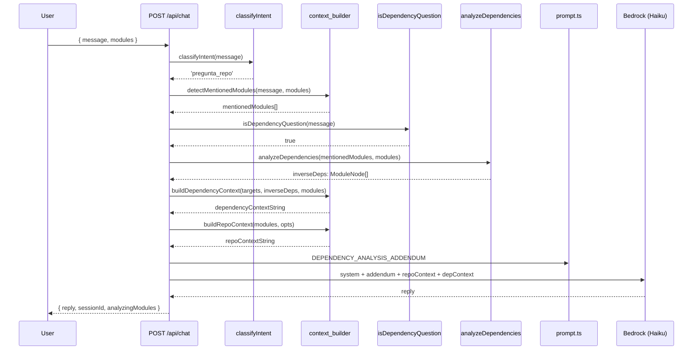

# Design Document: Dependency Analysis Chat

## Overview

Este diseño agrega análisis de dependencias inversas al chat contextual de TrazIA. Cuando un usuario pregunta qué pasaría si elimina un módulo, o quién depende de un módulo específico, el sistema:

1. Detecta que el mensaje es una pregunta de dependencias (`isDependencyQuestion`)
2. Identifica el módulo objetivo usando `detectMentionedModules` (ya existente)
3. Calcula las dependencias inversas recorriendo el array de `ModuleNode[]`
4. Construye un bloque de contexto enriquecido con el resultado
5. Agrega un addendum al prompt para instruir al LLM sobre cómo responder
6. Envía todo al LLM para generar la respuesta final

La feature se integra en el flujo existente del endpoint POST `/api/chat` sin alterar el comportamiento actual para mensajes que no son preguntas de dependencia.

## Architecture



La integración se posiciona **después** de `detectMentionedModules` y **antes** de `buildRepoContext` en el flujo del endpoint. Esto permite que el detector de dependencias use los módulos mencionados como target y que el contexto de dependencias se concatene al contexto general.

## Components and Interfaces

### 1. `isDependencyQuestion(message: string): boolean`

**Ubicación:** `packages/backend/src/agents/chat/context_builder.ts`

Función pura que determina si un mensaje del usuario es una pregunta sobre dependencias o eliminación de módulos. Evalúa patrones como substring case-insensitive y accent-insensitive.

```typescript
// Patrones de eliminación (almacenados normalizados: sin acentos, lowercase)
const DEPENDENCY_DELETION_PATTERNS: string[] = [
  'que pasa si borro',
  'que pasa si elimino',
  'que pasa si quito',
  'que se rompe si borro',
  'que se rompe si elimino',
  'que se rompe si quito',
  'que afecta si borro',
  'que afecta si elimino',
  'que afecta si quito',
]

// Patrones de consulta de dependencias (almacenados normalizados)
const DEPENDENCY_QUERY_PATTERNS: string[] = [
  'dependencias de',
  'quien depende de',
  'quien usa',
  'quien importa',
]

export function isDependencyQuestion(message: string): boolean
```

**Implementación de normalización:**
```typescript
// Normalizar acentos: NFD descompone, luego se eliminan marcas diacríticas
function normalizeAccents(text: string): string {
  return text.normalize('NFD').replace(/[\u0300-\u036f]/g, '')
}
```

**Decisión de diseño:** Se coloca en `context_builder.ts` junto con `isGeneralRepoQuestion` y `detectMentionedModules` porque cumple la misma función de clasificación/detección sobre mensajes. Los patrones se almacenan ya normalizados (sin acentos, lowercase) para evitar normalizarlos en cada invocación — solo se normaliza el mensaje de entrada.

### 2. `analyzeDependencies(targets: ModuleNode[], allModules: ModuleNode[]): ModuleNode[]`

**Ubicación:** `packages/backend/src/agents/chat/context_builder.ts`

Función pura que calcula la unión de dependencias inversas para uno o más módulos objetivo. Recorre `allModules` y retorna aquellos cuyo `dependencies` contiene el ID de algún target.

```typescript
export function analyzeDependencies(
  targets: ModuleNode[],
  allModules: ModuleNode[]
): ModuleNode[]
```

**Invariantes:**
- El resultado nunca contiene un target module
- El resultado no tiene duplicados
- Cada módulo retornado efectivamente importa al menos un target
- El orden preserva el orden de aparición en `allModules`
- `resultado.length <= allModules.length - targets.length`

**Decisión de diseño:** Acepta un array de targets (no uno solo) porque `detectMentionedModules` ya puede retornar múltiples módulos. La unión sin duplicados evita repetir módulos cuando un dependiente importa varios targets a la vez.

### 3. `buildDependencyContext(targets: ModuleNode[], inverseDeps: ModuleNode[], allModules: ModuleNode[]): string`

**Ubicación:** `packages/backend/src/agents/chat/context_builder.ts`

Construye el bloque de texto con el análisis de dependencias para inyectar en el contexto del LLM. El parámetro `allModules` se usa para resolver los nombres/paths de las dependencias directas del target (que están almacenadas como IDs en `target.dependencies`).

```typescript
export function buildDependencyContext(
  targets: ModuleNode[],
  inverseDeps: ModuleNode[],
  allModules: ModuleNode[]
): string
```

**Formato de salida (con dependencias inversas):**
```
=== Análisis de Dependencias: {target.name} ===
Módulos que dependen de {target.name}:
- {dep.name} ({dep.path})
- {dep.name} ({dep.path})
Total de módulos afectados: {N}

Módulos de los que depende:
- {directDep.name} ({directDep.path})
```

**Formato de salida (sin dependencias inversas):**
```
=== Análisis de Dependencias: {target.name} ===
Ningún módulo depende de {target.name}
Total de módulos afectados: 0

Módulos de los que depende:
- {directDep.name} ({directDep.path})
```

### 4. `DEPENDENCY_ANALYSIS_ADDENDUM: string`

**Ubicación:** `packages/backend/src/agents/chat/prompt.ts`

Constante string exportada que se concatena al system prompt cuando se detecta una pregunta de dependencias.

```typescript
export const DEPENDENCY_ANALYSIS_ADDENDUM: string = `El usuario está preguntando sobre dependencias o impacto de eliminar un módulo. Basándote en el análisis de dependencias proporcionado:
- Listá los módulos afectados con nombre y ruta, uno por línea.
- Indicá la cantidad numérica de módulos afectados.
- Si el módulo no tiene dependencias inversas (ningún otro módulo lo importa), indicá explícitamente que no tiene dependencias inversas.
- Explicá brevemente el impacto potencial de la eliminación.`
```

### 5. Integración en `chat.ts` (ruta)

El endpoint POST `/api/chat` agrega un bloque condicional después de la detección de módulos:

```typescript
// --- Nuevo: análisis de dependencias ---
const isDependency = isDependencyQuestion(truncatedMessage)
let dependencyContext = ''

if (isDependency && mentionedModules.length >= 1) {
  try {
    const inverseDeps = analyzeDependencies(mentionedModules, modules)
    dependencyContext = buildDependencyContext(mentionedModules, inverseDeps, modules)
    systemPromptAddendum += `\n${DEPENDENCY_ANALYSIS_ADDENDUM}`
  } catch (error: unknown) {
    console.error(JSON.stringify({
      agente: 'chat-route',
      módulo: 'dependency-analysis',
      error: error instanceof Error ? error.message : 'Error desconocido',
    }))
    // Continuar sin dependency context
  }
}

// El dependencyContext se concatena después del repoContext:
// system: `${CHAT_SYSTEM_PROMPT}${systemPromptAddendum}\n\n--- Contexto ---\n${repoContext}\n${dependencyContext}`
```

## Data Models

No se introducen nuevos tipos. La feature opera sobre los tipos existentes:

### Tipos existentes reutilizados

```typescript
// De shared/types.ts — sin modificaciones
interface ModuleNode {
  id: string              // ruta relativa, usada como clave en dependencies
  name: string            // nombre legible
  type: 'module'
  dependencies: string[]  // IDs de módulos que ESTE módulo importa
  path: string            // ruta relativa completa
  specStatus: SpecStatus
  specHealthScore: number
  sourceContent?: string
  earsSpec?: string
  linesOfCode?: number
  lastModified?: string
}
```

### Relación de dependencia inversa

La dependencia inversa se define por la relación existente en `ModuleNode.dependencies`:

- Si `moduleA.dependencies` contiene `moduleB.id`, entonces `moduleA` **depende de** `moduleB`
- Por lo tanto, `moduleA` es una **dependencia inversa** de `moduleB`
- Si se elimina `moduleB`, `moduleA` se vería afectado

No se almacena un grafo inverso precomputado — se calcula en tiempo real recorriendo el array. Esto es aceptable porque:
1. El array de módulos típico tiene 10-100 elementos (escala de proyecto)
2. El cálculo es O(n × m) donde n=módulos y m=dependencias promedio por módulo
3. Se ejecuta una vez por request de chat, no en hot path

## Correctness Properties

*A property is a characteristic or behavior that should hold true across all valid executions of a system — essentially, a formal statement about what the system should do. Properties serve as the bridge between human-readable specifications and machine-verifiable correctness guarantees.*

### Property 1: Detección round-trip de patrones de dependencia

*For any* known dependency pattern (de eliminación o consulta) concatenado con texto arbitrario antes y/o después, con cualquier combinación de mayúsculas/minúsculas y con o sin acentos, `isDependencyQuestion` SHALL retornar `true`.

**Validates: Requirements 1.1, 1.2, 1.4, 1.6**

### Property 2: Corrección de dependencias inversas

*For any* grafo de módulos generado aleatoriamente (entre 1 y 20 ModuleNode con dependencies válidas referenciando IDs del grafo) y para cualquier target elegido del grafo, todo módulo retornado por `analyzeDependencies` efectivamente contiene `target.id` en su campo `dependencies`.

**Validates: Requirements 2.1**

### Property 3: Exclusión del target en su propio resultado

*For any* grafo de módulos (entre 1 y 20 ModuleNode, incluyendo casos con auto-referencia en dependencies), el Target_Module nunca aparece en el array retornado por `analyzeDependencies`.

**Validates: Requirements 2.4**

### Property 4: Sin duplicados y cota superior en análisis multi-target

*For any* grafo de módulos y cualquier subconjunto de targets (1 a 5 módulos), el resultado de `analyzeDependencies` no contiene IDs duplicados y su longitud es menor o igual a `allModules.length - targets.length`.

**Validates: Requirements 2.5**

### Property 5: Completitud del contexto de dependencias

*For any* target ModuleNode y array de dependencias inversas (0 a 10 ModuleNode), `buildDependencyContext` produce un string que contiene: (a) el encabezado "=== Análisis de Dependencias: {nombre} ===", (b) el nombre y path de cada dependencia inversa (o "Ningún módulo depende de {nombre}" si no hay inversas), (c) "Total de módulos afectados: {N}" donde N iguala la cantidad de inversas, y (d) la sección "Módulos de los que depende:" listando las dependencias directas del target.

**Validates: Requirements 3.1, 3.2, 3.3, 3.4, 3.5**

## Error Handling

### `isDependencyQuestion`

| Caso | Comportamiento |
|------|----------------|
| Mensaje vacío, null, undefined, o solo whitespace | Retorna `false` sin error |
| Mensaje con caracteres Unicode no-latinos | Normaliza con NFD, evalúa patrones normalmente |

### `analyzeDependencies`

| Caso | Comportamiento |
|------|----------------|
| `targets` es array vacío | Retorna `[]` |
| `allModules` es array vacío | Retorna `[]` |
| Target cuyo ID no existe en ningún `dependencies` | Retorna `[]` |
| Módulo con auto-referencia en `dependencies` | Se excluye del resultado |

### `buildDependencyContext`

| Caso | Comportamiento |
|------|----------------|
| `inverseDeps` vacío | Genera texto "Ningún módulo depende de {nombre}" |
| `targets` vacío | Retorna string vacío |
| Target con `dependencies: []` | Sección "Módulos de los que depende" muestra "ninguna" |

### Orquestación en `chat.ts`

| Caso | Comportamiento |
|------|----------------|
| `analyzeDependencies` o `buildDependencyContext` lanzan error | Log con `{ agente, módulo, error }`, continúa flujo normal |
| `isDependencyQuestion` retorna `true` pero `mentionedModules` vacío | Ignora branch de dependencias, usa flujo existente |
| Mensaje no es pregunta de dependencia | Flujo idéntico al actual |

Formato de logging consistente con el proyecto:
```typescript
console.error(JSON.stringify({
  agente: 'chat-route',
  módulo: 'dependency-analysis',
  error: error instanceof Error ? error.message : 'Error desconocido',
}))
```

## Testing Strategy

### Enfoque: Property-based + Unit + Integration

La feature es ideal para property-based testing porque las funciones core son puras, con input spaces amplios y propiedades universales verificables.

**Librería PBT:** `fast-check` (ya instalada en el proyecto)
**Runner:** Jest (configuración existente)
**Configuración:** mínimo 100 iteraciones por property test (`{ numRuns: 100 }`)
**Tag format:** `Feature: dependency-analysis-chat, Property {N}: {título}`

### Property Tests (fast-check)

**Archivo:** `packages/backend/src/agents/chat/context_builder.dependency.property.test.ts`

| Property | Función bajo test | Qué genera |
|----------|-------------------|------------|
| 1: Round-trip detección | `isDependencyQuestion` | Patrón aleatorio + texto arbitrario alrededor, case/accent random |
| 2: Corrección inversas | `analyzeDependencies` | Grafos aleatorios (1-20 nodos, deps válidas) |
| 3: Exclusión target | `analyzeDependencies` | Grafos con auto-referencias forzadas |
| 4: Sin duplicados + cota | `analyzeDependencies` | Grafos + múltiples targets |
| 5: Completitud contexto | `buildDependencyContext` | Targets + inverseDeps aleatorios |

**Generador de grafo para fast-check:**
```typescript
const moduleGraphArb = (minSize: number, maxSize: number) =>
  fc.integer({ min: minSize, max: maxSize }).chain(size => {
    const ids = Array.from({ length: size }, (_, i) => `src/mod${i}.ts`)
    return fc.tuple(
      ...ids.map((id, i) =>
        fc.record({
          id: fc.constant(id),
          name: fc.constant(`mod${i}`),
          type: fc.constant('module' as const),
          dependencies: fc.subarray(ids, { maxLength: 5 }),
          path: fc.constant(id),
          specStatus: fc.constantFrom(
            'traced' as const, 'drift' as const, 'untraced' as const, 'na' as const
          ),
          specHealthScore: fc.integer({ min: 0, max: 100 }),
        })
      )
    )
  })
```

### Unit Tests (Jest)

**Archivo:** Se extiende `packages/backend/src/agents/chat/context_builder.test.ts`

- `isDependencyQuestion`: cada patrón individual, variantes case/accents, mensaje vacío, mensaje sin patrón
- `analyzeDependencies`: grafo lineal A→B→C, self-reference, múltiples targets, array vacío
- `buildDependencyContext`: formato con inversas, sin inversas, target sin deps directas
- `DEPENDENCY_ANALYSIS_ADDENDUM`: smoke test — string no vacío con keywords esperadas

### Integration Tests (supertest)

**Archivo:** Se extiende `packages/backend/src/routes/chat.test.ts`

- Flujo completo: mensaje de dependencia + módulos → HTTP 200, system prompt contiene addendum y dep context
- Mensaje de dependencia sin módulos mencionados → flujo normal
- Mensaje normal → comportamiento idéntico al actual (regresión)
- Error en análisis → HTTP 200, flujo normal sin dep context
