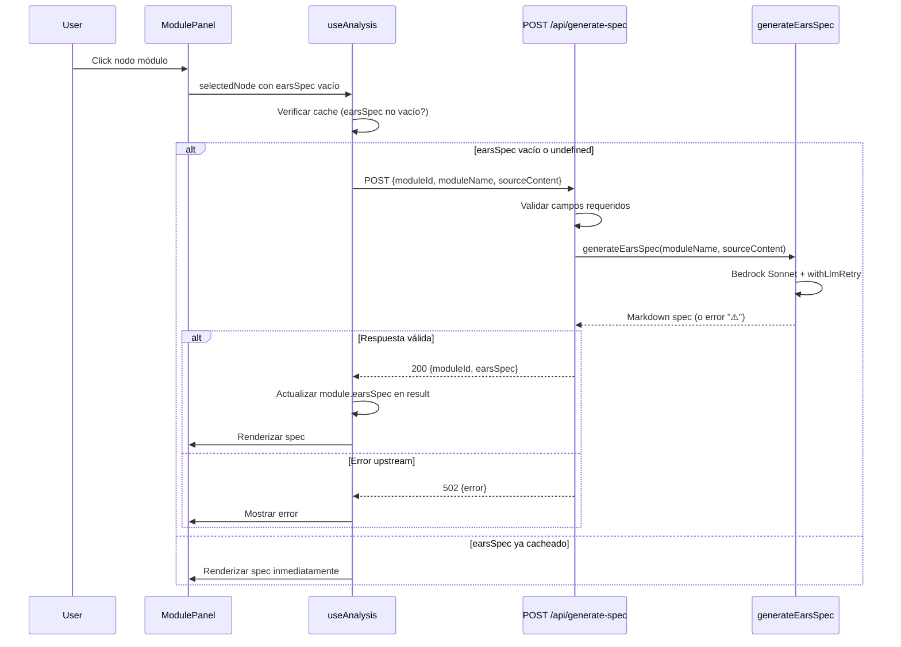

# Design Document: EARS On-Demand

## Overview

Este feature transforma la generación de specs EARS de un proceso batch (ejecutado para todos los módulos dentro del pipeline de análisis) a un proceso on-demand (ejecutado individualmente cuando el usuario selecciona un módulo en el grafo).

**Problema actual:** El pipeline POST `/api/analyze` invoca `generateEarsSpecs(modules)` para todos los módulos detectados, llamando a Claude Sonnet vía Bedrock por cada uno. Esto agrega ~2-3 minutos al análisis, bloqueando la respuesta al usuario.

**Solución:** Remover la generación batch del pipeline de análisis y exponer un endpoint dedicado POST `/api/generate-spec` que genera la spec para un solo módulo. El frontend dispara esta llamada automáticamente cuando el usuario abre el panel de un módulo sin spec, y cachea el resultado localmente.

**Decisiones clave:**
1. Reusar `generateEarsSpec(moduleName, sourceContent)` sin modificaciones — ya maneja reintentos y errores internamente
2. El frontend envía `sourceContent` directamente (ya disponible en el `AnalysisResult`), evitando que el backend tenga que clonar el repo nuevamente
3. La generación no modifica `specStatus` ni `specHealthScore` — esos valores los clasifica Haiku en el análisis y son inmutables desde la perspectiva de este feature

## Architecture



### Componentes afectados

| Capa | Archivo | Cambio |
|------|---------|--------|
| Backend route | `routes/analyze.ts` | Remover paso 4 (`generateEarsSpecs`) |
| Backend route | `routes/generate_spec.ts` | Implementar endpoint (reemplazar stub 501) |
| Frontend hook | `hooks/use_analysis.ts` | Cambiar contrato de `generateSpec`, auto-trigger, cache |
| Frontend types | `types/index.ts` | Agregar `sourceContent` a `ModuleNode`, actualizar `GenerateSpecResponse` |
| Frontend component | `components/module_panel.tsx` | Auto-trigger generación al abrir, mostrar spec |

## Components and Interfaces

### Backend: POST `/api/generate-spec` (generate_spec.ts)

**Request:**
```typescript
interface GenerateSpecRequest {
  moduleId: string       // ruta relativa del módulo (ej: "src/agents/analyzer/analyzer.ts")
  moduleName: string     // nombre legible del módulo
  sourceContent: string  // código fuente truncado (máx 100,000 chars)
}
```

**Responses:**

| Status | Body | Condición |
|--------|------|-----------|
| 200 | `{ moduleId: string, earsSpec: string }` | Generación exitosa |
| 400 | `{ error: string }` | Campos faltantes, vacíos o sourceContent > 100K chars |
| 502 | `{ error: string }` | `generateEarsSpec` retornó string con prefijo `> ⚠️` |

**Lógica interna:**
1. Parsear body y validar campos requeridos (non-empty strings)
2. Validar `sourceContent.length <= 100_000`
3. Invocar `generateEarsSpec(moduleName, sourceContent)`
4. Si el resultado empieza con `> ⚠️` → responder 502
5. Si no → responder 200 con `{ moduleId, earsSpec: resultado }`

### Backend: POST `/api/analyze` (analyze.ts) — Modificaciones

**Cambio:** Eliminar paso 4 completo (la llamada a `generateEarsSpecs(modules)`) y pasar `modules` directamente al orquestador. El campo `earsSpec` de cada módulo queda como `""` (ya es el default cuando no se genera).

**Antes:**
```typescript
// Paso 4: Generar specs EARS para cada módulo
const modulesWithSpecs = await generateEarsSpecs(modules)
// Paso 5: Orquestar
const result = buildAnalysisResult(repoUrl, modulesWithSpecs, integrations)
```

**Después:**
```typescript
// Paso 4: Orquestar — combinar estructura + integraciones en el grafo final
const result = buildAnalysisResult(repoUrl, modules, integrations)
```

El import de `generateEarsSpecs` también se elimina del archivo.

### Frontend: `useAnalysis` hook — Cambios

**Cambios en `generateSpec`:**
1. **Parámetro:** Recibe solo `moduleId: string` (busca `moduleName` y `sourceContent` del módulo en `result.modules`)
2. **Request body:** Envía `{ moduleId, moduleName, sourceContent }` en lugar de `{ moduleId, repoUrl }`
3. **Response mapping:** Actualiza `module.earsSpec` (no `specContent`) y NO modifica `specStatus` ni `specHealthScore`
4. **Cache check:** Si el módulo ya tiene `earsSpec` non-empty, retorna sin hacer request
5. **Timeout:** Usar `AbortController` con 30s timeout
6. **Sin retry de api_client:** La llamada a `/api/generate-spec` debe usar `{ skipRetry: true }` (o una instancia de axios sin el interceptor de retry) para evitar que un 502 sea reintentado automáticamente por `isRetryableError`. Razón: un 502 aquí significa que Sonnet falló tras los reintentos internos de `withLlmRetry`; reintentar a nivel HTTP dispararía otra generación de ~10s innecesaria.

**Opciones de implementación para skip-retry:**
- **Opción A (preferida):** Agregar un header custom `X-Skip-Retry: true` que el interceptor de `api_client` chequea antes de reintentar. Mínimo acoplamiento, no requiere instancia separada.
- **Opción B:** Pasar un `config` con un flag custom en `axios.post('/api/generate-spec', body, { __skipRetry: true })` y chequearlo en el interceptor.
- **Nota:** Esto debe coordinarse con el spec `bedrock-hardening` que modifica el mismo interceptor. El mecanismo de skip debe ser compatible con los reintentos que ese spec agrega para `/api/analyze`.

**Nuevo tipo de response:**
```typescript
interface GenerateSpecResponse {
  moduleId: string
  earsSpec: string  // Markdown de la spec EARS generada
}
```

### Frontend: `ModuleNode` type — Campos nuevos

```typescript
export interface ModuleNode {
  // ... campos existentes ...
  sourceContent?: string  // código fuente (truncado a 4000 chars), presente tras análisis
  earsSpec?: string       // spec EARS generada on-demand, undefined hasta que se genera
}
```

### Frontend: `ModulePanel` — Auto-trigger con protección anti-loop

El auto-trigger se implementa con un `useEffect` keyeado al `moduleId` del nodo seleccionado, con un flag de error local que bloquea reintentos automáticos:

```typescript
// Estado local para bloquear auto-trigger tras error
const [specErrorModules, setSpecErrorModules] = useState<Set<string>>(new Set())

useEffect(() => {
  if (!selectedNode || selectedNode.type !== 'module') return
  const module = selectedNode as ModuleNode
  // Guards: no disparar si ya tiene spec, si no hay sourceContent, si ya falló, o si ya está generando
  if (module.earsSpec) return
  if (!module.sourceContent) return
  if (specErrorModules.has(module.id)) return
  if (generatingSpec === module.id) return
  
  generateSpec(module.id)
}, [selectedNode?.id]) // keyeado SOLO al id, no a otros campos que cambien por render
```

**Reglas de seguridad:**
1. **Key estricto por moduleId:** El effect se dispara UNA vez por selección de módulo, no en cada render. La dependency es `selectedNode?.id`.
2. **Bloqueo tras error:** Si `generateSpec` falla (502, timeout, error de red), se agrega el `moduleId` al set `specErrorModules`. El auto-trigger NO reintenta automáticamente. El usuario debe clickear un botón "Reintentar" que limpia el error del set y vuelve a disparar manualmente.
3. **Guard de sourceContent vacío:** Si el módulo no tiene `sourceContent` (por ejemplo, un archivo binario o demasiado grande que no se leyó), NO se dispara el auto-trigger. En su lugar se muestra un cartel: "No hay código fuente disponible para generar la spec".
4. **Guard de generación en curso:** Si `generatingSpec === module.id`, no se duplica la llamada.

**Flujo post-error:**
- El módulo queda con un badge de error visible en el panel
- Aparece un botón "Reintentar" que al clickear: remueve del set de errores y llama a `generateSpec(moduleId)` explícitamente
- NO se reintenta automáticamente al cerrar y reabrir el panel (el set de errores persiste en la sesión)

## Data Models

### Contrato JSON: Cambios al `AnalysisResult`

El campo `sourceContent` que actualmente es "temporal del pipeline" pasa a incluirse en la respuesta JSON al frontend:

```typescript
// En el backend shared/types.ts — el comentario de sourceContent cambia:
sourceContent?: string  // contenido del archivo, truncado a 4000 chars — incluido en respuesta al frontend
```

No se crean nuevas tablas ni modelos persistentes. La spec generada vive exclusivamente en memoria del frontend (state de React) hasta que se recarga la página.

### Flujo de datos completo


## Correctness Properties

*A property is a characteristic or behavior that should hold true across all valid executions of a system — essentially, a formal statement about what the system should do. Properties serve as the bridge between human-readable specifications and machine-verifiable correctness guarantees.*

### Property 1: Source content truncation preserves prefix

*For any* file content string, the truncation applied before including `sourceContent` in the analysis response SHALL produce a string that is at most 4000 characters long AND is a prefix of the original string (i.e., `original.startsWith(truncated)` is true).

**Validates: Requirements 1.3**

### Property 2: Valid request with successful agent produces correct 200 response

*For any* valid request body (non-empty strings `moduleId`, `moduleName`, `sourceContent` where `sourceContent.length <= 100_000`) where `generateEarsSpec` returns a string that does NOT start with `> ⚠️`, the endpoint SHALL respond with HTTP 200 and a JSON body where `moduleId` equals the input `moduleId` and `earsSpec` equals the string returned by `generateEarsSpec`.

**Validates: Requirements 2.1, 5.3**

### Property 3: Invalid request produces 400 with field indication

*For any* request body where at least one required field (`moduleId`, `moduleName`, `sourceContent`) is missing, is not a string, is an empty string, or where `sourceContent` exceeds 100,000 characters, the endpoint SHALL respond with HTTP 400 and a JSON body containing an `error` field that indicates which validation rule failed.

**Validates: Requirements 2.2, 2.5**

### Property 4: Agent error prefix maps to 502

*For any* valid request where `generateEarsSpec` returns a string that starts with `> ⚠️`, the endpoint SHALL respond with HTTP 502 and a JSON body containing an `error` field that includes the failure message from the returned string.

**Validates: Requirements 2.3, 5.2**

### Property 5: Request gating by earsSpec presence

*For any* module in the local state, the frontend hook SHALL issue a POST `/api/generate-spec` request if and only if the module's `earsSpec` field is undefined or an empty string. If `earsSpec` is a non-empty string, no HTTP request SHALL be issued.

**Validates: Requirements 3.1, 4.2**

### Property 6: Successful spec storage preserves specStatus

*For any* module and any successfully generated `earsSpec` string, updating the local state with the new spec SHALL set `module.earsSpec` to the received value AND SHALL NOT modify `module.specStatus` or `module.specHealthScore`.

**Validates: Requirements 3.5, 4.1**

### Property 7: Error message truncation

*For any* error message string, when displayed in the Module Panel, the rendered text SHALL be at most 200 characters long. If the original message exceeds 200 characters, only the first 200 characters followed by "…" SHALL be shown.

**Validates: Requirements 3.6**

### Property 8: Auto-trigger fires at most once per module selection

*For any* module selection event, the auto-trigger `useEffect` SHALL invoke `generateSpec` at most once. Subsequent re-renders with the same `selectedNode.id` SHALL NOT re-invoke `generateSpec`, regardless of changes to other state variables.

**Validates: Requirements 3.2, 3.9**

### Property 9: Error state blocks auto-trigger

*For any* module in the `specErrorModules` set, the auto-trigger SHALL NOT invoke `generateSpec` automatically. The only way to re-trigger generation for that module is an explicit user action (clicking "Reintentar"), which first removes the module from the error set.

**Validates: Requirements 3.7**

### Property 10: Empty sourceContent blocks auto-trigger

*For any* module whose `sourceContent` field is undefined or empty string, the auto-trigger SHALL NOT invoke `generateSpec` and the Module Panel SHALL display an informational message instead of a spinner.

**Validates: Requirements 3.8**

## Error Handling

### Backend — POST `/api/generate-spec`

| Escenario | HTTP Status | Cuerpo | Acción |
|-----------|-------------|--------|--------|
| Campos faltantes o vacíos | 400 | `{ error: "Campo 'X' es requerido y debe ser un string no vacío" }` | Retornar inmediatamente sin invocar agente |
| sourceContent > 100K chars | 400 | `{ error: "sourceContent excede el límite de 100,000 caracteres" }` | Retornar inmediatamente |
| `generateEarsSpec` retorna `> ⚠️ ...` | 502 | `{ error: "Error upstream al generar spec: <mensaje>" }` | Propagar error del agente al cliente |
| Excepción no capturada | 500 | `{ error: "Error interno al generar spec" }` | Catch genérico, loggear con contexto |

### Backend — POST `/api/analyze` (cambios)

Sin cambios en error handling. Al remover el paso de EARS, se eliminan los errores de Sonnet del pipeline de análisis. Los errores de Haiku (clasificación) y del cloneo siguen manejándose igual.

### Frontend — `useAnalysis` hook

| Escenario | Comportamiento |
|-----------|----------------|
| Timeout (30s) | `AbortController.abort()`, marcar módulo en `specErrorModules`, mostrar mensaje de timeout |
| HTTP 400 | Mostrar error del servidor (campo `error` del body), marcar en `specErrorModules` |
| HTTP 502 | Mostrar "Error al generar spec" + detalle del servidor, marcar en `specErrorModules`. NO reintentar (skip retry en api_client) |
| Error de red | Mostrar "No se pudo conectar con el servidor", marcar en `specErrorModules` |
| Generación duplicada | Ignorar si `generatingSpec === moduleId` |
| sourceContent vacío/undefined | NO disparar request, mostrar cartel "No hay código fuente disponible" |
| Módulo en `specErrorModules` | NO auto-trigger, mostrar error previo + botón "Reintentar" |

## Testing Strategy

### Enfoque dual: Unit Tests + Property-Based Tests

**Property-Based Tests** (usando `fast-check` con Jest):
- Mínimo 100 iteraciones por propiedad
- Cada test referencia la propiedad del diseño en un tag comment
- Se mockea `generateEarsSpec` para aislar la lógica del endpoint de la llamada a Bedrock

**Unit Tests** (Jest):
- Tests de integración para el flujo completo del endpoint con mocks
- Tests del hook `useAnalysis` con React Testing Library
- Tests del componente `ModulePanel` para auto-trigger y rendering

### Distribución de tests

| Propiedad | Tipo | Ubicación |
|-----------|------|-----------|
| Property 1: Truncation | Property (fast-check) | `packages/backend/src/shared/__tests__/truncation.property.test.ts` |
| Property 2: Valid → 200 | Property (fast-check) | `packages/backend/src/routes/__tests__/generate_spec.property.test.ts` |
| Property 3: Invalid → 400 | Property (fast-check) | `packages/backend/src/routes/__tests__/generate_spec.property.test.ts` |
| Property 4: Error → 502 | Property (fast-check) | `packages/backend/src/routes/__tests__/generate_spec.property.test.ts` |
| Property 5: Request gating | Property (fast-check) | `packages/frontend/src/hooks/__tests__/use_analysis.property.test.ts` |
| Property 6: Store preserves status | Property (fast-check) | `packages/frontend/src/hooks/__tests__/use_analysis.property.test.ts` |
| Property 7: Error truncation | Property (fast-check) | `packages/frontend/src/components/__tests__/module_panel.property.test.ts` |

### Unit tests adicionales (example-based)

- `analyze.test.ts`: Verificar que el pipeline no invoca `generateEarsSpecs` y retorna `earsSpec: ""`
- `generate_spec.test.ts`: Happy path con mock real, timeout scenario
- `use_analysis.test.ts`: Deduplicación de requests, cache invalidation en reset/analyzeRepo
- `module_panel.test.ts`: Spinner display, auto-trigger, cache hit rendering

### Configuración

- **Library:** `fast-check` (ya usada como standard para PBT en TypeScript/Jest)
- **Runner:** Jest (ya configurado en el proyecto)
- **Iteraciones:** 100 mínimo por propiedad
- **Tag format:** `// Feature: ears-on-demand, Property N: <texto de la propiedad>`
