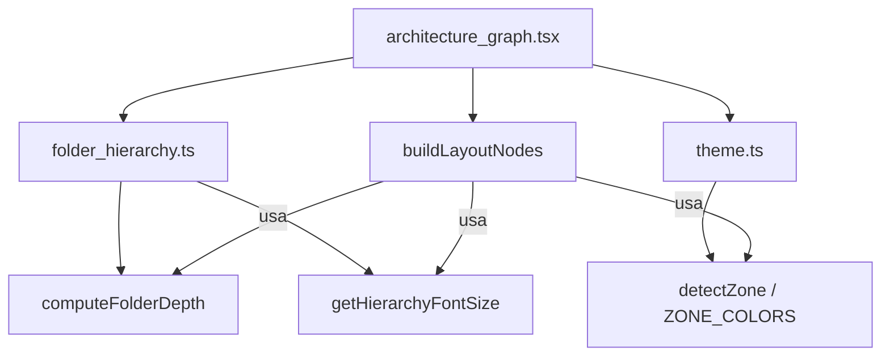

# Design Document: folder-node-hierarchy-titles

## Overview

Esta feature introduce títulos con jerarquía tipográfica en los nodos de carpeta del grafo interactivo de arquitectura. Actualmente, las carpetas muestran una etiqueta posicionada con `position: absolute` (top: 8, left: 12) con un tamaño fijo de 0.75rem. El nuevo diseño reemplaza esa etiqueta con un título centrado cuyo tamaño de fuente varía según la profundidad del nodo en el árbol jerárquico, siguiendo la convención de encabezados HTML (h1–h6).

El cambio principal es la extracción de una función pura `computeFolderDepth()` que calcula la profundidad de cada carpeta recorriendo la cadena de `parentFolder`, y una función de mapeo `getHierarchyFontSize()` que traduce profundidad a tamaño tipográfico. Ambas funciones son puras y altamente testeables. El renderizado del título se modifica para consumir estos valores y centrarse horizontalmente en la cabecera del nodo.

## Architecture

La feature se implementa enteramente en el paquete `packages/frontend/` sin cambios en el backend ni en los tipos compartidos. La estructura lógica se organiza en:



**Decisión de diseño:** Las funciones `computeFolderDepth` y `getHierarchyFontSize` se extraen a un archivo utilitario separado (`folder_hierarchy.ts`) en lugar de quedar inline en `buildLayoutNodes`. Esto permite:
1. Testeo unitario y property-based testing sin montar React
2. Reutilización si otros componentes necesitan conocer la profundidad
3. Separación clara entre lógica de cálculo y lógica de renderizado

## Components and Interfaces

### Nuevo archivo: `packages/frontend/src/utils/folder_hierarchy.ts`

```typescript
import type { FolderNode } from '../types'

/** Escala tipográfica: depth → fontSize en rem */
export const HIERARCHY_FONT_SIZES: readonly string[] = [
  '1.5rem',   // depth 1 (raíz)
  '1.25rem',  // depth 2
  '1.0rem',   // depth 3
  '0.875rem', // depth 4
  '0.8rem',   // depth 5
  '0.75rem',  // depth 6+
]

/**
 * Calcula la profundidad de una carpeta en el árbol jerárquico.
 * - Carpeta sin parentFolder → depth 1
 * - parentFolder inexistente → depth 1 (orphan)
 * - Referencia circular → depth 1 (safety)
 * - Caso normal → parent.depth + 1
 */
export function computeFolderDepth(
  folderId: string,
  foldersMap: ReadonlyMap<string, FolderNode>
): number

/**
 * Devuelve el fontSize correspondiente a un nivel de profundidad.
 * Clampea a nivel 6 (índice 5) para depths > 6.
 */
export function getHierarchyFontSize(depth: number): string
```

### Modificación: `packages/frontend/src/components/architecture_graph.tsx`

Dentro de `buildLayoutNodes()`, la sección que crea los nodos de carpeta se modifica para:
1. Construir un `Map<string, FolderNode>` a partir del array `folders`
2. Llamar a `computeFolderDepth(folder.id, foldersMap)` para cada carpeta
3. Llamar a `getHierarchyFontSize(depth)` para obtener el tamaño
4. Renderizar el título centrado con el fontSize resultante

### Interfaz del título renderizado (JSX)

```tsx
<div style={{
  position: 'absolute',
  top: 0,
  left: 0,
  right: 0,
  height: FOLDER_PADDING_Y,        // 40px
  display: 'flex',
  alignItems: 'center',
  justifyContent: 'center',
  gap: 4,
  overflow: 'hidden',
}}>
  <span style={{ fontSize: hierarchyFontSize, lineHeight: 1 }}>📁</span>
  <span style={{
    fontWeight: 700,
    fontSize: hierarchyFontSize,
    color: colors.text,
    opacity: 0.9,
    whiteSpace: 'nowrap',
    overflow: 'hidden',
    textOverflow: 'ellipsis',
    maxWidth: `calc(100% - 2rem)`,
  }}>
    {folder.name}
  </span>
</div>
```

## Data Models

No se introducen nuevas interfaces ni se modifican tipos existentes. La feature consume los tipos ya definidos:

| Tipo | Uso |
|------|-----|
| `FolderNode` | Input principal; usa `id`, `name`, `path`, `parentFolder` |
| `ZONE_COLORS` | Obtención del color de texto por zona |
| `detectZone()` | Determina la zona a partir de `folder.path` |

**Constantes nuevas** (en `folder_hierarchy.ts`):

| Constante | Valor | Propósito |
|-----------|-------|-----------|
| `HIERARCHY_FONT_SIZES` | `['1.5rem', '1.25rem', '1.0rem', '0.875rem', '0.8rem', '0.75rem']` | Escala de tamaños indexada por depth-1 |
| `MAX_HIERARCHY_DEPTH` | `6` | Profundidad máxima para la escala tipográfica |

## Correctness Properties

*A property is a characteristic or behavior that should hold true across all valid executions of a system — essentially, a formal statement about what the system should do. Properties serve as the bridge between human-readable specifications and machine-verifiable correctness guarantees.*

### Property 1: Depth calculation invariant

*For any* valid tree of FolderNodes (acyclic, with all parentFolder references pointing to existing nodes), the depth of each folder SHALL equal the number of its ancestors in the parentFolder chain plus one.

**Validates: Requirements 1.1, 1.2, 2.9**

### Property 2: Depth-to-fontSize mapping is correct and capped

*For any* positive integer depth, `getHierarchyFontSize(depth)` SHALL return `HIERARCHY_FONT_SIZES[min(depth, 6) - 1]`, ensuring depths greater than 6 always map to the same font size as depth 6 (0.75rem).

**Validates: Requirements 1.3, 2.2, 2.3, 2.4, 2.5, 2.6, 2.7, 2.8**

### Property 3: Title always contains the folder name

*For any* FolderNode with a non-empty name, the rendered Hierarchy_Title SHALL contain the folder name as text content (either fully or truncated with ellipsis if it overflows).

**Validates: Requirements 2.1, 3.3**

### Property 4: Zone color consistency

*For any* FolderNode, the text color applied to the Hierarchy_Title SHALL equal `ZONE_COLORS[detectZone(folder.path)].text`.

**Validates: Requirements 4.1**

## Error Handling

| Escenario | Comportamiento |
|-----------|----------------|
| `parentFolder` apunta a un ID inexistente | `computeFolderDepth` retorna 1 (trata como raíz) |
| Referencia circular en la cadena de `parentFolder` | `computeFolderDepth` detecta el ciclo (set de visitados) y retorna 1 |
| Profundidad > 6 | `getHierarchyFontSize` clampea al índice 5 (0.75rem) |
| Nombre de carpeta vacío | Se renderiza solo el ícono 📁 sin texto |
| Nombre de carpeta extremadamente largo | CSS `text-overflow: ellipsis` + `overflow: hidden` trunca visualmente |

La detección de ciclos usa un `Set<string>` de IDs visitados durante el recorrido ascendente. Si el ID actual ya está en el set, se aborta y retorna depth 1. Esto garantiza O(n) en el peor caso sin riesgo de stack overflow.

## Testing Strategy

### Property-Based Tests (fast-check + vitest)

Se usa `fast-check` (ya disponible como devDependency) para validar las propiedades de correctness con mínimo 100 iteraciones por propiedad.

**Archivo:** `packages/frontend/src/utils/folder_hierarchy.test.ts`

| Propiedad | Generador | Verificación |
|-----------|-----------|--------------|
| Property 1: Depth invariant | Árboles aleatorios de FolderNodes (1-20 nodos, depth 1-10, incluye orphans y ciclos) | `depth(node) === ancestors(node).length + 1` para árboles válidos; `depth === 1` para orphans/ciclos |
| Property 2: fontSize mapping | Enteros aleatorios 1-100 | `getHierarchyFontSize(d) === HIERARCHY_FONT_SIZES[Math.min(d, 6) - 1]` |
| Property 3: Title contains name | Strings unicode aleatorios (1-200 chars) como nombre de carpeta | El output del render contiene el nombre o tiene ellipsis |
| Property 4: Zone color | Paths aleatorios (combinaciones de segmentos típicos) | Color aplicado === `ZONE_COLORS[detectZone(path)].text` |

**Configuración:**
- Mínimo 100 iteraciones por test (`{ numRuns: 100 }`)
- Cada test etiquetado con: `// Feature: folder-node-hierarchy-titles, Property N: <texto>`

### Unit Tests (example-based)

**Archivo:** `packages/frontend/src/utils/folder_hierarchy.test.ts` (mismo archivo)

| Test | Escenario |
|------|-----------|
| Carpeta raíz sin parent | depth = 1, fontSize = 1.5rem |
| Cadena de 3 niveles | depths = [1, 2, 3] |
| Cadena de 8 niveles | depth 7 y 8 mapean a 0.75rem |
| Parent inexistente (orphan) | depth = 1 |
| Referencia circular A→B→A | ambas depth = 1 |
| Auto-referencia A→A | depth = 1 |

### Integration Tests (rendering)

**Archivo:** `packages/frontend/src/components/architecture_graph.test.tsx`

| Test | Verificación |
|------|--------------|
| Folder node renderiza título centrado | Container tiene `justifyContent: center` |
| Ícono 📁 presente con gap 4px | Estructura del DOM correcta |
| fontWeight 700 y opacity 0.9 | Estilos inline aplicados |
| Texto largo se trunca | `textOverflow: 'ellipsis'` en el span |
