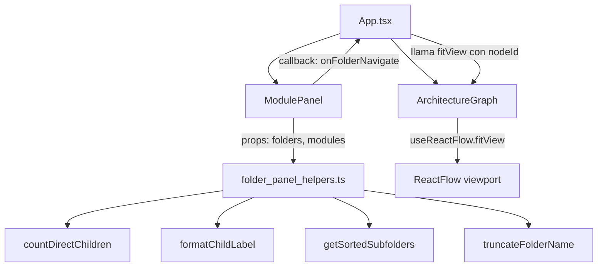

# Design Document: folder-panel-content

## Overview

Esta feature mejora el `ModulePanel` (panel lateral derecho) cuando se selecciona un nodo de carpeta, reemplazando el contador genérico "X elementos directos" por un contenido más detallado:

1. **Conteo desglosado** que muestra las carpetas directas y archivos directos por separado, con pluralización correcta en español
2. **Lista de subcarpetas** renderizada como botones clicables, ordenados alfabéticamente por nombre
3. **Navegación click-to-center** que centra el viewport del grafo en la subcarpeta seleccionada al hacer click en su botón

El cambio se localiza enteramente en el frontend (`packages/frontend/src/`). Se extraen funciones puras para contar hijos, formatear labels y ordenar subcarpetas, facilitando testing sin dependencias de React.

## Architecture



**Decisiones de diseño:**

1. **Funciones puras en archivo utilitario (`folder_panel_helpers.ts`)** — Las funciones de conteo, formateo, ordenamiento y truncado se extraen a `packages/frontend/src/utils/folder_panel_helpers.ts`. Esto permite property-based testing sin montar React y es consistente con el patrón establecido en `folder_hierarchy.ts`.

2. **Callback `onFolderNavigate` propagado desde App** — Cuando se hace click en un botón de subcarpeta, el `ModulePanel` invoca un callback que sube a `App.tsx`. Allí se actualiza `selectedNode` y se invoca la función de centrado del grafo. Esto mantiene el estado centralizado en App y evita acoplar ModulePanel con react-flow.

3. **`useReactFlow().fitView()` con filtro por nodo** — Para centrar el viewport en una carpeta específica, se usa `fitView({ nodes: [{ id: targetId }], duration: 800, padding: 0.15 })` desde dentro de `GraphContent` (que ya está envuelto en `ReactFlowProvider`). Se expone una ref o callback imperativo desde `ArchitectureGraph` para que App pueda disparar el centrado.

## Components and Interfaces

### Nuevo archivo: `packages/frontend/src/utils/folder_panel_helpers.ts`

```typescript
import type { FolderNode, ModuleNode } from '../types'

/** Resultado del conteo de hijos directos de una carpeta */
export interface DirectChildCounts {
  folders: number
  files: number
}

/**
 * Cuenta las carpetas y archivos directos de una carpeta dada.
 * Itera sobre folders y modules buscando los que tienen parentFolder === folderId.
 */
export function countDirectChildren(
  folderId: string,
  allFolders: readonly FolderNode[],
  allModules: readonly ModuleNode[]
): DirectChildCounts

/**
 * Formatea un conteo en su etiqueta en español con pluralización correcta.
 * - count === 1 → singular ("carpeta directa" / "archivo directo")
 * - count !== 1 → plural ("carpetas directas" / "archivos directos")
 */
export function formatChildLabel(
  count: number,
  type: 'folder' | 'file'
): string

/**
 * Retorna las subcarpetas directas ordenadas alfabéticamente (case-insensitive, stable).
 * Usa localeCompare con sensitivity: 'base' para comparación Unicode.
 */
export function getSortedSubfolders(
  folderId: string,
  allFolders: readonly FolderNode[]
): FolderNode[]

/**
 * Trunca un nombre de carpeta a maxLength caracteres, agregando "…" si excede.
 * Si el nombre tiene ≤ maxLength caracteres, se retorna sin modificar.
 */
export function truncateFolderName(name: string, maxLength?: number): string
```

### Modificación: `packages/frontend/src/components/module_panel.tsx`

**Nuevas props:**

```typescript
interface ModulePanelProps {
  node: GraphNode | null
  onClose: () => void
  onGenerateSpec: (moduleId: string) => Promise<void>
  generatingSpec: string | null
  specError: string | null
  // Nuevas props para folder-panel-content
  allFolders?: FolderNode[]       // todas las carpetas del análisis
  allModules?: ModuleNode[]       // todos los módulos del análisis
  onFolderNavigate?: (folderId: string) => void  // callback para navegar a una subcarpeta
}
```

**Sección "Contenido" para carpetas (reemplaza el bloque actual):**

```tsx
{isFolder && (
  <>
    <section className="module-panel__section">
      <h3 className="module-panel__section-title">Ruta</h3>
      <p className="module-panel__code">{(node as FolderNode).path}</p>
    </section>

    <section className="module-panel__section">
      <h3 className="module-panel__section-title">Contenido</h3>
      <p className="module-panel__text">
        {formatChildLabel(counts.folders, 'folder')}
      </p>
      <p className="module-panel__text">
        {formatChildLabel(counts.files, 'file')}
      </p>
    </section>

    {sortedSubfolders.length > 0 && (
      <section className="module-panel__section">
        <h3 className="module-panel__section-title">Subcarpetas</h3>
        <div className="module-panel__folder-buttons">
          {sortedSubfolders.map((sub) => (
            <button
              key={sub.id}
              className="module-panel__folder-btn"
              onClick={() => onFolderNavigate?.(sub.id)}
              title={sub.name}
            >
              📁 {truncateFolderName(sub.name)}
            </button>
          ))}
        </div>
      </section>
    )}
  </>
)}
```

### Modificación: `packages/frontend/src/components/architecture_graph.tsx`

Se agrega un mecanismo imperativo para que App pueda solicitar centrado:

```typescript
export interface ArchitectureGraphRef {
  fitToNode: (nodeId: string) => void
}
```

Dentro de `GraphContent`, se usa `useReactFlow()` para obtener `fitView`:

```typescript
const { fitView } = useReactFlow()

const fitToNode = useCallback((nodeId: string) => {
  fitView({
    nodes: [{ id: nodeId }],
    duration: 800,
    padding: 0.15,
  })
}, [fitView])
```

Se expone mediante `useImperativeHandle` + `forwardRef` o bien mediante un callback prop `onFitToNode` que App registra.

### Modificación: `packages/frontend/src/App.tsx`

```typescript
const handleFolderNavigate = (folderId: string) => {
  // 1. Actualizar selección al nodo de la subcarpeta
  const targetFolder = result?.folders.find(f => f.id === folderId)
  if (targetFolder) {
    setSelectedNode(targetFolder)
  }
  // 2. Centrar el grafo en esa carpeta
  graphRef.current?.fitToNode(folderId)
}
```

## Data Models

No se modifican los tipos existentes en `types/index.ts`. La feature consume los datos ya presentes:

| Tipo | Campos usados |
|------|--------------|
| `FolderNode` | `id`, `name`, `path`, `parentFolder` |
| `ModuleNode` | `id`, `parentFolder` |

**Nueva interfaz** (en `folder_panel_helpers.ts`):

| Interfaz | Campos | Propósito |
|----------|--------|-----------|
| `DirectChildCounts` | `folders: number`, `files: number` | Resultado del conteo desglosado |

**Constantes:**

| Constante | Valor | Propósito |
|-----------|-------|-----------|
| `MAX_FOLDER_NAME_LENGTH` | `30` | Límite de truncado para nombres de botones |
| `FIT_VIEW_DURATION` | `800` | Duración de la animación de centrado (ms) |
| `FIT_VIEW_PADDING` | `0.15` | Padding del fitView relativo al viewport |

## Correctness Properties

*A property is a characteristic or behavior that should hold true across all valid executions of a system — essentially, a formal statement about what the system should do. Properties serve as the bridge between human-readable specifications and machine-verifiable correctness guarantees.*

### Property 1: Child counts are accurate

*For any* folder and any set of folders/modules where some have `parentFolder` equal to that folder's id, `countDirectChildren` SHALL return the exact count of direct child folders and direct child files matching that parent.

**Validates: Requirements 1.1, 1.2, 1.3, 1.4**

### Property 2: Pluralization follows Spanish grammar rules

*For any* non-negative integer count and type ('folder' | 'file'), `formatChildLabel` SHALL return the singular form ("carpeta directa" / "archivo directo") when count equals 1, and the plural form ("carpetas directas" / "archivos directos") for any other count.

**Validates: Requirements 1.5, 1.6**

### Property 3: Subfolder buttons are in stable alphabetical order

*For any* set of direct child folders, `getSortedSubfolders` SHALL return them ordered by case-insensitive Unicode comparison of their names, preserving original relative order for folders with identical case-insensitive names.

**Validates: Requirements 2.1, 2.2, 2.3, 2.5**

### Property 4: Folder name truncation

*For any* string name, `truncateFolderName(name, 30)` SHALL return the name unchanged if its length is ≤ 30, or return the first 30 characters followed by "…" if its length exceeds 30.

**Validates: Requirements 2.4**

## Error Handling

| Escenario | Comportamiento |
|-----------|----------------|
| `allFolders` o `allModules` no proporcionados | Mostrar "0 carpetas directas" y "0 archivos directos" (fallback seguro) |
| Folder seleccionada sin hijos | Mostrar conteos en cero, no renderizar sección de botones |
| `onFolderNavigate` no proporcionado | Los botones se renderizan pero el click no hace nada (callback opcional) |
| Carpeta destino no encontrada en el grafo (por inconsistencia de datos) | `fitView` con nodo inexistente no produce error en react-flow (no-op graceful) |
| Nombre de carpeta vacío | El botón muestra solo el ícono 📁 sin texto adicional |
| Nombre de carpeta con caracteres Unicode especiales | `localeCompare` con `sensitivity: 'base'` maneja correctamente diacríticos y caracteres no-latinos |

## Testing Strategy

### Property-Based Tests (fast-check + vitest)

Se usa `fast-check` (ya disponible como devDependency) para validar las 4 propiedades de correctness con mínimo 100 iteraciones.

**Archivo:** `packages/frontend/src/utils/folder_panel_helpers.test.ts`

| Propiedad | Generador | Verificación |
|-----------|-----------|--------------|
| Property 1: Child counts | Árboles aleatorios: 1 carpeta target + 0-20 folders/modules con parentFolder aleatorio | `counts.folders` === cantidad real de folders hijos, `counts.files` === cantidad real de modules hijos |
| Property 2: Pluralization | Enteros no-negativos 0-1000 × tipo ('folder' \| 'file') | Label contiene singular si count===1, plural en otro caso |
| Property 3: Sort order | Arrays de 0-30 FolderNodes con nombres Unicode aleatorios (incluyendo duplicados case-insensitive) | Output está sorted y preserva orden relativo de iguales |
| Property 4: Truncation | Strings aleatorios 0-200 caracteres | Length ≤ 30 → output === input; length > 30 → output === input.slice(0,30) + "…" |

**Configuración:**
- Mínimo 100 iteraciones por test (`{ numRuns: 100 }`)
- Cada test etiquetado: `// Feature: folder-panel-content, Property N: <texto>`

### Unit Tests (example-based)

**Archivo:** `packages/frontend/src/utils/folder_panel_helpers.test.ts`

| Test | Escenario |
|------|-----------|
| Carpeta sin hijos | counts = { folders: 0, files: 0 } |
| Carpeta con 3 subcarpetas y 5 archivos | counts = { folders: 3, files: 5 } |
| `formatChildLabel(0, 'folder')` | "0 carpetas directas" |
| `formatChildLabel(1, 'file')` | "1 archivo directo" |
| Nombre de 30 chars exactos | No se trunca |
| Nombre de 31 chars | Se trunca a 30 + "…" |
| Carpeta sin subcarpetas → lista vacía | `getSortedSubfolders` retorna [] |
| Subcarpetas con nombres mixcase | Orden case-insensitive correcto |

### Integration / Component Tests

**Archivo:** `packages/frontend/src/components/module_panel.test.tsx` (extender el existente)

| Test | Verificación |
|------|--------------|
| Panel con folder seleccionada muestra conteos separados | No aparece "elementos directos" |
| Click en botón de subcarpeta invoca `onFolderNavigate` | Callback llamado con el id correcto |
| Botones no aparecen cuando no hay subcarpetas | Sección "Subcarpetas" ausente del DOM |
| Botón muestra nombre truncado para nombres largos | Texto del botón tiene ≤ 31 chars (30 + "…") |

### Library & Configuration

- **PBT library:** `fast-check` (ya en devDependencies)
- **Test runner:** `vitest` con `{ numRuns: 100 }` para property tests
- **Tag format:** `// Feature: folder-panel-content, Property {N}: {texto}`
