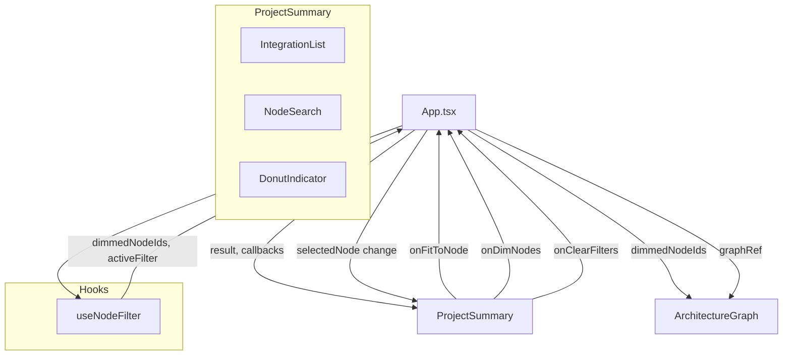

# Design Document — Interactive Summary Panel

## Overview

Este diseño describe la transformación del componente `ProjectSummary` de un panel estático de tarjetas a un centro de control interactivo con tres funcionalidades: lista expandible de integraciones con navegación al grafo, buscador de nodos con efecto de dimming, y un indicador donut de trazabilidad con filtrado por estado.

La arquitectura se basa en un patrón de **estado elevado en App.tsx** que coordina la comunicación entre `ProjectSummary` y `ArchitectureGraph` mediante props de callback y la ref imperativa existente (`ArchitectureGraphRef`). Se introduce un nuevo hook `useNodeFilter` para encapsular la lógica de filtrado/dimming, y funciones puras extraídas a un módulo de utilidades para facilitar testing por propiedades.

### Decisiones de diseño clave

1. **Estado de dimming elevado a App.tsx** — El grafo necesita saber qué nodos dimear, y el panel necesita disparar cambios. App.tsx es el punto natural de coordinación.
2. **Funciones puras para lógica de filtrado** — `filterNodes`, `computeDonutSegments`, `computeDimmedIds` se extraen como funciones puras testables.
3. **"Last filter wins"** — Cuando se activan filtros simultáneos (búsqueda + trazabilidad), solo el último activado aplica dimming. Simplifica la UX y evita confusión.
4. **Donut chart con SVG inline** — Se usa SVG con `stroke-dasharray` para el donut, sin dependencias externas. Es ligero y suficiente para 4 segmentos.

## Architecture



### Flujo de datos

1. `App.tsx` pasa `result` (AnalysisResult) al `ProjectSummary` y al `ArchitectureGraph`.
2. `ProjectSummary` recibe nuevos callbacks: `onFitToNode(nodeId)`, `onDimNodes(nodeIds)`, `onClearDimming()`.
3. Cuando el usuario interactúa (busca, filtra por trazabilidad, clickea integración), `ProjectSummary` invoca los callbacks.
4. `App.tsx` usa el hook `useNodeFilter` para calcular `dimmedNodeIds` y lo pasa como prop al grafo.
5. `ArchitectureGraph` aplica opacidad reducida a los nodos cuyo ID está en `dimmedNodeIds`.
6. Cuando el usuario clickea un nodo directamente en el grafo (`onNodeClick`), App.tsx invoca la limpieza de filtros.

## Components and Interfaces

### Nuevas props de ProjectSummary

```typescript
interface ProjectSummaryProps {
  result: AnalysisResult
  // Nuevos callbacks para interacción con el grafo
  onFitToNode: (nodeId: string) => void
  onDimNodes: (nodeIds: Set<string>) => void
  onClearDimming: () => void
  // Señal externa para limpiar filtros internos (cuando el grafo recibe click directo)
  clearFiltersSignal: number // incrementa cada vez que se debe limpiar
}
```

### Sub-componentes internos de ProjectSummary

#### IntegrationList

```typescript
interface IntegrationListProps {
  integrations: IntegrationNode[]
  onNavigate: (nodeId: string) => void
}
```

Componente colapsable que muestra integraciones agrupadas por tipo. Maneja su propio estado `expanded: boolean`.

#### NodeSearch

```typescript
interface NodeSearchProps {
  nodes: GraphNode[] // todos los nodos (modules + folders + integrations)
  onSelect: (nodeId: string) => void
  onFilterChange: (matchingIds: Set<string> | null) => void
  clearSignal: number
}
```

Campo de búsqueda con lista de resultados. Emite `onFilterChange` con los IDs coincidentes (o `null` si no hay búsqueda activa).

#### DonutIndicator

```typescript
interface DonutIndicatorProps {
  tracedCount: number
  untracedCount: number
  driftCount: number
  totalModules: number
  onSegmentClick: (status: SpecStatus | null) => void
  activeSegment: SpecStatus | null
}
```

Donut SVG con segmentos clickeables. Emite `onSegmentClick` con el estado clickeado, o `null` si se desactiva.

### Extensión de ArchitectureGraphProps

```typescript
interface ArchitectureGraphProps {
  // ... props existentes ...
  dimmedNodeIds?: Set<string> | null // nodos con opacidad reducida
}
```

### Hook useNodeFilter

```typescript
interface UseNodeFilterReturn {
  dimmedNodeIds: Set<string> | null
  activeFilterType: 'search' | 'traceability' | null
  applySearchFilter: (matchingIds: Set<string> | null) => void
  applyTraceabilityFilter: (status: SpecStatus | null, modules: ModuleNode[]) => void
  clearAll: () => void
}

function useNodeFilter(allNodeIds: Set<string>): UseNodeFilterReturn
```

Encapsula la lógica de "last filter wins": mantiene internamente qué filtro está activo y calcula el complemento de nodos a dimear.

## Data Models

### Tipos nuevos (en `types/index.ts` o local al feature)

```typescript
// Segmento del donut de trazabilidad
interface DonutSegment {
  status: SpecStatus
  count: number
  percentage: number  // 0-100, redondeado al entero
  color: string       // hex color del tema
}

// Tipo de filtro activo (para "last wins")
type ActiveFilterType = 'search' | 'traceability' | null
```

### Funciones puras de utilidad (módulo `utils/summary_panel_helpers.ts`)

```typescript
// Filtra nodos por coincidencia de nombre (case-insensitive substring)
function filterNodesByName(nodes: GraphNode[], query: string): GraphNode[]

// Ordena nodos alfabéticamente y limita a maxResults
function sortAndCap(nodes: GraphNode[], maxResults: number): GraphNode[]

// Calcula los segmentos del donut a partir de los conteos del análisis
function computeDonutSegments(
  tracedCount: number,
  untracedCount: number,
  driftCount: number,
  totalModules: number
): DonutSegment[]

// Calcula IDs de nodos a dimear (complemento del set de matching)
function computeDimmedIds(allNodeIds: Set<string>, matchingIds: Set<string>): Set<string>

// Calcula IDs de módulos a dimear por filtro de trazabilidad
function computeTraceabilityDimmedIds(
  modules: ModuleNode[],
  selectedStatus: SpecStatus
): Set<string>

// Devuelve el icono correspondiente al tipo de nodo
function getNodeTypeIcon(node: GraphNode): string

// Agrupa integraciones por tipo, databases primero
function groupIntegrationsByType(integrations: IntegrationNode[]): IntegrationNode[]
```

## Correctness Properties

*A property is a characteristic or behavior that should hold true across all valid executions of a system — essentially, a formal statement about what the system should do. Properties serve as the bridge between human-readable specifications and machine-verifiable correctness guarantees.*

### Property 1: Integration list expand/collapse round-trip

*For any* non-empty list of integrations, expanding and then collapsing the integration list should return it to the initial state where no individual integration names are visible.

**Validates: Requirements 1.1, 1.2**

### Property 2: Node type icon mapping

*For any* GraphNode, the icon returned by `getNodeTypeIcon` should be deterministic based on node type: `'module'` → file icon derived from path, `'folder'` → 📁, `'database'` → 🗄️, `'external_api'` → 🌐.

**Validates: Requirements 1.3, 2.9**

### Property 3: Click-to-navigate invokes fitToNode with correct ID

*For any* navigable item (integration in expanded list or search result), clicking it should invoke the `onFitToNode` callback with exactly that item's `id` string, unmodified.

**Validates: Requirements 1.4, 2.5**

### Property 4: Integration list ordering (databases before APIs)

*For any* list of integrations, `groupIntegrationsByType` should return a list where every integration of type `'database'` appears before every integration of type `'external_api'`, and no items are lost or duplicated.

**Validates: Requirements 1.5**

### Property 5: Node filter function correctness

*For any* list of GraphNodes and any search string of length ≥ 2, `filterNodesByName(nodes, query)` should return exactly those nodes where `node.name.toLowerCase()` contains `query.toLowerCase()` as a substring, with no false positives or false negatives.

**Validates: Requirements 2.2, 2.8**

### Property 6: Filter results sorted alphabetically and capped at 50

*For any* list of matching nodes returned by the filter, `sortAndCap(nodes, 50)` should produce a list that is (a) sorted by `name` using case-insensitive comparison, and (b) has at most 50 elements.

**Validates: Requirements 2.3**

### Property 7: Search dimming is the complement of matching nodes

*For any* set of all node IDs and any non-empty set of matching node IDs (matchingIds ⊆ allNodeIds), `computeDimmedIds(allNodeIds, matchingIds)` should equal `allNodeIds \ matchingIds` (set difference).

**Validates: Requirements 2.4**

### Property 8: Donut segment computation

*For any* non-negative integers tracedCount, untracedCount, driftCount where their sum ≤ totalModules and totalModules > 0, `computeDonutSegments` should produce segments where (a) the sum of all segment percentages equals 100 (±1 due to rounding), (b) each segment's percentage equals `Math.round(count / totalModules * 100)`, (c) the `na` count is derived as `totalModules - tracedCount - untracedCount - driftCount`, and (d) segments with count === 0 are omitted.

**Validates: Requirements 3.1, 3.3, 3.7, 3.9**

### Property 9: Traceability dimming by specStatus

*For any* list of modules and any selected SpecStatus value, `computeTraceabilityDimmedIds(modules, selectedStatus)` should return the set of module IDs where `module.specStatus !== selectedStatus` (treating undefined as `'untraced'`).

**Validates: Requirements 3.4**

### Property 10: Graph click clears all active filters

*For any* active filter state (search query non-empty or traceability segment selected), when `clearAll()` is invoked, both the search query and the active traceability segment should be reset to their initial values (empty string and null respectively), and `dimmedNodeIds` should become null.

**Validates: Requirements 4.3**

### Property 11: Last filter wins

*For any* sequence where a search filter is active and then a traceability filter is activated (or vice versa), `dimmedNodeIds` should reflect only the most recently activated filter's computation, not a combination of both.

**Validates: Requirements 4.6**

## Error Handling

| Escenario | Comportamiento |
|-----------|----------------|
| `fitToNode` con ID inexistente | El grafo ignora la invocación (guard existente en `getNodesBounds` que retorna bounds con width 0) |
| `integrations` vacío | `IntegrationList` no se renderiza (guard condicional) |
| `totalModules === 0` | `DonutIndicator` no se renderiza (guard condicional) |
| Query de búsqueda < 2 chars | No se muestra lista de resultados, no se aplica dimming |
| Todos los segmentos del donut con count 0 | No se renderiza ningún segmento (solo centro) |
| `result` es null | `ProjectSummary` no se renderiza (ya existente en App.tsx) |
| Performance con muchos nodos (>500) | `filterNodesByName` es O(n) con cap a 50 resultados — aceptable |

## Testing Strategy

### Enfoque dual: Tests de propiedades + Tests de ejemplo

**Property-Based Testing (PBT):**
- Librería: **fast-check** (ya disponible como dependencia de desarrollo en el proyecto)
- Mínimo 100 iteraciones por propiedad
- Se testean las funciones puras extraídas en `utils/summary_panel_helpers.ts`
- Tag format: `Feature: interactive-summary-panel, Property {N}: {title}`

**Tests de ejemplo (unit):**
- Verifican edge cases específicos (lista vacía, totalModules === 0, query de 1 char)
- Verifican rendering correcto de componentes con React Testing Library
- Verifican integración de callbacks entre componentes

### Distribución de tests

| Tipo | Targets | Framework |
|------|---------|-----------|
| Property tests | `filterNodesByName`, `sortAndCap`, `computeDonutSegments`, `computeDimmedIds`, `computeTraceabilityDimmedIds`, `groupIntegrationsByType`, `getNodeTypeIcon` | Vitest + fast-check |
| Unit tests (ejemplo) | Rendering de `IntegrationList`, `NodeSearch`, `DonutIndicator` | Vitest + React Testing Library |
| Integration tests | Flujo completo App → ProjectSummary → ArchitectureGraph (dimming aplicado) | Vitest + React Testing Library |

### Configuración de PBT

```typescript
// Cada test de propiedad debe seguir este patrón:
fc.assert(
  fc.property(
    // generadores...
    (...args) => {
      // assertions sobre la propiedad
    }
  ),
  { numRuns: 100 } // mínimo 100 iteraciones
)
```

### Archivos de test

- `utils/summary_panel_helpers.test.ts` — Property tests para funciones puras
- `components/integration_list.test.tsx` — Unit tests del componente
- `components/node_search.test.tsx` — Unit tests del componente
- `components/donut_indicator.test.tsx` — Unit tests del componente
- `hooks/use_node_filter.test.ts` — Unit + property tests del hook
