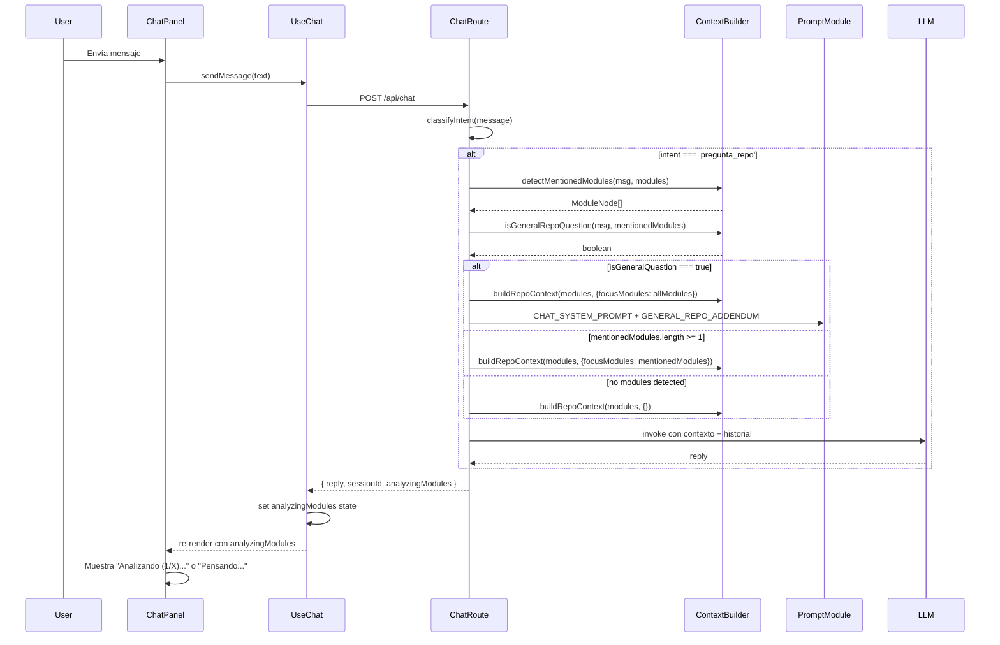
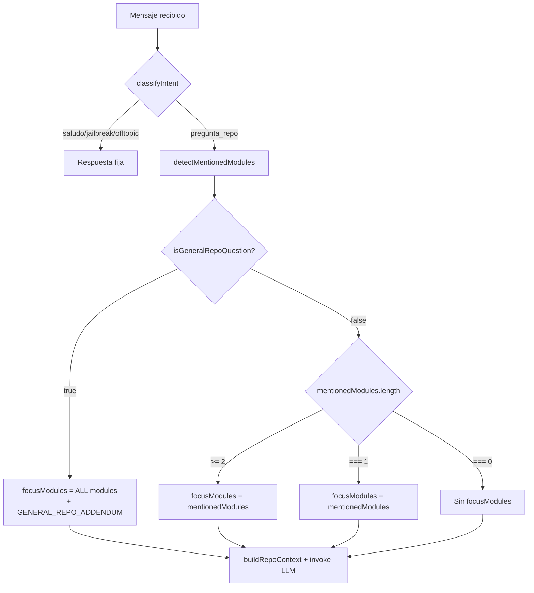

# Design Document: Multi-Module Chat Context

## Overview

Esta feature extiende el sistema de contexto del chat de TrazIA para soportar múltiples módulos simultáneamente y detectar preguntas generales sobre el repositorio. Actualmente, el contexto solo incluye el código fuente (`sourceContent`) de un único módulo focalizado. Cuando un usuario pregunta por el repositorio en general o menciona varios módulos, el LLM responde sin tener acceso al código, resultando en respuestas genéricas.

La solución implementa:
1. **Detección multi-módulo** — `detectMentionedModules` reemplaza `detectMentionedModule`, retornando todos los módulos mencionados en el mensaje
2. **Detección de pregunta general** — `isGeneralRepoQuestion` identifica preguntas sobre el repositorio completo cuando no se mencionan módulos específicos
3. **Contexto adaptativo** — `buildRepoContext` acepta un array `focusModules[]` e incluye snippets truncados con límite adaptativo (500 chars para 1-4 módulos, 300 chars para 5+)
4. **Orquestación priorizada** — La ruta de chat evalúa: pregunta general > multi-module > single module > no-focus
5. **Frontend contextual** — El indicador de carga muestra "Analizando (1/X)..." cuando hay módulos en análisis

### Decisiones de diseño clave

- **Truncado adaptativo**: Se reduce el snippet a 300 chars con 5+ módulos para mantener el contexto total bajo control (evitar exceder ventana del LLM)
- **Prioridad de pregunta general sobre multi-module**: Si el usuario dice "qué hace todo el repo", se incluyen todos los módulos aunque alguno matchee por nombre
- **El campo `analyzingModules` es opcional en la respuesta**: Para backward compatibility, el frontend maneja `undefined` como `null`
- **Se mantiene `detectMentionedModule` existente** como deprecated para no romper tests existentes en la transición

## Architecture



### Flujo de decisión en la ruta



## Components and Interfaces

### Backend — `context_builder.ts`

```typescript
// Nueva interfaz para opciones de contexto multi-module
interface BuildRepoContextOptions {
  readme?: string
  focusModule?: ModuleNode       // DEPRECATED — mantener para backward compat
  focusModules?: ModuleNode[]    // NUEVO — array de módulos a incluir
}

/**
 * Detecta TODOS los módulos mencionados en el mensaje.
 * Reemplaza detectMentionedModule (que retorna solo el primero).
 * Matching: case-insensitive substring contra name y último segmento de path.
 * Cada módulo aparece como máximo una vez, en el orden del array de entrada.
 */
export function detectMentionedModules(
  message: string,
  modules: ModuleNode[]
): ModuleNode[]

/**
 * Determina si el mensaje es una pregunta general sobre el repositorio.
 * Retorna true si el mensaje contiene al menos un keyword general
 * Y mentionedModules está vacío.
 */
export function isGeneralRepoQuestion(
  message: string,
  mentionedModules: ModuleNode[]
): boolean

/**
 * buildRepoContext actualizado — si focusModules está definido y no vacío,
 * incluye snippets truncados de cada módulo con límite adaptativo.
 * Si focusModule (singular, deprecated) está definido, lo trata como [focusModule].
 */
export function buildRepoContext(
  modules: ModuleNode[],
  options?: BuildRepoContextOptions
): string
```

### Backend — `prompt.ts`

```typescript
/**
 * Addendum que se agrega al system prompt cuando se detecta una pregunta general.
 */
export const GENERAL_REPO_ADDENDUM: string = 
  "El usuario está preguntando sobre el repositorio en general. Arrancá tu respuesta con 'Voy a analizar todos los módulos del repositorio:' y hacé un resumen de qué hace cada uno, basándote en el código fuente proporcionado."
```

### Backend — `chat.ts` (ruta)

```typescript
// Interfaz actualizada del response
interface ChatResponse {
  reply: string
  sessionId: string
  analyzingModules?: string[]  // nombres de módulos en focusModules
}
```

### Frontend — `types/index.ts`

```typescript
// Response del endpoint POST /api/chat — actualizado
export interface ChatResponse {
  reply: string
  sessionId: string
  analyzingModules?: string[]  // NUEVO — array de nombres de módulos analizados
}
```

### Frontend — `hooks/use_chat.ts`

```typescript
// Retorno actualizado del hook
interface UseChatReturn {
  messages: ChatMessage[]
  isLoading: boolean
  error: string | null
  analyzingModules: string[] | null  // NUEVO
  sendMessage: (text: string) => Promise<void>
  clearChat: () => void
}
```

### Frontend — `components/chat_panel.tsx`

El componente consume `analyzingModules` del hook y renderiza condicionalmente el texto del spinner:
- `analyzingModules !== null && analyzingModules.length > 0` → "Analizando (1/{X})..."
- En otro caso → "Pensando..."

## Data Models

### Constantes del Context Builder

| Constante | Valor | Descripción |
|-----------|-------|-------------|
| `MAX_README_LENGTH` | 3000 | Máximo de caracteres para el README en contexto |
| `SNIPPET_LIMIT_SMALL` | 500 | Caracteres de sourceContent por módulo (1-4 módulos) |
| `SNIPPET_LIMIT_LARGE` | 300 | Caracteres de sourceContent por módulo (5+ módulos) |
| `GENERAL_KEYWORDS` | `["repo", "repositorio", "proyecto", "app", "aplicación", "código", "código fuente", "general"]` | Keywords para detectar preguntas generales |

### Estado del hook `useChat`

| Campo | Tipo | Valor inicial | Descripción |
|-------|------|---------------|-------------|
| `messages` | `ChatMessage[]` | `[]` | Historial de mensajes |
| `isLoading` | `boolean` | `false` | Si hay request en curso |
| `error` | `string \| null` | `null` | Error del último request |
| `analyzingModules` | `string[] \| null` | `null` | Módulos siendo analizados |

### Flujo de estados de `analyzingModules` en el hook

```
null → (response con analyzingModules[]) → string[] → (assistant msg agregado) → null
```

1. Se envía mensaje: `analyzingModules` permanece en `null`, `isLoading = true`
2. Se recibe response con `analyzingModules` no vacío: se setea al array recibido
3. Se agrega el assistant message a `messages`: se resetea a `null`, `isLoading = false`


## Correctness Properties

*A property is a characteristic or behavior that should hold true across all valid executions of a system — essentially, a formal statement about what the system should do. Properties serve as the bridge between human-readable specifications and machine-verifiable correctness guarantees.*

### Property 1: Detection completeness

*For any* message string and any array of ModuleNode objects, `detectMentionedModules` SHALL return exactly the subset of modules whose `name` field OR whose last path segment (after the final "/" in `path`) appears as a case-insensitive substring within the message — no more, no fewer.

**Validates: Requirements 1.1, 1.2, 1.3, 1.4**

### Property 2: Detection order preservation

*For any* message and modules array where multiple modules match, the returned array SHALL contain those modules in the same relative order they appear in the input `modules` array.

**Validates: Requirements 1.5**

### Property 3: Detection deduplication

*For any* message and modules array, the returned array SHALL contain no duplicate ModuleNode entries (each module appears at most once), even if the module matches by both `name` and last path segment.

**Validates: Requirements 1.6**

### Property 4: General question detection biconditional

*For any* message string and any `mentionedModules` array, `isGeneralRepoQuestion` SHALL return `true` if and only if: (a) the message contains at least one of the defined general keywords as a case-insensitive substring, AND (b) the `mentionedModules` array is empty. In all other cases it SHALL return `false`.

**Validates: Requirements 2.1, 2.2, 2.3, 2.4, 2.5**

### Property 5: Adaptive truncation for small module sets

*For any* invocation of `buildRepoContext` where `focusModules` contains between 1 and 4 modules with `sourceContent` longer than 500 characters, the output SHALL contain a snippet of exactly 500 characters from each module's `sourceContent`, wrapped in delimiters.

**Validates: Requirements 3.1, 3.3**

### Property 6: Adaptive truncation for large module sets

*For any* invocation of `buildRepoContext` where `focusModules` contains 5 or more modules with `sourceContent` longer than 300 characters, the output SHALL contain a snippet of exactly 300 characters from each module's `sourceContent`, wrapped in delimiters.

**Validates: Requirements 3.2**

### Property 7: Omission of empty sourceContent

*For any* module in `focusModules` where `sourceContent` is `undefined` or an empty string, `buildRepoContext` SHALL NOT include the code snippet delimiters ("--- Código fuente" / "--- Fin código fuente ---") for that module in the output.

**Validates: Requirements 3.4**

### Property 8: No snippets without focusModules

*For any* invocation of `buildRepoContext` where `focusModules` is `undefined` or an empty array, the output SHALL NOT contain any code snippet delimiter strings ("--- Código fuente" / "--- Fin código fuente ---").

**Validates: Requirements 3.5**

## Error Handling

| Escenario | Componente | Estrategia |
|-----------|------------|------------|
| `message` vacío o solo whitespace | `isGeneralRepoQuestion` | Retorna `false` — no es pregunta general |
| `modules` es array vacío | `detectMentionedModules` | Retorna `[]` — sin módulos que matchear |
| `focusModules` contiene módulos sin `sourceContent` | `buildRepoContext` | Omite la sección de snippet para ese módulo |
| Respuesta del LLM sin text block | Chat Route | Retorna reply genérico "No pude generar una respuesta." |
| Timeout del LLM (AbortError) | Chat Route | Retorna reply de timeout (comportamiento existente preservado) |
| Backend responde sin `analyzingModules` | `useChat` hook | Trata como `null` — backward compatible |
| Error de red en POST /api/chat | `useChat` hook | Setea `error`, resetea `analyzingModules` a `null`, `isLoading = false` |

### Backward Compatibility

- `detectMentionedModule` (singular) se mantiene exportada como deprecated. Internamente puede delegarse a `detectMentionedModules(msg, modules)[0] ?? null`.
- `buildRepoContext` sigue aceptando `focusModule` (singular) en las opciones. Si se provee sin `focusModules`, lo trata como `focusModules: [focusModule]`.
- El frontend trata `analyzingModules` como opcional en `ChatResponse` — si falta, se maneja como `null`.

## Testing Strategy

### Property-Based Tests (fast-check)

Se usa `fast-check` (ya presente en `devDependencies`) con mínimo 100 iteraciones por propiedad.

**Archivo:** `packages/backend/src/agents/chat/context_builder.property.test.ts` (extender el existente)

Cada test taggeado con:
```
Feature: multi-module-chat-context, Property {N}: {título}
```

Properties a implementar como PBT:
- Property 1: Detection completeness
- Property 2: Detection order preservation
- Property 3: Detection deduplication
- Property 4: General question detection biconditional
- Property 5: Adaptive truncation (small)
- Property 6: Adaptive truncation (large)
- Property 7: Omission of empty sourceContent
- Property 8: No snippets without focusModules

### Unit Tests (Jest, example-based)

**Backend:**
- `context_builder.test.ts` — ejemplos concretos para `detectMentionedModules`, `isGeneralRepoQuestion`, y el nuevo `buildRepoContext` con `focusModules`
- `prompt.test.ts` — verificar que `GENERAL_REPO_ADDENDUM` tiene el texto exacto esperado
- `chat.test.ts` — integration tests con supertest para la orquestación:
  - Pregunta general → todos los módulos como focusModules + addendum en system prompt
  - Multi-module → módulos detectados como focusModules
  - Single module → módulo detectado como focusModules
  - Sin match → sin focusModules
  - `analyzingModules` presente en response

**Frontend:**
- `use_chat.test.ts` — verificar lifecycle de `analyzingModules`: null → array → null
- `chat_panel.test.tsx` — verificar texto del spinner según `analyzingModules`
- Verificar `aria-live="polite"` en el contenedor del spinner

### Generadores para PBT

Reutilizar el `moduleNodeArb` existente en `context_builder.property.test.ts`. Agregar:

```typescript
// Generador de mensajes que contienen nombres de módulos
const messageWithModulesArb = (modules: ModuleNode[]) =>
  fc.subarray(modules, { minLength: 1 }).chain(selected =>
    fc.tuple(
      fc.constant(selected),
      fc.stringMatching(/^[a-záéíóúñ ]{0,20}$/).map(prefix =>
        `${prefix} ${selected.map(m => m.name).join(' y ')}`
      )
    )
  )

// Generador de mensajes con keywords generales
const generalKeywordArb = fc.constantFrom(
  'repo', 'repositorio', 'proyecto', 'app', 'aplicación', 'código', 'código fuente', 'general'
)
```
