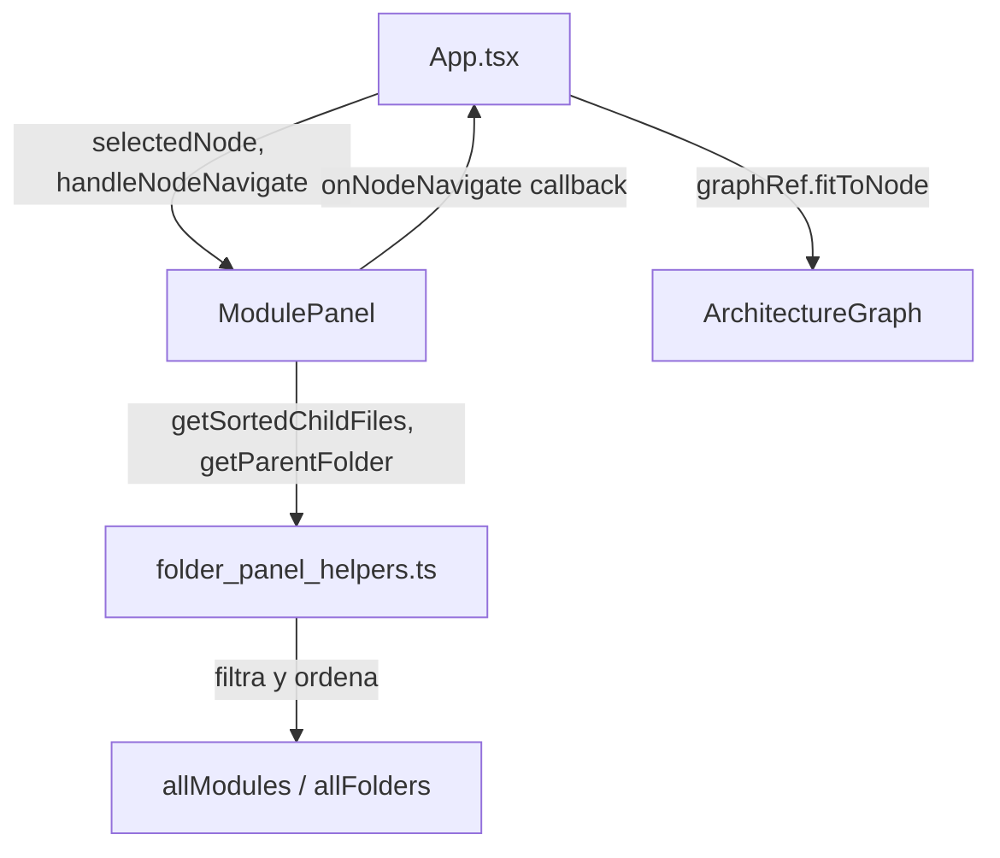

# Design Document: Panel Node Navigation

## Overview

Esta feature extiende el `ModulePanel` para permitir navegación completa por la jerarquía del grafo de arquitectura. Agrega dos capacidades nuevas al panel lateral:

1. **Botones de archivos hijos** cuando se selecciona una carpeta — permite navegar a cualquier archivo directo de esa carpeta.
2. **Botón de carpeta padre** cuando se selecciona cualquier nodo (archivo o carpeta) con padre — permite subir un nivel en la jerarquía.

Ambas capacidades reutilizan el `Navigation_Action` existente (seleccionar nodo + centrar viewport con zoom 2.5x a 800ms) y comparten el mismo estilo visual que los botones de subcarpetas ya implementados.

### Decisiones de diseño clave

- **Generalizar el handler de navegación**: El actual `handleFolderNavigate` solo busca en `result.folders`. Se reemplaza por un `handleNodeNavigate(nodeId)` que busca en folders Y modules, delegando en la misma lógica de `fitToNode`.
- **Helpers puros para la lógica**: Toda la lógica de filtrado, ordenamiento y validación vive en `folder_panel_helpers.ts` como funciones puras — testeable sin React.
- **CSS compartido**: Todos los botones de navegación (padre, hijos, subcarpetas) usan la misma clase `module-panel__folder-btn` para consistencia visual garantizada.

## Architecture



### Flujo de datos

1. Usuario hace click en un botón de navegación dentro del `ModulePanel`
2. `ModulePanel` invoca `onNodeNavigate(targetId)`
3. `App.tsx` recibe el callback, busca el nodo en `result.folders` o `result.modules`
4. Si el nodo existe: actualiza `selectedNode` + invoca `graphRef.current.fitToNode(targetId)`
5. Si el nodo NO existe: no hace nada (guard clause)
6. `ModulePanel` se re-renderiza con el nuevo `selectedNode`, mostrando los detalles del nodo destino

## Components and Interfaces

### Helpers nuevos en `folder_panel_helpers.ts`

```typescript
/**
 * Retorna los archivos directos de una carpeta, ordenados alfabéticamente
 * (case-insensitive). Solo incluye módulos cuyo id existe en graphNodeIds.
 */
export function getSortedChildFiles(
  folderId: string,
  allModules: readonly ModuleNode[],
  graphNodeIds: ReadonlySet<string>
): ModuleNode[]

/**
 * Busca la carpeta padre de un nodo dado. Retorna la FolderNode si existe
 * en allFolders, o undefined si no tiene padre o si el padre no existe en el grafo.
 */
export function getParentFolder(
  node: { parentFolder?: string },
  allFolders: readonly FolderNode[]
): FolderNode | undefined
```

### Cambios en `ModulePanelProps`

```typescript
interface ModulePanelProps {
  // ... props existentes sin cambios ...
  
  // Renombrar para generalizar (antes: onFolderNavigate)
  onNodeNavigate?: (nodeId: string) => void
}
```

### Nuevo handler en `App.tsx`

```typescript
// Reemplaza handleFolderNavigate — busca en folders y modules
const handleNodeNavigate = (nodeId: string) => {
  const targetFolder = result?.folders.find(f => f.id === nodeId)
  const targetModule = result?.modules.find(m => m.id === nodeId)
  const target = targetFolder ?? targetModule
  
  if (!target) return  // Guard: nodo no existe, no hacer nada
  
  setSelectedNode(target)
  graphRef.current?.fitToNode(nodeId)
}
```

### Cambios en `ModulePanel` (render)

#### Sección de archivos hijos (folder seleccionada)

```tsx
{isFolder && (() => {
  const childFiles = getSortedChildFiles(
    node.id,
    allModules ?? [],
    graphNodeIds  // Set<string> de todos los nodos en el grafo
  )
  if (childFiles.length === 0) return null
  return (
    <section className="module-panel__section">
      <h3 className="module-panel__section-title">Archivos</h3>
      <div className="module-panel__folder-buttons">
        {childFiles.map((file) => (
          <button
            key={file.id}
            className="module-panel__folder-btn"
            onClick={() => onNodeNavigate?.(file.id)}
            title={file.name}
          >
            📄 {truncateFolderName(file.name)}
          </button>
        ))}
      </div>
    </section>
  )
})()}
```

#### Sección de carpeta padre (archivo o carpeta seleccionado)

```tsx
{(isFolder || isModule) && (() => {
  const parent = getParentFolder(node as { parentFolder?: string }, allFolders ?? [])
  if (!parent) return null
  return (
    <section className="module-panel__section">
      <h3 className="module-panel__section-title">Carpeta padre</h3>
      <div className="module-panel__folder-buttons">
        <button
          className="module-panel__folder-btn"
          onClick={() => onNodeNavigate?.(parent.id)}
          title={parent.name}
        >
          📁 {truncateFolderName(parent.name)}
        </button>
      </div>
    </section>
  )
})()}
```

### Interfaz imperativa (sin cambios)

```typescript
// ArchitectureGraphRef — ya existe, sin modificaciones
export interface ArchitectureGraphRef {
  fitToNode: (nodeId: string) => void
}
```

## Data Models

No se agregan modelos de datos nuevos. Se reutilizan los tipos existentes:

```typescript
// Ya definidos en types/index.ts
interface ModuleNode {
  id: string
  name: string
  type: 'module'
  parentFolder?: string  // usado para filtrar hijos y encontrar padre
  // ...
}

interface FolderNode {
  id: string
  name: string
  type: 'folder'
  parentFolder?: string  // usado para encontrar padre de una carpeta
  // ...
}
```

### Derivaciones en tiempo de render

| Dato derivado | Fuente | Cálculo |
|---|---|---|
| `childFiles` | `allModules` + `graphNodeIds` | `getSortedChildFiles(folderId, allModules, graphNodeIds)` |
| `parentFolder` | `allFolders` | `getParentFolder(node, allFolders)` |
| `graphNodeIds` | `allModules` + `allFolders` | `new Set([...allModules.map(m => m.id), ...allFolders.map(f => f.id)])` |

## Correctness Properties

*A property is a characteristic or behavior that should hold true across all valid executions of a system — essentially, a formal statement about what the system should do. Properties serve as the bridge between human-readable specifications and machine-verifiable correctness guarantees.*

### Property 1: Child files filtering, existence validation, and sorting

*For any* folder id, set of modules, and set of valid graph node ids, `getSortedChildFiles` SHALL return exactly those modules whose `parentFolder` equals the folder id AND whose `id` is present in the graph node id set, sorted in case-insensitive alphabetical order by name.

**Validates: Requirements 1.1, 1.5, 1.7**

### Property 2: Name truncation invariant

*For any* string, applying `truncateFolderName` SHALL produce a result where: if the input length is ≤ 30, the output equals the input unchanged; if the input length is > 30, the output has exactly 31 characters and ends with the '…' character.

**Validates: Requirements 1.6, 2.1, 3.1**

### Property 3: Parent folder existence validation

*For any* node with a `parentFolder` field and any list of folders, `getParentFolder` SHALL return the matching FolderNode if and only if a folder with that id exists in the list; otherwise it SHALL return undefined.

**Validates: Requirements 2.5, 3.6**

### Property 4: Edge highlighting for selected node

*For any* set of graph edges and selected node id, `buildEdges` SHALL produce edges where every edge connected to the selected node has `strokeWidth: 3`, `opacity: 1`, and `animated: true`; and every unconnected edge has `opacity: 0.25`.

**Validates: Requirements 4.3**

### Property 5: Navigation guard for non-existent nodes

*For any* node id that does not exist in the combined set of folders and modules, calling the navigate handler SHALL not change the selected node state and SHALL not invoke `fitToNode`.

**Validates: Requirements 4.5**

## Error Handling

| Escenario | Comportamiento |
|---|---|
| `parentFolder` apunta a un folder que no existe en el grafo | `getParentFolder` retorna `undefined` → sección no se renderiza |
| `parentFolder` es `undefined` en el nodo | `getParentFolder` retorna `undefined` → sección no se renderiza |
| Carpeta sin archivos hijos | `getSortedChildFiles` retorna `[]` → sección no se renderiza |
| Archivo hijo referenciado pero no presente en el grafo | Filtrado por `graphNodeIds` lo excluye — botón no aparece |
| `onNodeNavigate` invocado con id que no existe | Guard clause en `handleNodeNavigate` — no-op, panel sin cambios |
| `graphRef.current` es null (grafo no montado aún) | Optional chaining `graphRef.current?.fitToNode()` — no crash |
| `allModules` o `allFolders` son `undefined` | Default a `[]` con `?? []` — helpers reciben array vacío |

## Testing Strategy

### Property-Based Tests (fast-check, vitest)

Se usa `fast-check` (ya instalado) para validar las 5 correctness properties. Cada test se configura con mínimo 100 iteraciones.

| Property | Archivo de test | Generadores |
|---|---|---|
| 1: Child files filtering + sorting | `folder_panel_helpers.property.test.ts` | `fc.array(arbitraryModuleNode)`, `fc.string()` para folderId |
| 2: Name truncation | `folder_panel_helpers.property.test.ts` | `fc.string({ minLength: 0, maxLength: 100 })` |
| 3: Parent folder validation | `folder_panel_helpers.property.test.ts` | `fc.record(...)` para nodos con parentFolder, `fc.array(arbitraryFolderNode)` |
| 4: Edge highlighting | `architecture_graph.property.test.ts` | `fc.array(arbitraryGraphEdge)`, `fc.string()` para selectedNodeId |
| 5: Navigation guard | `app_navigation.property.test.ts` | `fc.string()` para ids, arrays de folders/modules sin ese id |

**Configuración por test:**
```typescript
fc.assert(
  fc.property(/* arbitraries */, (inputs) => {
    // Assertion
  }),
  { numRuns: 100 }
)
```

**Tag format:** `Feature: panel-node-navigation, Property {N}: {description}`

### Unit Tests (vitest + @testing-library/react)

Tests de ejemplo para interacciones de UI y edge cases:

- Render de botones hijos cuando carpeta tiene archivos (1.1)
- Click en botón hijo invoca `onNodeNavigate` con id correcto (1.2, 1.3)
- Carpeta sin hijos no renderiza sección de archivos (1.4)
- Render de botón padre para módulo con parentFolder (2.1)
- Click en botón padre invoca `onNodeNavigate` (2.2, 2.3)
- Módulo sin parentFolder no renderiza sección padre (2.4)
- Carpeta raíz no renderiza sección padre (3.4)
- Solo muestra padre directo, no abuelo (3.5)
- Todos los botones usan la misma CSS class (4.2)

### Cobertura complementaria

- **Property tests**: cubren la lógica pura (helpers) con inputs aleatorios — encuentran edge cases inesperados
- **Unit tests**: cubren las interacciones de UI y el wiring entre componentes — verifican que el sistema está conectado correctamente
