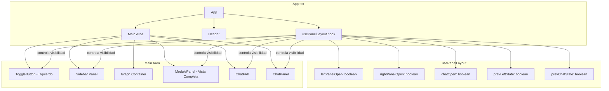

# Design Document: Responsive Graph Panels

## Overview

Este diseño transforma el layout principal de TrazIA de un grid estático con sidebar siempre visible a un sistema de paneles con toggle explícito. El objetivo es maximizar el espacio del grafo interactivo como estado por defecto, permitiendo al usuario desplegar paneles laterales y chat según necesite.

### Cambios principales respecto al estado actual

1. **Panel Izquierdo** (`app__sidebar`): pasa de estar siempre visible a oculto por defecto, controlado por un botón toggle.
2. **Panel Derecho** (`ModulePanel`): pasa de ocupar una columna lateral (340px) a expandirse al 100% del Área Principal (Vista Completa).
3. **Chat** (`ChatPanel`): se reposiciona a la esquina inferior izquierda con un FAB dedicado y reglas de visibilidad dependientes del estado de los otros paneles.

### Decisiones de diseño clave

- **Estado centralizado en un custom hook** (`usePanelLayout`): toda la lógica de visibilidad, preservación de estado previo y reglas de ocultación mutua vive en un solo lugar, facilitando testing y mantenimiento.
- **CSS transforms para animaciones**: se usan exclusivamente `opacity` y `transform` (translateX/scale) para evitar reflow y mantener el canvas de react-flow fluido durante las transiciones.
- **Sin cambios en el grid durante animaciones**: los paneles se superponen al grafo mediante `position: absolute/fixed` en lugar de redimensionar columnas del grid, evitando reflows costosos.

## Architecture



### Flujo de estados

```mermaid
stateDiagram-v2
    [*] --> Default: Dashboard cargado
    Default --> LeftOpen: Toggle izquierdo
    LeftOpen --> Default: Toggle izquierdo
    Default --> FullScreen: Seleccionar nodo
    LeftOpen --> FullScreen: Seleccionar nodo
    FullScreen --> Default: Cerrar panel (prev left=false)
    FullScreen --> LeftOpen: Cerrar panel (prev left=true)
    
    state Default {
        [*] --> GraphFull
        note right of GraphFull: Grafo 100%, sidebar oculto
        note right of GraphFull: Chat FAB visible (inf-izq)
    }
    
    state FullScreen {
        [*] --> ModuleDetail
        note right of ModuleDetail: ModulePanel 100%
        note right of ModuleDetail: Todos los toggles ocultos
    }

```

## Components and Interfaces

### 1. Hook `usePanelLayout`

Nuevo custom hook que centraliza toda la lógica de estado de los paneles.

**Ubicación:** `packages/frontend/src/hooks/use_panel_layout.ts`

```typescript
interface PanelLayoutState {
  // Estados de visibilidad actuales
  leftPanelOpen: boolean
  rightPanelOpen: boolean
  chatOpen: boolean
  // Derivados — controlan visibilidad de botones toggle
  showLeftToggle: boolean    // false cuando rightPanelOpen
  showChatToggle: boolean    // false cuando rightPanelOpen || leftPanelOpen
  showChat: boolean          // false cuando rightPanelOpen || leftPanelOpen
}

interface PanelLayoutActions {
  toggleLeftPanel: () => void
  openRightPanel: () => void
  closeRightPanel: () => void
  toggleChat: () => void
}

type UsePanelLayoutReturn = PanelLayoutState & PanelLayoutActions
```

**Reglas de negocio internas:**
- `openRightPanel()`: guarda el estado actual de `leftPanelOpen` y `chatOpen` en refs internas antes de forzar ambos a `false`.
- `closeRightPanel()`: restaura `leftPanelOpen` y `chatOpen` a los valores guardados.
- `toggleLeftPanel()`: cuando se abre el panel izquierdo, el chat se oculta visualmente (sin alterar `chatOpen`). Cuando se cierra, el chat se restaura si `chatOpen` era `true`.
- `showChatToggle` es derivado: `!rightPanelOpen && !leftPanelOpen`.
- `showChat` es derivado: `chatOpen && !rightPanelOpen && !leftPanelOpen`.

### 2. Componente `ToggleSidebarButton`

Nuevo componente para el botón toggle del panel izquierdo.

**Ubicación:** `packages/frontend/src/components/toggle_sidebar_button.tsx`

```typescript
interface ToggleSidebarButtonProps {
  isExpanded: boolean
  onClick: () => void
  visible: boolean  // controla si se renderiza (cuando Vista Completa está activa se oculta)
}
```

**Responsabilidades:**
- Renderiza un `<button>` con `aria-expanded` y `aria-label` dinámicos.
- Se posiciona con `position: absolute` dentro del contenedor del grafo, a 8px del borde superior izquierdo.
- Icono visual de hamburguesa/flecha según estado.

### 3. Componente `ChatPanel` (refactorizado)

Se modifica el componente existente para:
- Reposicionar FAB y panel a la esquina inferior **izquierda**.
- Aceptar nueva prop `visible` que controla si el FAB y el panel se renderizan.
- El estado interno `isOpen` se mantiene intacto incluso cuando `visible` es `false`.
- Eliminar la prop `isSpecPanelOpen` y `specPanelWidth` (ya no necesarias con el nuevo sistema).

```typescript
interface ChatPanelProps {
  modules: ModuleNode[]
  readme?: string
  isOpen: boolean           // controlado externamente por usePanelLayout
  onToggle: () => void      // callback para toggle
  visible: boolean          // si false, no renderiza FAB ni panel
}
```

### 4. Componente `ModulePanel` (refactorizado)

Se modifica para renderizarse en modo Vista Completa (100% del Área Principal) en lugar de como una columna lateral.

**Cambios en CSS:**
- Pasa de `width: var(--panel-width)` a `position: absolute; inset: 0` dentro del `app__main`.
- Se elimina el grid de 3 columnas: el grafo siempre ocupa el 100% del contenedor.

```typescript
// Props sin cambios funcionales, pero el layout cambia visualmente.
// El botón de cierre ya existe (aria-label "Cerrar panel").
```

### 5. Componente `SidebarPanel` (wrapper)

Nuevo wrapper para el sidebar izquierdo que maneja la animación de apertura/cierre.

**Ubicación:** `packages/frontend/src/components/sidebar_panel.tsx`

```typescript
interface SidebarPanelProps {
  isOpen: boolean
  children: React.ReactNode
}
```

**Responsabilidades:**
- Renderiza el `<aside>` con `transform: translateX(-100%)` cuando cerrado y `translateX(0)` cuando abierto.
- Posición absoluta sobre el grafo (superpuesto, no empujando el grid).
- Ancho fijo de 280px.

### Árbol de componentes actualizado

```
App
├── Header (RepoInput)
├── Main (app__main) — position: relative
│   ├── ToggleSidebarButton (absolute, top-left)
│   ├── SidebarPanel (absolute, left) 
│   │   ├── ProjectSummary
│   │   └── GraphLegend
│   ├── GraphContainer (100% width siempre)
│   │   └── ArchitectureGraph (react-flow)
│   ├── ModulePanel (absolute, inset: 0 — Vista Completa)
│   ├── ChatFAB (fixed, bottom-left)
│   └── ChatPanel (fixed, bottom-left)
```

## Data Models

### Estado del hook `usePanelLayout`

```typescript
// Estado interno del hook
interface PanelLayoutInternalState {
  leftPanelOpen: boolean       // default: false
  rightPanelOpen: boolean      // default: false (se activa con selectedNode !== null)
  chatOpen: boolean            // default: false
}

// Estado previo guardado al entrar en Vista Completa
interface PanelLayoutSavedState {
  prevLeftPanelOpen: boolean
  prevChatOpen: boolean
}
```

### Mapeo de estados a clases CSS

| Estado | Clase CSS | Efecto visual |
|--------|-----------|---------------|
| Sidebar cerrado | `.sidebar-panel--closed` | `transform: translateX(-100%); opacity: 0` |
| Sidebar abierto | `.sidebar-panel--open` | `transform: translateX(0); opacity: 1` |
| ModulePanel cerrado | (no renderizado) | — |
| ModulePanel abierto | `.module-panel--fullscreen` | `position: absolute; inset: 0; opacity: 1` |
| Chat cerrado | `.chat-panel--closed` | `transform: scale(0); opacity: 0` |
| Chat abierto | (clase base) | `transform: scale(1); opacity: 1` |
| FAB visible | `.chat-fab--visible` | `opacity: 1; pointer-events: all` |
| FAB oculto | `.chat-fab--hidden` | `opacity: 0; pointer-events: none` |

### Variables CSS nuevas/modificadas

```css
:root {
  /* Existentes que se mantienen */
  --sidebar-width: 280px;
  --header-height: 72px;
  --transition: 200ms ease;

  /* Nuevas */
  --transition-open: 250ms ease-out;
  --transition-close: 250ms ease-in;
  --sidebar-z-index: 100;
  --module-panel-z-index: 200;
  --chat-fab-z-index: 90;
  --chat-panel-z-index: 95;
}
```

### Reglas de visibilidad (tabla de verdad)

| leftPanelOpen | rightPanelOpen | chatOpen | ToggleIzq visible | ToggleChat visible | Chat visible |
|:---:|:---:|:---:|:---:|:---:|:---:|
| false | false | false | ✅ | ✅ | ❌ |
| false | false | true | ✅ | ✅ | ✅ |
| true | false | false | ✅ | ❌ | ❌ |
| true | false | true | ✅ | ❌ | ❌ |
| false | true | * | ❌ | ❌ | ❌ |
| true | true | * | ❌ | ❌ | ❌ |


## Correctness Properties

*A property is a characteristic or behavior that should hold true across all valid executions of a system—essentially, a formal statement about what the system should do. Properties serve as the bridge between human-readable specifications and machine-verifiable correctness guarantees.*

### Property 1: Toggle izquierdo es un flip

*For any* state where `rightPanelOpen` is `false`, calling `toggleLeftPanel()` SHALL flip the value of `leftPanelOpen` (si era `true`, pasa a `false`; si era `false`, pasa a `true`).

**Validates: Requirements 1.3, 1.4**

### Property 2: Toggle chat es un flip

*For any* state where `showChatToggle` is `true` (es decir, `!rightPanelOpen && !leftPanelOpen`), calling `toggleChat()` SHALL flip the value of `chatOpen`.

**Validates: Requirements 3.2, 3.3**

### Property 3: Vista Completa oculta todos los demás elementos

*For any* prior combination of `leftPanelOpen` and `chatOpen`, when `openRightPanel()` is called, the resulting state SHALL have `showLeftToggle = false`, `showChatToggle = false`, and `showChat = false`.

**Validates: Requirements 1.2, 2.2, 2.3, 2.4**

### Property 4: Vista Completa round-trip preserva estado

*For any* initial state (`leftPanelOpen`, `chatOpen`), calling `openRightPanel()` followed by `closeRightPanel()` SHALL restore `leftPanelOpen` and `chatOpen` a sus valores originales previos a la apertura.

**Validates: Requirements 2.5, 2.6, 2.7**

### Property 5: Visibilidad del chat es derivación pura

*For any* combination of (`leftPanelOpen`, `rightPanelOpen`, `chatOpen`), the derived value `showChat` SHALL equal `chatOpen && !rightPanelOpen && !leftPanelOpen`, y `showChatToggle` SHALL equal `!rightPanelOpen && !leftPanelOpen`. Además, ninguna acción sobre otros paneles SHALL modificar el valor interno de `chatOpen`.

**Validates: Requirements 3.4, 3.5, 3.6**

### Property 6: Aria attributes reflejan estado correctamente

*For any* value de `leftPanelOpen`, el `Botón_Toggle_Izquierdo` SHALL tener `aria-expanded` igual a `leftPanelOpen` y `aria-label` igual a `"Cerrar panel lateral"` si `leftPanelOpen=true`, o `"Abrir panel lateral"` si `leftPanelOpen=false`. Análogamente, *for any* value de `chatOpen`, el `Botón_Toggle_Chat` SHALL tener `aria-expanded` igual a `chatOpen` y `aria-label` igual a `"Cerrar chat"` si `chatOpen=true`, o `"Abrir chat"` si `chatOpen=false`.

**Validates: Requirements 1.6, 6.1, 6.2, 6.3, 6.4**

## Error Handling

### Errores de estado

| Escenario | Comportamiento |
|-----------|---------------|
| `closeRightPanel()` llamado sin `openRightPanel()` previo | No-op: el estado no cambia, no hay estado previo guardado que restaurar. |
| `toggleLeftPanel()` llamado durante Vista Completa | No-op: el toggle no está visible ni accesible, pero si se llama programáticamente, se ignora mientras `rightPanelOpen=true`. |
| `toggleChat()` llamado cuando chat toggle no visible | No-op: se ignora la acción si `showChatToggle=false`. |

### Errores de renderizado

- Si `selectedNode` es `null` y `rightPanelOpen` es `true` por algún desync, el `ModulePanel` renderiza vacío y se fuerza `closeRightPanel()` automáticamente.
- Si la media query `prefers-reduced-motion` no es soportada por el navegador, se aplican las transiciones normales (degradación elegante).

### Manejo de focus perdido

Cuando un panel se oculta por efecto de otro (ej. Vista Completa oculta el sidebar), el foco se mueve programáticamente al botón de cierre del panel que causó la ocultación. Si el foco no puede moverse (elemento no existe en DOM), se mueve al `document.body` como fallback.

## Testing Strategy

### Enfoque dual

Esta feature se beneficia de **property-based testing** para la lógica de estado del hook `usePanelLayout`, y de **example-based testing** para los aspectos visuales y de accesibilidad.

### Property-Based Tests (hook `usePanelLayout`)

- **Librería:** `fast-check` (ya instalada en el proyecto)
- **Runner:** `vitest`
- **Iteraciones mínimas:** 100 por propiedad
- **Ubicación:** `packages/frontend/src/hooks/use_panel_layout.property.test.ts`

Cada propiedad del diseño se implementa como un test PBT que genera secuencias aleatorias de acciones sobre el hook y verifica que los invariantes se mantienen.

**Generadores:**
- `arbitraryPanelState`: genera combinaciones de (`leftPanelOpen`, `chatOpen`) como estados iniciales.
- `arbitraryActionSequence`: genera secuencias de acciones (`toggleLeftPanel`, `toggleChat`, `openRightPanel`, `closeRightPanel`).

**Tag format:** `Feature: responsive-graph-panels, Property {N}: {description}`

### Example-Based Tests

- **Ubicación:** `packages/frontend/src/hooks/use_panel_layout.test.ts` y `packages/frontend/src/components/toggle_sidebar_button.test.tsx`
- **Cobertura:**
  - Estado inicial correcto (Req 1.1, 3.7)
  - Dimensiones CSS en breakpoints (Req 4.1–4.5)
  - Accesibilidad: teclado operable (Req 6.5)
  - Focus management en transiciones entre paneles (Req 6.6)
  - Botón de cierre del ModulePanel (Req 2.8)
  - Navegación entre nodos mantiene Vista Completa (Req 2.9)

### Tests de integración visual (manuales o con Storybook)

- Verificar transiciones CSS con timing correcto (Req 5.1, 5.2)
- Verificar `prefers-reduced-motion` (Req 5.5)
- Verificar que solo se animan propiedades GPU-optimizadas (Req 5.6)
- Verificar ausencia de `pointer-events: none` durante transiciones (Req 5.3)
- Verificar cancelación de transiciones interrumpidas (Req 5.4)
