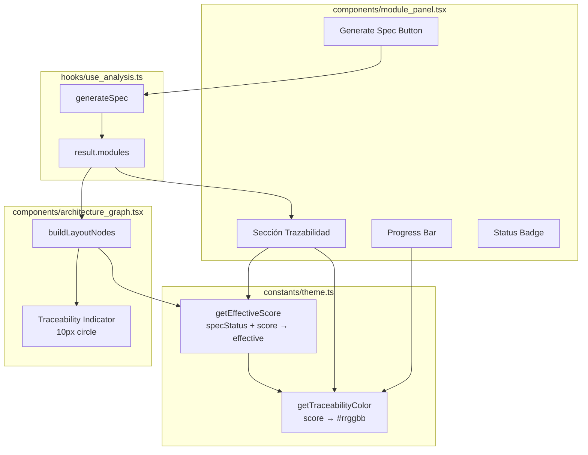

# Design Document: Traceability Visual Indicators

## Overview

Este diseño describe la implementación de indicadores visuales de trazabilidad en el grafo de arquitectura de TrazIA. La funcionalidad añade una capa visual complementaria a los nodos de tipo módulo que comunica, mediante un gradiente de color (rojo → amarillo → verde), el nivel de cobertura de especificaciones EARS de cada módulo.

El sistema se compone de:
1. Una **función pura de interpolación de color** (`getTraceabilityColor`) centralizada en `constants/theme.ts`
2. Un **indicador circular** (10px) dentro de cada nodo de módulo en el grafo
3. Una **sección de trazabilidad** en el `ModulePanel` con score, barra de progreso, badge de estado y botón de acción
4. **Actualización reactiva** del grafo tras la generación exitosa de una spec

La arquitectura respeta la separación existente: los Zone_Colors del grafo permanecen intactos y el indicador de trazabilidad es un elemento visual adicional, no un reemplazo.

## Architecture



**Flujo de datos:**
1. `result.modules` (del hook `useAnalysis`) provee `specStatus` y `specHealthScore` para cada módulo
2. `getEffectiveScore` aplica las reglas de override según `specStatus` para obtener el score efectivo
3. `getTraceabilityColor` interpola el color a partir del score efectivo
4. El grafo renderiza el indicador circular con ese color
5. El panel muestra el score numérico, barra y badge
6. Al generar una spec, `useAnalysis` actualiza `result.modules` → React reconcilia → el grafo y panel reflejan el cambio

## Components and Interfaces

### 1. `getTraceabilityColor(score: number): string` — `constants/theme.ts`

Función pura de interpolación de color.

```typescript
/**
 * Interpola un color hexadecimal entre rojo → amarillo → verde
 * según el score de trazabilidad (0–100).
 *
 * Anchors:
 *   0  → #e53935 (rojo)
 *   50 → #fdd835 (amarillo/amber)
 *   100 → #43a047 (verde)
 *
 * Interpolación lineal por canal RGB en dos segmentos:
 *   [0, 50]   rojo → amarillo
 *   [50, 100]  amarillo → verde
 */
export function getTraceabilityColor(score: number): string
```

**Comportamiento de clamping:**
- Si `score` es `NaN`, `Infinity`, `-Infinity` → tratar como 0
- Si `score < 0` → clamp a 0
- Si `score > 100` → clamp a 100

**Formato de salida:** siempre `#rrggbb` en minúsculas, 7 caracteres.

### 2. `getEffectiveScore(specStatus, specHealthScore): number` — `constants/theme.ts`

Función pura que aplica las reglas de override de `specStatus` sobre el score crudo.

```typescript
/**
 * Calcula el score efectivo aplicando las reglas de precedencia:
 * - specStatus undefined → 0 (tratar como untraced)
 * - specStatus 'untraced' → 0 (siempre rojo, ignora score)
 * - specStatus 'drift' → min(specHealthScore ?? 0, 50) (cap en 50)
 * - specStatus 'traced' → specHealthScore ?? 0
 *
 * Si specHealthScore es undefined/null → usar 0 como base
 */
export function getEffectiveScore(
  specStatus: SpecStatus | undefined,
  specHealthScore: number | undefined
): number
```

### 3. Traceability Indicator — `components/architecture_graph.tsx`

Modificación al bloque de renderizado de nodos de módulo dentro de `buildLayoutNodes`. Se añade un `<span>` circular de 10px después del nombre del archivo.

```typescript
// Dentro del label JSX de nodos de módulo:
<div style={{ display: 'flex', alignItems: 'center', gap: 3, padding: '0 6px' }}>
  <span style={{ fontSize: '0.75rem', flexShrink: 0 }}>{icon}</span>
  <span style={{ /* nombre del archivo existente */ }}>
    {shortName}
  </span>
  {/* Nuevo: indicador de trazabilidad */}
  {traceabilityColor && (
    <span
      style={{
        width: 10,
        height: 10,
        borderRadius: '50%',
        backgroundColor: traceabilityColor,
        flexShrink: 0,
        marginLeft: 'auto',
        transition: 'background-color 300ms',
      }}
      aria-label={`Trazabilidad: ${effectiveScore}%`}
    />
  )}
</div>
```

**Condición de visibilidad:** el círculo solo se renderiza si el módulo tiene `specStatus` definido O `specHealthScore` definido. Si ambos son `undefined`, no se muestra indicador (el módulo aún no fue evaluado).

**Restricción:** solo nodos de tipo `'module'` muestran el indicador. Folders e integraciones no se modifican.

### 4. Sección Trazabilidad — `components/module_panel.tsx`

Nueva sección dentro del panel, renderizada solo cuando el nodo seleccionado es de tipo `'module'`. Se posiciona después de la sección "Dependencias" existente.

**Props adicionales necesarias en `ModulePanel`:**
```typescript
interface ModulePanelProps {
  node: GraphNode | null
  onClose: () => void
  onGenerateSpec: (moduleId: string) => Promise<void>  // nueva
  generatingSpec: string | null                         // nueva
  specError: string | null                              // nueva
}
```

**Sub-componentes de la sección:**
- **Score display:** `"{score}%"` (Math.floor) o `"Sin trazabilidad"` si undefined
- **Progress bar:** `<div>` con width porcentual y color de `getTraceabilityColor`
- **Status badge:** `<span>` con texto y color según `specStatus`
- **Generate Spec Button:** condicional según zona (ver Requirement 3)

### 5. Integración en `App.tsx`

El componente `App` ya tiene `generateSpec` y `generatingSpec` del hook. Debe pasar estas props al `ModulePanel`:

```typescript
<ModulePanel
  node={selectedNode}
  onClose={handleClosePanel}
  onGenerateSpec={handleGenerateSpec}
  generatingSpec={generatingSpec}
  specError={error}
/>
```

El `selectedNode` se mantiene sincronizado con `result.modules` para reflejar actualizaciones post-generación. Esto requiere un efecto que actualice `selectedNode` cuando `result.modules` cambia para el módulo actualmente seleccionado.

## Data Models

No se requieren nuevos tipos. Los campos necesarios ya existen en las interfaces definidas en `types/index.ts`:

```typescript
// Ya existente en ModuleNode:
specStatus?: SpecStatus        // 'traced' | 'untraced' | 'drift'
specHealthScore?: number       // 0–100
specContent?: string

// Ya existente en AnalysisResult:
tracedCount: number
untracedCount: number
driftCount: number
projectHealthScore: number
```

**Nuevas constantes en `constants/theme.ts`:**

```typescript
// Anchors de color para interpolación de trazabilidad
export const TRACEABILITY_ANCHORS = {
  red:    { r: 0xe5, g: 0x39, b: 0x35 },  // #e53935 — score 0
  yellow: { r: 0xfd, g: 0xd8, b: 0x35 },  // #fdd835 — score 50
  green:  { r: 0x43, g: 0xa0, b: 0x47 },  // #43a047 — score 100
} as const
```

**Tabla de decisión para el botón:**

| specStatus    | specHealthScore | Effective Zone | Botón          |
|---------------|-----------------|----------------|----------------|
| undefined     | any             | Red (0)        | "Generar Spec" |
| 'untraced'    | any             | Red (0)        | "Generar Spec" |
| 'drift'       | 0–50            | Yellow (≤50)   | "Mejorar Spec" |
| 'drift'       | 51–100          | Yellow (50)    | "Mejorar Spec" |
| 'traced'      | 0–33            | Red            | "Generar Spec" |
| 'traced'      | 34–66           | Yellow         | "Mejorar Spec" |
| 'traced'      | 67–100          | Green          | No button      |

## Correctness Properties

*A property is a characteristic or behavior that should hold true across all valid executions of a system — essentially, a formal statement about what the system should do. Properties serve as the bridge between human-readable specifications and machine-verifiable correctness guarantees.*

### Property 1: Piecewise linear interpolation correctness

*For any* score `s` in [0, 100], `getTraceabilityColor(s)` SHALL return the piecewise linear interpolation per RGB channel between `#e53935` at 0, `#fdd835` at 50, and `#43a047` at 100. Specifically, for any score `s` in [0, 50], each channel `c` satisfies `output_c = red_c + (yellow_c - red_c) * s / 50` (rounded to nearest integer), and for `s` in [50, 100], `output_c = yellow_c + (green_c - yellow_c) * (s - 50) / 50`.

**Validates: Requirements 1.1, 1.2, 1.3, 1.5, 6.4, 6.5**

### Property 2: Input clamping and output format

*For any* numeric value `n` (including NaN, Infinity, -Infinity, negatives, and values > 100), `getTraceabilityColor(n)` SHALL return a string matching the regex `/^#[0-9a-f]{6}$/` and SHALL produce the same result as `getTraceabilityColor(clamp(n))` where clamp maps non-finite values to 0, negatives to 0, and values > 100 to 100.

**Validates: Requirements 6.2, 6.3**

### Property 3: Effective score override rules

*For any* combination of `specStatus` (including undefined) and `specHealthScore` (including undefined, 0–100), `getEffectiveScore(specStatus, specHealthScore)` SHALL return: 0 when specStatus is undefined or 'untraced'; min(score, 50) when specStatus is 'drift'; and the raw score (or 0 if undefined) when specStatus is 'traced'.

**Validates: Requirements 1.6, 1.7, 1.8, 1.9**

### Property 4: Zone_Colors preservation with traceability indicator

*For any* module node rendered in the graph, the node's background color SHALL equal `ZONE_COLORS[detectZone(module.path)].bg`, the border color SHALL equal `ZONE_COLORS[detectZone(module.path)].border`, and the text color SHALL equal `ZONE_COLORS[detectZone(module.path)].text`, regardless of the module's specStatus or specHealthScore values.

**Validates: Requirements 2.2**

### Property 5: Button visibility follows effective zone classification

*For any* module node with any valid combination of specStatus and specHealthScore, the Generate Spec Button SHALL be visible with label "Generar Spec" when the effective score is in [0, 33], visible with label "Mejorar Spec" when in [34, 66], and absent when specStatus is 'traced' AND effective score is in [67, 100].

**Validates: Requirements 3.1, 3.2, 3.3, 3.4**

### Property 6: Score display and progress bar accuracy

*For any* module node with a defined specHealthScore `s` in [0, 100], the panel SHALL display `Math.floor(s)` as the percentage text and the progress bar width SHALL equal `s%` of the total bar width, colored with `getTraceabilityColor(getEffectiveScore(specStatus, s))`.

**Validates: Requirements 4.1, 4.2**

## Error Handling

### Generación de spec fallida

- Si `generateSpec` retorna `null` (fallo), el panel muestra el mensaje de error del hook truncado a 200 caracteres
- El grafo NO actualiza el color del nodo (retiene el color previo)
- El error se limpia al seleccionar otro nodo o al intentar generar nuevamente

### Datos faltantes (defensivo)

- `specHealthScore` undefined → effective score 0
- `specStatus` undefined → tratar como 'untraced'
- `getTraceabilityColor` recibe NaN/Infinity → tratar como 0
- Nodos sin evaluación de trazabilidad (ambos campos undefined) → no mostrar indicador

### Estado de carga

- Mientras `generatingSpec === moduleId`, el botón muestra "Generando..." y está deshabilitado (`aria-disabled="true"`)
- No se permiten invocaciones concurrentes sobre el mismo módulo

## Testing Strategy

### Framework

- **Vitest** (ya configurado en el proyecto) con `@testing-library/react` para tests de componentes
- **fast-check** para property-based testing (a instalar como devDependency)

### Dual Testing Approach

**Property-based tests (fast-check, mínimo 100 iteraciones):**

| Property | Archivo de test | Qué genera |
|----------|----------------|------------|
| Property 1 | `theme.test.ts` | Scores aleatorios [0, 100], verifica interpolación matemática |
| Property 2 | `theme.test.ts` | Números arbitrarios (incluye edge cases), verifica formato y clamping |
| Property 3 | `theme.test.ts` | Combinaciones de specStatus × score, verifica reglas de override |
| Property 4 | `architecture_graph.test.tsx` | Módulos con distintas zonas y scores, verifica colores de zona intactos |
| Property 5 | `module_panel.test.tsx` | Combinaciones de specStatus × score, verifica visibilidad/label del botón |
| Property 6 | `module_panel.test.tsx` | Scores aleatorios, verifica texto de porcentaje y ancho de barra |

**Configuración PBT:**
- Mínimo 100 iteraciones por property test
- Cada test tagueado: `Feature: traceability-visual-indicators, Property {N}: {text}`

**Unit tests (example-based):**

- `getTraceabilityColor` retorna exactamente `#e53935` para score 0, `#fdd835` para 50, `#43a047` para 100
- Indicador circular de 10px se renderiza solo en nodos de módulo
- Indicador no aparece cuando ambos campos son undefined
- Badge de estado muestra texto y color correcto para cada specStatus
- "Sin trazabilidad" se muestra cuando specHealthScore es undefined
- Botón deshabilitado durante generación con texto "Generando..."
- Error se muestra truncado a 200 caracteres y se limpia al cambiar nodo
- Transición CSS de 300ms presente en el indicador
- selectionHighlight (boxShadow) coexiste con indicador de trazabilidad

**Integration tests:**

- Flujo completo: click en nodo sin spec → click "Generar Spec" → mock de generateSpec → verificar actualización del panel y del grafo
- Viewport de react-flow no se resetea tras actualización de módulos
