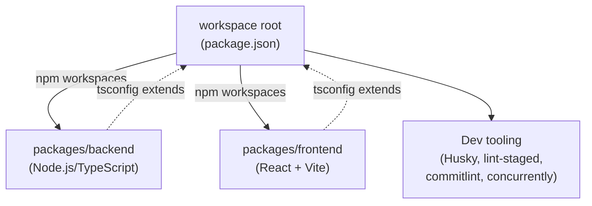
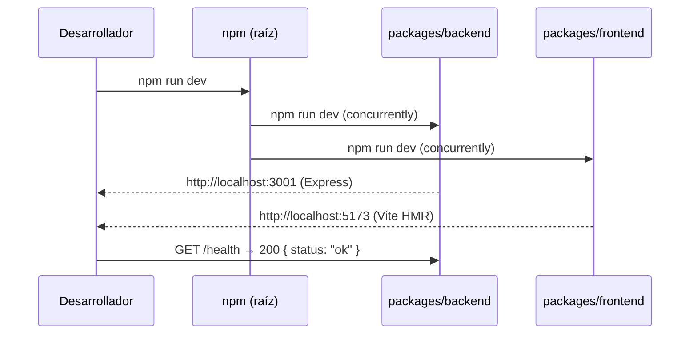

# Design Document: trazia-project-init

## Overview

Este documento describe el diseño técnico para la inicialización del proyecto TrazIA como un monorepo npm workspaces. El objetivo es establecer la estructura base completa — backend Node.js/TypeScript, frontend React + React Flow, tooling de calidad y scripts de workspace — desde la que el equipo puede comenzar a desarrollar los agentes, la API y la visualización sin configuración adicional.

La inicialización es un proceso **idempotente de scaffolding**: genera archivos de configuración, estructura de carpetas y dependencias de forma determinista. No hay lógica de negocio en esta fase; el resultado es un árbol de archivos reproducible que satisface todos los criterios de aceptación de los requisitos.

### Decisiones de diseño clave

- **npm workspaces** como mecanismo de monorepo, sin herramientas adicionales (Turborepo, Lerna, nx) para mantener el setup lo más simple posible en un sprint de 5 días.
- **`concurrently`** para el script `dev` raíz (ambos procesos corren en paralelo con prefijos de color); **`npm-run-all`** para `lint` y `build` secuenciales.
- **Vite** como bundler del frontend por su velocidad en desarrollo (HMR sub-segundo) y soporte TypeScript nativo.
- **ts-node-dev** como runner de desarrollo del backend por su bajo overhead y reinicio automático en cambios de `.ts`.
- **Husky + lint-staged + commitlint** para enforcement en pre-commit y commit-msg, herramientas estándares del ecosistema JS/TS.

---

## Architecture

El resultado de la inicialización es una estructura monorepo con dos paquetes independientes orquestados desde la raíz:

```
trazia/                          ← workspace root
├── package.json                 ← scripts raíz, workspaces declaration
├── tsconfig.base.json           ← configuración TypeScript base compartida
├── .eslintrc.json               ← configuración ESLint base (compartida)
├── .gitignore                   ← exclusiones de git
├── .husky/
│   ├── pre-commit               ← hook: lint-staged
│   └── commit-msg               ← hook: commitlint
├── .commitlintrc.json           ← reglas commitlint (Conventional Commits)
├── .lintstagedrc.json           ← configuración lint-staged
├── README.md                    ← documentación del proyecto
├── packages/
│   ├── backend/                 ← paquete Node.js/TypeScript
│   │   ├── package.json
│   │   ├── tsconfig.json        ← extiende ../../tsconfig.base.json
│   │   ├── .env.example
│   │   └── src/
│   │       ├── app.ts           ← punto de entrada Express
│   │       ├── routes/
│   │       ├── services/
│   │       ├── types/
│   │       └── utils/
│   └── frontend/                ← paquete React + Vite
│       ├── package.json
│       ├── vite.config.ts
│       ├── tsconfig.json
│       ├── .env.example
│       └── src/
│           ├── main.tsx
│           ├── App.tsx
│           ├── components/
│           │   └── architecture_graph.tsx
│           ├── hooks/
│           ├── services/
│           │   └── api_client.ts
│           └── types/
```

### Diagrama de dependencias del workspace



### Flujo de arranque en desarrollo



---

## Components and Interfaces

### 1. Workspace Root (`package.json` raíz)

Responsable de la orquestación del monorepo. Declara los workspaces y los scripts de nivel superior.

**Scripts expuestos:**

| Script | Implementación | Comportamiento |
|--------|---------------|----------------|
| `dev` | `concurrently "npm run dev -w packages/backend" "npm run dev -w packages/frontend"` | Ambos procesos en paralelo; el fallo de uno no mata al otro (`--kill-others-on-fail false`) |
| `build` | `npm-run-all build:backend build:frontend` | Secuencial: backend primero, luego frontend |
| `lint` | `npm-run-all lint:backend lint:frontend` | Secuencial, falla rápido si hay errores |
| `test` | `npm-run-all test:backend test:frontend` | Secuencial |

**Dependencias de desarrollo en raíz:**
- `concurrently` — ejecución paralela con prefijos
- `npm-run-all` — ejecución secuencial/paralela de scripts
- `husky` — git hooks
- `lint-staged` — linting selectivo de archivos staged
- `@commitlint/cli` + `@commitlint/config-conventional` — validación de mensajes de commit

### 2. Backend (`packages/backend`)

Servidor Express mínimo con endpoint de salud, listo para recibir los agentes.

**Interfaz pública (HTTP):**

```
GET /health
→ 200 OK
→ Content-Type: application/json
→ Body: { "status": "ok", "service": "trazia-backend" }
```

**Estructura de `src/`:**

```
src/
├── app.ts          ← crea y configura la app Express, arranca el servidor
├── routes/         ← definición de rutas (health.ts para el MVP de init)
├── services/       ← lógica de negocio (vacío en init, reservado para agentes)
├── types/          ← tipos TypeScript del backend
└── utils/          ← utilidades compartidas (logger, etc.)
```

**Variables de entorno:**

| Variable | Tipo | Default | Descripción |
|----------|------|---------|-------------|
| `PORT` | `number` | `3001` | Puerto donde escucha Express |

**`app.ts` — contrato de módulo:**

```typescript
// Exporta la app Express para testing; el arranque del servidor
// ocurre en el bloque principal solo cuando es el módulo de entrada
export const app: Express;
export function startServer(port: number): http.Server;
```

**Scripts del `package.json`:**

| Script | Comando |
|--------|---------|
| `build` | `tsc` |
| `dev` | `ts-node-dev --respawn --transpile-only src/app.ts` |
| `lint` | `eslint "src/**/*.ts"` |
| `test` | `jest --passWithNoTests` |

### 3. Frontend (`packages/frontend`)

Aplicación React + Vite con React Flow preconfigurado.

**Componente `ArchitectureGraph`:**

```typescript
// src/components/architecture_graph.tsx
// Renderiza un ReactFlow vacío (0 nodos, 0 aristas)
// Punto de extensión para la visualización del grafo de arquitectura

interface ArchitectureGraphProps {
  // reservado para props futuras (nodes, edges, etc.)
}

export const ArchitectureGraph: React.FC<ArchitectureGraphProps>;
```

**Módulo `api_client.ts`:**

```typescript
// src/services/api_client.ts
// Configura axios/fetch con la URL base del backend
// Lee VITE_API_URL o usa http://localhost:3001 por defecto

const apiClient: AxiosInstance; // o equivalente con fetch
export default apiClient;
```

**Variables de entorno (prefijo Vite):**

| Variable | Default | Descripción |
|----------|---------|-------------|
| `VITE_API_URL` | `http://localhost:3001` | URL base del backend |

**Scripts del `package.json`:**

| Script | Comando |
|--------|---------|
| `dev` | `vite` |
| `build` | `tsc && vite build` |
| `lint` | `eslint "src/**/*.{ts,tsx}"` |
| `test` | `vitest run` |

### 4. Configuración TypeScript compartida (`tsconfig.base.json`)

Base que extienden ambos paquetes:

```json
{
  "compilerOptions": {
    "strict": true,
    "noImplicitAny": true,
    "esModuleInterop": true,
    "skipLibCheck": true,
    "forceConsistentCasingInFileNames": true,
    "resolveJsonModule": true
  }
}
```

El backend extiende con `"module": "commonjs"`, `"target": "ES2020"`, `"outDir": "dist"`.  
El frontend extiende con `"module": "ESNext"`, `"target": "ES2020"`, `"jsx": "react-jsx"`.

### 5. Configuración ESLint compartida (`.eslintrc.json` raíz)

Reglas activas en modo `error`:
- `@typescript-eslint/no-explicit-any`
- `camelcase` (variables y parámetros)
- `@typescript-eslint/naming-convention`: PascalCase para clases e interfaces, UPPER_SNAKE_CASE para `const` a nivel de módulo

### 6. Git Hooks (Husky)

**`pre-commit`** → ejecuta `lint-staged`:
- Archivos `.ts` y `.tsx` staged → `eslint --fix`
- Si ESLint reporta errores no autofix → commit rechazado con reporte de ruta, línea, regla y mensaje

**`commit-msg`** → ejecuta `commitlint`:
- Valida formato Conventional Commits
- Tipos válidos: `feat`, `fix`, `docs`, `style`, `refactor`, `perf`, `test`, `build`, `ci`, `chore`, `revert`
- Si el mensaje no cumple → commit rechazado con el tipo recibido y lista de tipos aceptados

---

## Data Models

La fase de inicialización no define modelos de datos de negocio (esos pertenecen a los agentes). Sin embargo, hay estructuras de configuración relevantes:

### Estructura de `package.json` raíz

```typescript
interface RootPackageJson {
  name: string;                          // "trazia"
  version: string;                       // "0.1.0"
  private: true;
  workspaces: string[];                  // ["packages/backend", "packages/frontend"]
  scripts: Record<string, string>;
  devDependencies: Record<string, string>;
}
```

### Estructura del `.env.example` del backend

```
PORT=3001
```

### Estructura del `.env.example` del frontend

```
VITE_API_URL=http://localhost:3001
```

### Health Check Response

```typescript
interface HealthCheckResponse {
  status: "ok";
  service: "trazia-backend";
}
```

Esta interfaz se define en `packages/backend/src/types/` y es el único tipo concreto del módulo de inicialización. Sirve también como ejemplo de la convención de tipado que se seguirá en el resto del proyecto.

---

## Correctness Properties

*A property is a characteristic or behavior that should hold true across all valid executions of a system — essentially, a formal statement about what the system should do. Properties serve as the bridge between human-readable specifications and machine-verifiable correctness guarantees.*

### Evaluación de aplicabilidad de PBT

Esta feature es principalmente **scaffolding y configuración**: genera archivos de configuración, instala dependencias y registra scripts en `package.json`. La mayor parte de los requisitos describe comportamientos de herramientas externas (TypeScript compiler, ESLint, Vite, Husky) o configuraciones one-shot.

Sin embargo, hay una pieza de lógica propia claramente testeable con property-based testing:

- **El backend lee `PORT` del entorno** y usa `3001` como fallback → comportamiento que varía con el input (valor de `PORT`).
- **El API client del frontend lee `VITE_API_URL`** y usa `http://localhost:3001` como fallback → mismo patrón.
- **El endpoint `/health`** devuelve un cuerpo JSON con estructura fija independientemente de quién lo invoque.

El resto de requisitos son SMOKE (verificar que herramientas externas están configuradas) o EXAMPLE (verificar comportamiento con un ejemplo concreto). PBT aplica de forma limitada pero real para la lógica de resolución de configuración.

---

### Property 1: PORT environment variable resolution

*For any* numeric string `PORT` válida (rango 1–65535), cuando el backend arranca con esa variable de entorno definida, el servidor SHALL escuchar exactamente en ese puerto y no en el puerto por defecto `3001`.

**Validates: Requirements 2.2**

---

### Property 2: PORT fallback when unset

*For any* arranque del backend donde `PORT` no está definida en el entorno, el servidor SHALL escuchar en el puerto `3001`.

**Validates: Requirements 2.2**

---

### Property 3: Health check response invariant

*For any* petición `GET /health` al backend (independientemente del origen, headers adicionales o parámetros de query), la respuesta SHALL tener código HTTP `200`, `Content-Type: application/json`, y el cuerpo SHALL ser igual a `{ "status": "ok", "service": "trazia-backend" }` sin campos adicionales.

**Validates: Requirements 2.3**

---

### Property 4: VITE_API_URL resolution

*For any* URL válida definida en `VITE_API_URL`, el módulo `api_client.ts` SHALL usar exactamente esa URL como base; cuando `VITE_API_URL` no está definida, SHALL usar `http://localhost:3001`.

**Validates: Requirements 3.7**

---

### Property 5: Commit message validation completeness

*For any* mensaje de commit cuyo primer token (antes de `:`) sea un tipo NO incluido en la lista de tipos válidos de Conventional Commits, `commitlint` SHALL rechazar el commit; *for any* mensaje cuyo primer token sea un tipo válido seguido de `: ` y un scope no vacío, SHALL aceptarlo.

**Validates: Requirements 5.3, 5.5**

---

## Error Handling

### Backend: arranque con servicios externos no disponibles

**Requisito 2.7:** Si el backend no puede conectarse a un servicio externo durante el arranque, debe loggear en `stderr` y continuar.

**Diseño:**
```typescript
// En app.ts, patrón de conexión defensiva
async function connectOptionalService(
  serviceName: string,
  url: string,
  connectFn: () => Promise<void>
): Promise<void> {
  try {
    await connectFn();
  } catch (error) {
    // Log a stderr con contexto completo
    console.error(JSON.stringify({
      agente: 'backend',
      módulo: 'startup',
      servicio: serviceName,
      url,
      error: error instanceof Error ? error.message : String(error),
    }));
    // No relanzar — el servidor continúa arrancando
  }
}
```

Este patrón sigue la convención de `{ agente, módulo, error }` definida en `conventions.md`.

### ESLint en pre-commit: fallo con contexto

Si `lint-staged` detecta errores, ESLint los formatea con `--format stylish` (ruta, línea, regla, mensaje) y el proceso termina con código de salida ≠ 0, lo que hace que Husky rechace el commit automáticamente.

### Commitlint: mensaje de error descriptivo

La configuración de `commitlint` con `@commitlint/config-conventional` produce mensajes del estilo:
```
⧗   input: wip: adding stuff
✖   type must be one of [feat, fix, docs, style, refactor, perf, test, build, ci, chore, revert] [type-enum]
✖   found 1 problems, 0 warnings
```

### Proceso concurrente con fallo

`concurrently` está configurado con el flag adecuado para mostrar el nombre del proceso que falló y su código de salida en `stderr`, sin silenciar el error. El script `dev` no usa `--kill-others-on-fail` para que el fallo de uno no mate al otro, satisfaciendo el requisito 4.1.

---

## Testing Strategy

### Evaluación: ¿aplica PBT a esta feature?

Esta feature inicializa scaffolding. La mayoría de sus criterios de aceptación verifican configuración (SMOKE), comportamiento de herramientas externas (INTEGRATION), o ejemplos concretos (EXAMPLE). Sin embargo, la lógica propia del backend (resolución de `PORT`, respuesta de `/health`) y del frontend (`VITE_API_URL`) son candidatos legítimos para PBT.

**Librería PBT elegida:** `fast-check` (TypeScript-native, ampliamente mantenida, integra con Jest y Vitest).

---

### Unit Tests (Jest — backend)

Tests de ejemplo para comportamientos específicos:

1. **`app.test.ts`** — El servidor Express devuelve `200` y el body correcto en `GET /health`.
2. **`app.test.ts`** — El servidor arranca en `PORT=3001` cuando la variable no está definida.
3. **`startupError.test.ts`** — Un servicio externo que falla durante el arranque no detiene el servidor.

### Property Tests (Jest + fast-check — backend)

Cada propiedad se implementa con un único test parametrizado con `fc.assert()` y mínimo 100 iteraciones.

**Property 1 & 2 — Resolución de PORT:**
```typescript
// Feature: trazia-project-init, Property 1: PORT environment variable resolution
// Feature: trazia-project-init, Property 2: PORT fallback when unset
import * as fc from 'fast-check';

fc.assert(
  fc.property(fc.integer({ min: 1, max: 65535 }), async (port) => {
    process.env.PORT = String(port);
    const server = await startServer();
    expect(server.address().port).toBe(port);
    server.close();
    delete process.env.PORT;
  }),
  { numRuns: 100 }
);
```

**Property 3 — Health check invariant:**
```typescript
// Feature: trazia-project-init, Property 3: Health check response invariant
fc.assert(
  fc.property(
    fc.record({ extraHeaders: fc.dictionary(fc.string(), fc.string()) }),
    async ({ extraHeaders }) => {
      const res = await request(app).get('/health').set(extraHeaders);
      expect(res.status).toBe(200);
      expect(res.headers['content-type']).toMatch(/application\/json/);
      expect(res.body).toStrictEqual({ status: 'ok', service: 'trazia-backend' });
    }
  ),
  { numRuns: 100 }
);
```

### Unit Tests (Vitest — frontend)

1. **`api_client.test.ts`** — Cuando `VITE_API_URL` no está definida, la URL base es `http://localhost:3001`.
2. **`architecture_graph.test.tsx`** — El componente monta sin errores y el contenedor de React Flow está presente en el DOM.

### Property Tests (Vitest + fast-check — frontend)

**Property 4 — VITE_API_URL resolution:**
```typescript
// Feature: trazia-project-init, Property 4: VITE_API_URL resolution
fc.assert(
  fc.property(fc.webUrl(), (url) => {
    import.meta.env.VITE_API_URL = url;
    const client = createApiClient();
    expect(client.defaults.baseURL).toBe(url);
  }),
  { numRuns: 100 }
);
```

### Integration / Smoke Tests

Los siguientes criterios se validan con tests de integración manuales o scripts de CI (no PBT):

| Criterio | Tipo | Estrategia |
|----------|------|------------|
| `npm install` desde raíz instala sin errores | SMOKE | `npm ci` en CI pipeline |
| `tsc --noEmit` sale con código 0 | SMOKE | Paso en CI |
| `npm run lint` produce 0 errores | SMOKE | Paso en CI |
| `npm run build` completa con código 0 | SMOKE | Paso en CI |
| Dev server disponible en 30s | INTEGRATION | Health check en CI con timeout |
| Husky hooks activos tras `npm install` | SMOKE | Verificación de `.husky/` en CI |
| Commitlint rechaza tipos inválidos | EXAMPLE | Test con `commitlint --from HEAD~1` |

### Configuración de tests

- Backend: `jest.config.ts` en `packages/backend`, `testEnvironment: "node"`, cobertura con `jest --coverage`.
- Frontend: `vitest.config.ts` en `packages/frontend` con `environment: "jsdom"`, integrado con `@testing-library/react`.
- Iteraciones mínimas de fast-check: **100** por propiedad.
- Cada test de propiedad lleva el tag de comentario: `Feature: trazia-project-init, Property N: <texto>`.
