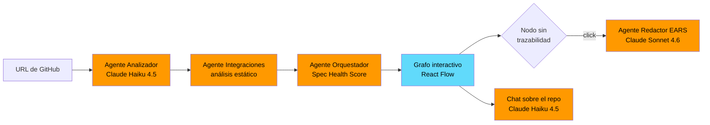

<div align="center">

# TrazIA

**Trazabilidad de intención para repositorios de GitHub**

[](https://www.typescriptlang.org/)
[](https://react.dev/)
[](https://vite.dev/)
[](https://nodejs.org/)
[](https://aws.amazon.com/bedrock/)
[](https://aws.amazon.com/ec2/)
[](https://aws.amazon.com/cloudfront/)
[](https://kiro.dev/)

Pegás la URL de un repositorio y en segundos ves un mapa interactivo de su arquitectura,
coloreado según qué partes tienen trazabilidad real y cuáles son una caja negra.
Con un click, un agente genera la spec faltante en sintaxis EARS, y además tenés un chat con un agente de soporte.

[]()
[](https://dd3vs0c4nng7j.cloudfront.net)

</div>

---

## El problema

El código se acumula más rápido de lo que se documenta — sea porque se escribió sin dejar rastro de por qué existe, o porque se generó con IA sin spec previa. En ambos casos el síntoma es el mismo: nadie sabe qué partes del repositorio se entienden y cuáles son deuda invisible, hasta que se rompe algo o entra alguien nuevo al equipo.

TrazIA infiere la intención **sin asumir el origen del código**. 

El núcleo del producto no es el grafo: es la trazabilidad. El grafo es la interfaz para navegar una pregunta más profunda — *¿qué partes de este código alguien realmente entendió y documentó, y cuáles existen sin dejar rastro de por qué?*

---

## Cómo funciona



**1. Carga** — URL de un repositorio público de GitHub. Análisis estático, sin necesidad de ejecutar el proyecto.

**2. Pipeline de agentes** — cinco agentes que corren en un proceso Express único e invocan Claude vía Amazon Bedrock:

| Agente | Responsabilidad | Modelo |
|---|---|---|
| **Analizador** | Mapea módulos, dependencias y estructura del código | Claude Haiku 4.5 |
| **Integraciones** | Detecta bases de datos, APIs externas y servicios cloud por análisis de patrones | — *(estático)* |
| **Orquestador** | Calcula el **Spec Health Score** por módulo y a nivel proyecto | — *(determinista)* |
| **Redactor EARS** | Infiere qué requisito cumple cada módulo y redacta un `requirements.md` retroactivo | Claude Sonnet 4.6 |
| **Chat** | Responde preguntas sobre el repo con contexto multi-módulo y dependencias inversas | Claude Haiku 4.5 |

> Integraciones y Orquestador son **deterministas a propósito**: detectar un import de `pg` o calcular un score no necesita un LLM, y hacerlo sin él lo vuelve reproducible y gratis.

**3. Visualización** — grafo interactivo coloreado por estado de trazabilidad:

- 🟢 **Trazado** — tiene spec vigente
- 🟡 **Drift** — la spec existe pero está desactualizada respecto al código
- 🔴 **Sin trazabilidad** — caja negra, no hay spec
- ⚪ **No aplica** — archivos de configuración y assets, excluidos del score

**4. Generación de specs on-demand** — click en un nodo rojo y el Agente Redactor genera la spec faltante en vivo, en sintaxis EARS, lista para guardarse en `.kiro/specs/`. No se pre-generan: se piden cuando se necesitan.

**5. Chat sobre el repo** — preguntas en lenguaje natural con el análisis completo como contexto. Detecta preguntas de impacto (*"¿qué se rompe si borro esto?"*) y calcula **dependencias inversas** para responder con el grafo en la mano en vez de suponer.

---

## Stack tecnológico

| Capa | Tecnología |
|---|---|
| **Backend** | Node.js · TypeScript · Express |
| **Frontend** | React · Vite · React Flow (`@xyflow/react`) · Dagre |
| **Agentes** | Proceso Express único, pipeline en memoria |
| **IA** | Amazon Bedrock en `sa-east-1` vía `@anthropic-ai/bedrock-sdk` — inference profiles globales de Claude Haiku 4.5 y Claude Sonnet 4.6 |
| **Persistencia** | Ninguna — el análisis es stateless y se recalcula por request |
| **Deploy** | EC2 (Amazon Linux 2023 · nginx · pm2) · CloudFront · IAM instance role |
| **Calidad** | 203 tests · property-based testing con `fast-check` |
| **Specs** | Formato EARS, versionadas en `.kiro/specs/` |

**Servicios AWS usados:** Bedrock · EC2 · CloudFront · IAM

Las credenciales de Bedrock se resuelven por la cadena estándar del AWS SDK. En producción la EC2 usa un **IAM instance role** con permiso `bedrock:InvokeModel` — no hay access keys en ningún archivo.

---

## Alcance

- Input por URL de repositorio público de GitHub
- Análisis multi-lenguaje: **TypeScript · JavaScript · Python · Java · Kotlin · Go · Rust · C# · Ruby · PHP · Swift · Dart · Scala**, más templates (Vue, Svelte, Astro, HTML) y hojas de estilo
- Grafo estático (carpetas + imports), sin trazas de runtime
- Analizador + Integraciones + Spec Health Score
- Generación EARS on-demand por módulo
- Chat sobre el repo con análisis de dependencias

---

## Roadmap

Deliberadamente **fuera** de la implementación actual:

- **Una Lambda por agente** — hoy el pipeline es filesystem-based: clona el repo con `simple-git` y los agentes leen del disco. El runtime Node de Lambda no incluye el binario `git`, así que migrar exige reemplazar el clonado por la API de GitHub. Es un cambio de arquitectura, no una configuración.
- **S3 + hosting estático desacoplado** del backend
- **Drift-checker** contra specs existentes en el repo analizado
- Edición de la spec antes de guardarla · input por carpeta local

---

## Desarrollo spec-driven con Kiro

TrazIA se construye con el mismo principio que evalúa. Todo el proyecto está definido en `.kiro/`:

```
.kiro/
├── steering/          ← reglas permanentes (producto, convenciones, workflows)
├── specs/             ← 14 specs con el ciclo requirements.md → design.md → tasks.md
└── settings/          ← configuración de MCP
```

El historial de git muestra las specs commiteadas **antes** que el código que las implementa.

---

## Calidad

```bash
npm run test    # 203 tests: 168 backend (Jest) + 35 frontend (Vitest)
```

Además de tests de ejemplo, el constructor de contexto del chat está cubierto con **property-based testing** (`fast-check`): en vez de verificar casos puntuales, se generan cientos de entradas aleatorias y se afirman invariantes que deben valer siempre — por ejemplo, que ningún módulo del análisis se pierda al armar el contexto que se le pasa al LLM.

El backend incluye además reintentos con backoff exponencial, un limitador de concurrencia para las llamadas a Bedrock y logging estructurado en JSON.

---

## Instalación

Requiere **Node.js 18+** y **npm 9+** (con soporte de workspaces).

```bash
git clone https://github.com/joaquinalejandroguzman/trazIA.git
cd trazIA
npm install
```

`npm install` desde la raíz instala backend y frontend en una sola operación gracias a los npm workspaces.

> **Importante:** instalar siempre desde la raíz. Correr `npm install` dentro de `packages/` genera lockfiles por paquete que rompen la instalación reproducible del monorepo.

**Nota sobre binarios nativos.** Algunas dependencias de build (Rollup, esbuild) publican un paquete distinto por sistema operativo y arquitectura. npm no siempre incluye en el lockfile los binarios de plataformas distintas a la que lo generó ([npm/cli#4828](https://github.com/npm/cli/issues/4828)). Si `npm run build` falla con `Cannot find module @rollup/rollup-<plataforma>`, instalar el que corresponda:

```bash
npm install --no-save @rollup/rollup-linux-x64-gnu@$(node -p "require('rollup/package.json').version")
```

Reemplazando `linux-x64-gnu` por la plataforma de destino (`darwin-arm64`, `win32-x64-msvc`, etc.).

---

## Comandos

Desde la raíz del monorepo:

```bash
npm run dev      # levanta backend y frontend en paralelo con hot-reload
npm run build    # compila ambos paquetes para producción
npm run lint     # ESLint sobre todo el monorepo
npm run test     # tests de todos los paquetes
```

`npm run dev` levanta ambos: abrí **`http://localhost:5173`** en el navegador. El backend queda en `http://localhost:3001` y el frontend le pega solo.

---

## API

| Método | Endpoint | Descripción |
|---|---|---|
| `GET` | `/health` | Health check del servicio |
| `POST` | `/api/analyze` | Clona y analiza un repo; devuelve módulos, integraciones y Spec Health Score |
| `POST` | `/api/generate-spec` | Genera la spec EARS de un módulo puntual |
| `POST` | `/api/classify-module` | Clasifica el estado de trazabilidad de un módulo |
| `POST` | `/api/chat` | Pregunta en lenguaje natural sobre el repo analizado |

---

## Estructura del proyecto

```
trazIA/
├── package.json                 ← scripts raíz y declaración de workspaces
├── tsconfig.base.json           ← configuración TypeScript compartida
├── .eslintrc.json               ← configuración ESLint compartida
├── .kiro/                       ← steering y specs del proyecto
├── deploy/
│   └── nginx.conf               ← estáticos + proxy al backend
└── packages/
    ├── backend/                 ← servidor Node.js + TypeScript
    │   ├── .env.example
    │   └── src/
    │       ├── app.ts           ← punto de entrada Express
    │       ├── agents/          ← un agente por carpeta
    │       ├── clients/         ← cliente Bedrock singleton
    │       ├── routes/          ← endpoints REST
    │       ├── services/        ← clonado de repos
    │       ├── shared/          ← tipos, retry, limitador, escáner de archivos
    │       └── types/
    └── frontend/                ← aplicación React + Vite
        ├── .env.example
        └── src/
            ├── main.tsx
            ├── App.tsx
            ├── components/      ← grafo interactivo con React Flow
            ├── constants/       ← tema y paleta de trazabilidad
            ├── hooks/
            ├── mocks/           ← datos de ejemplo para desarrollo sin backend
            ├── services/        ← cliente HTTP
            ├── types/
            └── utils/           ← motor de layout del grafo
```

---

## Variables de entorno

**Solo el backend necesita configuración.** El frontend ya trae sus valores de desarrollo en `.env.development`, versionado en el repo.

```bash
cp packages/backend/.env.example packages/backend/.env    # macOS / Linux
copy packages\backend\.env.example packages\backend\.env  # Windows
```

Completá las tres variables de Bedrock antes de arrancar.

### Backend

**Requeridas** — el servidor lanza un error al arrancar si falta alguna:

| Variable | Ejemplo | Descripción |
|---|---|---|
| `BEDROCK_REGION` | `sa-east-1` | Región AWS donde están habilitados los modelos |
| `BEDROCK_MODEL_ANALYZER` | `global.anthropic.claude-haiku-4-5-20251001-v1:0` | Inference profile del Agente Analizador |
| `BEDROCK_MODEL_EARS` | `global.anthropic.claude-sonnet-4-6` | Inference profile del Agente Redactor EARS |

**Opcionales** — todas con valor por defecto:

| Variable | Por defecto | Descripción |
|---|---|---|
| `PORT` | `3001` | Puerto del servidor Express |
| `MAX_LLM_RETRIES` | `3` | Reintentos ante fallos de Bedrock |
| `BASE_RETRY_DELAY_MS` | `1000` | Demora inicial del backoff exponencial |
| `MAX_RETRY_DELAY_MS` | `30000` | Techo de la demora entre reintentos |
| `MAX_LLM_CONCURRENCY` | `4` | Llamadas simultáneas a Bedrock, para evitar throttling |


> **Sin access keys.** Las credenciales salen de la cadena estándar del AWS SDK: perfil local en `~/.aws/credentials` durante el desarrollo, IAM instance role en producción.

### Frontend

| Variable | Por defecto | Descripción |
|---|---|---|
| `VITE_API_URL` | `http://localhost:3001` | URL base del backend. **Vacío en producción**: las llamadas salen relativas al mismo origen |
| `VITE_USE_MOCK` | `false` | Usa datos de ejemplo en vez del backend real |

> Las variables con prefijo `VITE_` quedan expuestas al cliente. No poner secretos ahí.

---

## Despliegue

CloudFront termina HTTPS y enruta a una EC2 en `sa-east-1` (la misma región que Bedrock), donde nginx sirve el bundle estático y proxya la API:

```
CloudFront (HTTPS)
  /       → nginx → packages/frontend/dist/   (frontend estático)
  /api/*  → nginx → localhost:3001            (Express + Bedrock)
```

El backend corre bajo `pm2` con arranque automático al reboot. La configuración de nginx está versionada en `deploy/nginx.conf`.

---

<div align="center">

**Equipo 131**

*Hackathon Código Facilito x AWS · Julio 2026*

</div>
