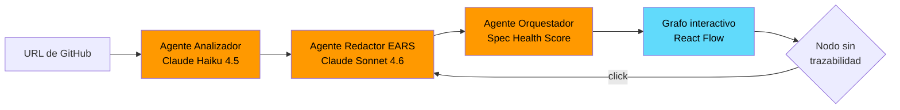

<div align="center">

# TrazIA

**Trazabilidad de intención para repositorios de código**

[](https://www.typescriptlang.org/)
[](https://react.dev/)
[](https://vite.dev/)
[](https://nodejs.org/)
[](https://aws.amazon.com/lambda/)
[](https://aws.amazon.com/bedrock/)
[](https://kiro.dev/)

Pegás la URL de un repo y en segundos ves un mapa interactivo de su arquitectura,
coloreado según qué partes tienen trazabilidad real y cuáles son una caja negra.
Con un click, un agente genera la spec faltante en sintaxis EARS.

[]()
[]()

</div>

---

## El problema

El código se acumula más rápido de lo que se documenta — sea porque se generó con IA sin spec previa, o porque un dev lo escribió a mano hace años sin dejar rastro de por qué existe. En ambos casos el síntoma es el mismo: **nadie sabe qué partes del repo se entienden y cuáles son deuda invisible**, hasta que se rompe algo o entra alguien nuevo al equipo.

TrazIA infiere la intención **sin asumir el origen del código**. Funciona igual en código generado con IA sin spec previa que en código escrito a mano hace años sin documentar.

El núcleo del producto no es el grafo: es la trazabilidad. El grafo es la interfaz para navegar una pregunta más profunda — *¿qué partes de este código alguien realmente entendió y documentó, y cuáles existen sin dejar rastro de por qué?*

---

## Cómo funciona



**1. Carga** — URL de un repositorio público de GitHub. Análisis estático, sin necesidad de ejecutar el proyecto.

**2. Pipeline de agentes** — tres funciones Lambda que invocan Claude vía Amazon Bedrock:

| Agente | Responsabilidad | Modelo |
|---|---|---|
| **Analizador** | Mapea módulos, dependencias y estructura del código | Claude Haiku 4.5 |
| **Redactor EARS** | Infiere qué requisito cumple cada módulo y redacta un `requirements.md` retroactivo | Claude Sonnet 4.6 |
| **Orquestador** | Calcula el **Spec Health Score** por módulo y a nivel proyecto | — |

**3. Visualización** — grafo interactivo coloreado por estado de trazabilidad:

- 🟢 **Trazado** — tiene spec vigente
- 🟡 **Drift** — la spec existe pero está desactualizada respecto al código
- 🔴 **Sin trazabilidad** — caja negra, no hay spec

**4. Interacción** — click en un nodo rojo y el agente genera la spec faltante en vivo, en sintaxis EARS, lista para guardarse en `.kiro/specs/`.

---

## Stack tecnológico

| Capa | Tecnología |
|---|---|
| **Backend** | Node.js · TypeScript · Express |
| **Frontend** | React · Vite · React Flow |
| **Agentes** | AWS Lambda (una función por agente) |
| **IA** | Amazon Bedrock en `sa-east-1` — `anthropic.claude-haiku-4-5` y `anthropic.claude-sonnet-4-6` |
| **Persistencia** | DynamoDB (histórico del Spec Health Score) · S3 (hosting del frontend) |
| **Specs** | Formato EARS, versionadas en `.kiro/specs/` |

---

## Alcance del MVP

Lo que se compromete a funcionar de punta a punta:

- Input por URL de repositorio público de GitHub
- Análisis de repositorios **TypeScript / JavaScript**
- Grafo estático (carpetas + imports), sin trazas de runtime
- Analizador + Redactor EARS + Spec Health Score

**Fuera de alcance (stretch goals):** drift-checker contra specs existentes, generador de steering, soporte multi-lenguaje, edición de spec antes de guardar, input por carpeta local.

---

## Desarrollo spec-driven con Kiro

TrazIA se construye con el mismo principio que evalúa. Todo el proyecto está definido en `.kiro/`:

```
.kiro/
├── steering/          ← reglas permanentes (producto, convenciones, workflows)
├── specs/             ← requirements.md → design.md → tasks.md
└── settings/          ← configuración de MCP
```

El historial de git muestra las specs commiteadas **antes** que el código que las implementa.

---

## Instalación

Requiere **Node.js 18+** y **npm 9+** (con soporte de workspaces).

```bash
git clone https://github.com/joaquinalejandroguzman/trazIA.git
cd trazIA
npm install
```

`npm install` desde la raíz instala backend y frontend en una sola operación gracias a los npm workspaces.

> **Importante:** instalar siempre desde la raíz. Correr `npm install` dentro de `packages/` genera lockfiles por paquete que rompen la build en otros sistemas operativos.

---

## Comandos

Desde la raíz del monorepo:

```bash
npm run dev      # levanta backend y frontend en paralelo con hot-reload
npm run build    # compila ambos paquetes para producción
npm run lint     # ESLint sobre todo el monorepo
npm run test     # tests de todos los paquetes
```

Backend en `http://localhost:3001` · Frontend en `http://localhost:5173`

---

## Estructura del proyecto

```
trazIA/
├── package.json                 ← scripts raíz y declaración de workspaces
├── tsconfig.base.json           ← configuración TypeScript compartida
├── .eslintrc.json               ← configuración ESLint compartida
├── .kiro/                       ← steering y specs del proyecto
└── packages/
    ├── backend/                 ← servidor Node.js + TypeScript
    │   ├── .env.example
    │   └── src/
    │       ├── app.ts           ← punto de entrada Express
    │       ├── agents/          ← un agente por carpeta
    │       ├── routes/          ← endpoints REST
    │       ├── shared/          ← tipos y contrato JSON entre agentes
    │       └── utils/
    └── frontend/                ← aplicación React + Vite
        ├── .env.example
        └── src/
            ├── main.tsx
            ├── App.tsx
            ├── components/      ← grafo interactivo con React Flow
            ├── hooks/
            ├── services/        ← cliente HTTP
            └── types/
```

---

## Variables de entorno

Cada paquete trae un `.env.example`. Copiarlo y completar antes de arrancar:

```bash
cp packages/backend/.env.example packages/backend/.env
cp packages/frontend/.env.example packages/frontend/.env
```

**Backend**

| Variable | Por defecto | Descripción |
|---|---|---|
| `PORT` | `3001` | Puerto del servidor Express |
| `AWS_REGION` | `sa-east-1` | Región de Bedrock y Lambda |
| `BEDROCK_MODEL_ANALYZER` | — | ID del modelo para el Agente Analizador |
| `BEDROCK_MODEL_EARS_WRITER` | — | ID del modelo para el Agente Redactor EARS |

**Frontend**

| Variable | Por defecto | Descripción |
|---|---|---|
| `VITE_API_URL` | `http://localhost:3001` | URL base del backend |

> Las variables con prefijo `VITE_` quedan expuestas al cliente. No poner secretos ahí.

---

<div align="center">

**Equipo 131**

*Hackathon Código Facilito x AWS · Julio 2026*

</div>